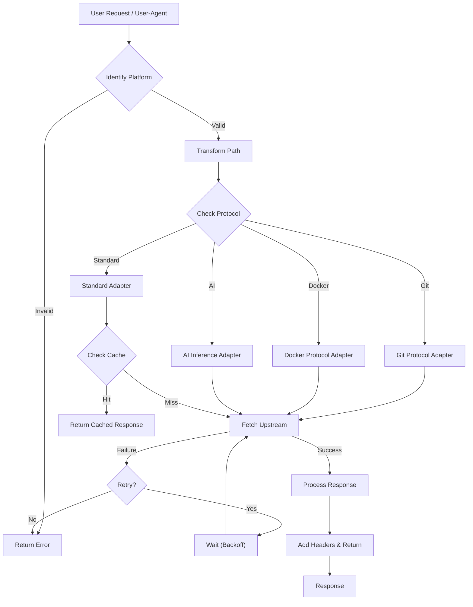
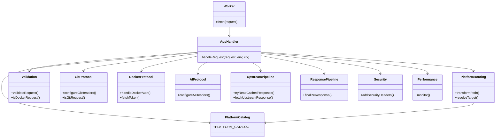

<div align="center">

# Xget 🚀

<a href="https://trendshift.io/repositories/14768" target="_blank"></a>

[![Ask Zread](https://img.shields.io/badge/Ask_Zread-_.svg?style=flat&color=00b0aa&labelColor=000000&logo=data%3Aimage%2Fsvg%2Bxml%3Bbase64%2CPHN2ZyB3aWR0aD0iMTYiIGhlaWdodD0iMTYiIHZpZXdCb3g9IjAgMCAxNiAxNiIgZmlsbD0ibm9uZSIgeG1sbnM9Imh0dHA6Ly93d3cudzMub3JnLzIwMDAvc3ZnIj4KPHBhdGggZD0iTTQuOTYxNTYgMS42MDAxSDIuMjQxNTZDMS44ODgxIDEuNjAwMSAxLjYwMTU2IDEuODg2NjQgMS42MDE1NiAyLjI0MDFWNC45NjAxQzEuNjAxNTYgNS4zMTM1NiAxLjg4ODEgNS42MDAxIDIuMjQxNTYgNS42MDAxSDQuOTYxNTZDNS4zMTUwMiA1LjYwMDEgNS42MDE1NiA1LjMxMzU2IDUuNjAxNTYgNC45NjAxVjIuMjQwMUM1LjYwMTU2IDEuODg2NjQgNS4zMTUwMiAxLjYwMDEgNC45NjE1NiAxLjYwMDFaIiBmaWxsPSIjZmZmIi8%2BCjxwYXRoIGQ9Ik00Ljk2MTU2IDEwLjM5OTlIMi4yNDE1NkMxLjg4ODEgMTAuMzk5OSAxLjYwMTU2IDEwLjY4NjQgMS42MDE1NiAxMS4wMzk5VjEzLjc1OTlDMS42MDE1NiAxNC4xMTM0IDEuODg4MSAxNC4zOTk5IDIuMjQxNTYgMTQuMzk5OUg0Ljk2MTU2QzUuMzE1MDIgMTQuMzk5OSA1LjYwMTU2IDE0LjExMzQgNS42MDE1NiAxMy43NTk5VjExLjAzOTlDNS42MDE1NiAxMC42ODY0IDUuMzE1MDIgMTAuMzk5OSA0Ljk2MTU2IDEwLjM5OTlaIiBmaWxsPSIjZmZmIi8%2BCjxwYXRoIGQ9Ik0xMy43NTg0IDEuNjAwMUgxMS4wMzg0QzEwLjY4NSAxLjYwMDEgMTAuMzk4NCAxLjg4NjY0IDEwLjM5ODQgMi4yNDAxVjQuOTYwMUMxMC4zOTg0IDUuMzEzNTYgMTAuNjg1IDUuNjAwMSAxMS4wMzg0IDUuNjAwMUgxMy43NTg0QzE0LjExMTkgNS42MDAxIDE0LjM5ODQgNS4zMTM1NiAxNC4zOTg0IDQuOTYwMVYyLjI0MDFDMTQuMzk4NCAxLjg4NjY0IDE0LjExMTkgMS42MDAxIDEzLjc1ODQgMS42MDAxWiIgZmlsbD0iI2ZmZiIvPgo8cGF0aCBkPSJNNCAxMkwxMiA0TDQgMTJaIiBmaWxsPSIjZmZmIi8%2BCjxwYXRoIGQ9Ik00IDEyTDEyIDQiIHN0cm9rZT0iI2ZmZiIgc3Ryb2tlLXdpZHRoPSIxLjUiIHN0cm9rZS1saW5lY2FwPSJyb3VuZCIvPgo8L3N2Zz4K&logoColor=ffffff)](https://zread.ai/xixu-me/Xget)
[](https://deepwiki.com/xixu-me/xget)
[](https://codecov.io/github/xixu-me/xget)
[](#ecosystem-integration)
[](#ecosystem-integration)

[](#deploy-to-cloudflare-workers)
[](#deploy-to-edgeone-pages)
[](#deploy-to-vercel)
[](#deploy-to-netlify)
[](#deploy-to-deno-deploy)
[](#self-hosted-deployment)
[](#self-hosted-deployment)

**English** | [汉语（简体）](README.zh-Hans.md) |
[漢語（繁體）](README.zh-Hant.md)

</div>

> [!TIP]
> 欢迎加入“Xget 开源与 AI 交流群”，一起交流开源项目、AI 应用、工程实践、效率工具和独立开发；如果你也在做产品、写代码、折腾项目或者对开源和 AI 感兴趣，欢迎[**进群**](https://file.xi-xu.me/QR%20Codes/%E7%BE%A4%E4%BA%8C%E7%BB%B4%E7%A0%81.png)认识更多认真做事、乐于分享的朋友。

An ultra-high-performance, secure, all-in-one acceleration engine for developer
resources. It provides unified, efficient acceleration for code hosting, model
and dataset hubs, package registries, container registries, AI inference
providers, and more, while handling caching, retries, security headers, and
protocol-specific compatibility behavior for you.

Technical deep dive:
**_[Deep Dive into Xget: A High-Performance, Multi-Protocol, and Secure Acceleration Engine for Developer Resources](https://blog.xi-xu.me/en/2025/10/07/Deep-Dive-into-Xget.html)_**.

Xget was invited onto [GitCode](https://gitcode.com/xixu-me/xget) and
recognized as a G-Star graduation project. As "a widely used public project",
it receives support from OpenAI's
[Codex for Open Source](https://developers.openai.com/community/codex-for-oss)
and has also been spontaneously recommended by several tech creators, including
[Ruan Yifeng](https://www.ruanyifeng.com/blog/2025/12/weekly-issue-379.html#:~:text=Xget),
[GitHubDaily](https://x.com/i/status/1956204203937829256),
[FishC](https://www.bilibili.com/video/BV1EeeBzVEop/), and
[Xuanli 199](https://www.bilibili.com/video/BV197hqzsE8Y/?t=8). Thanks to every
individual, team, and community that supports, shares, recommends, or actively
uses Xget.

## Supported Platforms

> [!NOTE]
> The badges below point to the relevant usage or deployment sections in this
> README.

[](#github)
[](#gitlab)
[](#gitea)
[](#codeberg)
[](#sourceforge)
[](#aosp-android-open-source-project)
[](#hugging-face-mirror)
[](#civitai-ai-model-platform)
[](#npm-package-acceleration)
[](#python-package-acceleration)
[](#conda-package-acceleration)
[](#maven-package-acceleration)
[](#apache-software-download-acceleration)
[](#gradle-package-acceleration)
[](#homebrew-package-acceleration)
[](#ruby-package-acceleration)
[](#r-package-acceleration)
[](#perl-package-acceleration)
[](#texlatex-package-acceleration)
[](#go-module-acceleration)
[](#nuget-package-acceleration)
[](#rust-package-acceleration)
[](#php-package-acceleration)
[](#flathub-repository-mirror)
[](#debianubuntu-apt-configuration)
[](#debianubuntu-apt-configuration)
[](#fedora-dnf-configuration)
[](#rocky-linux-dnf-configuration)
[](#opensuse-zypper-configuration)
[](#arch-linux-pacman-configuration)
[](#arxiv-paper-download)
[](#f-droid-repository-mirror)
[](#jenkins-plugin-download)
[](#container-registries)
[](#ai-inference-providers)

## Quick Start

**Pre-deployed Instance: `xget.xi-xu.me`** - For evaluation and trial only,
deploy your own instance for production or availability-sensitive workloads

> [!WARNING]
> If you self-host it, put it behind authentication, IP allowlists,
> or both unless you explicitly intend to run a public mirror.

**URL Converter:** [**`xuc.xi-xu.me`**](https://xuc.xi-xu.me) - Convert any
supported platform URL to Xget's acceleration format with one click

**Agent Skills: `npx skills add xixu-me/skills -s xget`**

## Why Xget

### Performance-Oriented Design

- **Global Edge Runtime**: Built on Cloudflare Workers and designed to run
  close to users and upstream services
- **Protocol-Aware Handling**: Supports HTTP/3, range requests, Git traffic,
  container registry flows, and AI inference APIs
- **Cache and Retry Pipeline**: Includes edge caching for compatible
  responses, retry logic for transient upstream failures, and request
  normalization for supported platforms
- **Connection Reuse**: Uses standard HTTP connection reuse and keep-alive
  behavior where the runtime and upstream allow it
- **Request Timing Visibility**: Can expose timing data through
  `X-Performance-Metrics` headers where protocol compatibility allows

### Deep Multi-Platform Integration

- **All-in-One Multi-Platform Support**: Unified support for mainstream
  platforms in various development scenarios
- **Intelligent Recognition and Conversion**: Automatically recognizes platform
  prefixes and converts to correct URL structures for target platforms
- **Consistent Acceleration Experience**: Enjoy unified and stable ultra-fast
  download experience regardless of file type or source

### Enterprise-Grade Security

- **Multi-Layer Security Headers**:
  - `Strict-Transport-Security`: Enforces HTTPS transmission, prevents
    man-in-the-middle attacks
  - `X-Frame-Options: DENY`: Prevents clickjacking attacks
  - `Content-Security-Policy`: Strict content security policy
  - `Referrer-Policy`: Controls referrer information leakage
  - `Permissions-Policy`: Restricts privacy-sensitive browser features by
    default
  - `X-XSS-Protection`: Legacy compatibility header for older browsers
- **Request Validation Mechanism**:
  - HTTP method whitelist: Regular requests limited to GET/HEAD, while Git/LFS,
    container registry, AI inference, and Hugging Face API traffic allow `POST`,
    `PUT`, `PATCH`, and `DELETE` as needed
  - Path length limit: Prevents excessively long URL attacks (max 2048
    characters)
  - Input sanitization: Prevents path traversal and injection attacks
- **Timeout Protection**: 30-second request timeout, prevents resource
  exhaustion and malicious requests

### Modern Architecture and Reliability

- **Intelligent Retry Mechanism**:
  - Maximum 3 retries with linear delay strategy (1000ms × retry count)
  - Automatic error recovery, improved download success rate
  - Timeout detection and interruption handling
- **Efficient Caching Strategy**:
  - Strategy-based cache durations keep mutable metadata fresh while caching
    immutable artifacts longer
  - Git operations skip caching to ensure real-time data
  - Edge caching based on Cloudflare Cache API and Cloudflare fetch cache
    controls
- **Performance Monitoring System**:
  - Built-in `PerformanceMonitor` class for real-time tracking of request stage
    durations
  - Detailed performance data provided via `X-Performance-Metrics` response
    header
  - Cache hit rate statistics and optimization recommendations

### Full Git Protocol Compatibility

- **Smart Protocol Detection**:
  - Automatically recognizes Git-specific endpoints (`/info/refs`,
    `/git-upload-pack`, `/git-receive-pack`)
  - Detects Git client User-Agent patterns
  - Supports query parameters like `service=git-upload-pack`
- **Complete Operation Support**:
  - `git clone`: Full repository cloning, supports shallow clones and branch
    specification
  - `git push`: Code push and branch management
  - `git pull/fetch`: Incremental updates and remote synchronization
  - `git submodule`: Recursive submodule cloning
- **Protocol Optimization**:
  - Preserves Git-specific request headers and authentication information
  - Smart User-Agent handling (default `git/2.34.1`)
  - Supports Git LFS large file transfer

### Ecosystem Integration

- **Dedicated Browser Extension**:
  [Xget Now](https://github.com/xixu-me/Xget-Now) provides seamless experience
  - Automatic URL redirection, no manual URL modification needed
  - Support for custom Xget instance domains
  - Multi-platform preference settings and blacklist/whitelist management
  - Local processing ensures privacy and security
- **Download Tool Compatibility**: Perfect support for wget, cURL, aria2, IDM,
  and other mainstream download tools
- **CI/CD Integration**: Can be used directly in GitHub Actions, GitLab CI, and
  other environments

## Architecture

### Request Processing Flow



### Component Architecture



## URL Conversion Rules

Using the pre-deployed instance **`xget.xi-xu.me`** or your own deployed
instance, simply replace the domain and add the platform prefix:

### Conversion Format

| Platform               | Platform Prefix | Original URL Format                                                  | Accelerated URL Format                                                            |
| ---------------------- | --------------- | -------------------------------------------------------------------- | --------------------------------------------------------------------------------- |
| GitHub                 | `gh`            | `https://github.com/...`                                             | `https://xget.xi-xu.me/gh/...`                                                    |
| GitHub Gist            | `gist`          | `https://gist.github.com/...`                                        | `https://xget.xi-xu.me/gist/...`                                                  |
| GitLab                 | `gl`            | `https://gitlab.com/...`                                             | `https://xget.xi-xu.me/gl/...`                                                    |
| Gitea                  | `gitea`         | `https://gitea.com/...`                                              | `https://xget.xi-xu.me/gitea/...`                                                 |
| Codeberg               | `codeberg`      | `https://codeberg.org/...`                                           | `https://xget.xi-xu.me/codeberg/...`                                              |
| SourceForge            | `sf`            | `https://sourceforge.net/...`                                        | `https://xget.xi-xu.me/sf/...`                                                    |
| AOSP                   | `aosp`          | `https://android.googlesource.com/...`                               | `https://xget.xi-xu.me/aosp/...`                                                  |
| Hugging Face           | `hf`            | `https://huggingface.co/...`                                         | `https://xget.xi-xu.me/hf/...`                                                    |
| Civitai                | `civitai`       | `https://civitai.com/...`                                            | `https://xget.xi-xu.me/civitai/...`                                               |
| npm                    | `npm`           | `https://registry.npmjs.org/...`                                     | `https://xget.xi-xu.me/npm/...`                                                   |
| PyPI                   | `pypi`          | `https://pypi.org/...`                                               | `https://xget.xi-xu.me/pypi/...`                                                  |
| conda                  | `conda`         | `https://repo.anaconda.com/...` and `https://conda.anaconda.org/...` | `https://xget.xi-xu.me/conda/...` and `https://xget.xi-xu.me/conda/community/...` |
| Maven                  | `maven`         | `https://repo1.maven.org/...`                                        | `https://xget.xi-xu.me/maven/...`                                                 |
| Apache                 | `apache`        | `https://downloads.apache.org/...`                                   | `https://xget.xi-xu.me/apache/...`                                                |
| Gradle                 | `gradle`        | `https://plugins.gradle.org/...`                                     | `https://xget.xi-xu.me/gradle/...`                                                |
| Homebrew               | `homebrew`      | `https://github.com/Homebrew/...`                                    | `https://xget.xi-xu.me/homebrew/...`                                              |
| RubyGems               | `rubygems`      | `https://rubygems.org/...`                                           | `https://xget.xi-xu.me/rubygems/...`                                              |
| CRAN                   | `cran`          | `https://cran.r-project.org/...`                                     | `https://xget.xi-xu.me/cran/...`                                                  |
| CPAN                   | `cpan`          | `https://www.cpan.org/...`                                           | `https://xget.xi-xu.me/cpan/...`                                                  |
| CTAN                   | `ctan`          | `https://tug.ctan.org/...`                                           | `https://xget.xi-xu.me/ctan/...`                                                  |
| Go Modules             | `golang`        | `https://proxy.golang.org/...`                                       | `https://xget.xi-xu.me/golang/...`                                                |
| NuGet                  | `nuget`         | `https://api.nuget.org/...`                                          | `https://xget.xi-xu.me/nuget/...`                                                 |
| Rust Crates            | `crates`        | `https://crates.io/...`                                              | `https://xget.xi-xu.me/crates/...`                                                |
| Packagist              | `packagist`     | `https://repo.packagist.org/...`                                     | `https://xget.xi-xu.me/packagist/...`                                             |
| Flathub                | `flathub`       | `https://dl.flathub.org/...`                                         | `https://xget.xi-xu.me/flathub/...`                                               |
| Debian                 | `debian`        | `https://deb.debian.org/...`                                         | `https://xget.xi-xu.me/debian/...`                                                |
| Ubuntu                 | `ubuntu`        | `https://archive.ubuntu.com/...`                                     | `https://xget.xi-xu.me/ubuntu/...`                                                |
| Fedora                 | `fedora`        | `https://dl.fedoraproject.org/...`                                   | `https://xget.xi-xu.me/fedora/...`                                                |
| Rocky Linux            | `rocky`         | `https://download.rockylinux.org/...`                                | `https://xget.xi-xu.me/rocky/...`                                                 |
| openSUSE               | `opensuse`      | `https://download.opensuse.org/...`                                  | `https://xget.xi-xu.me/opensuse/...`                                              |
| Arch Linux             | `arch`          | `https://geo.mirror.pkgbuild.com/...`                                | `https://xget.xi-xu.me/arch/...`                                                  |
| arXiv                  | `arxiv`         | `https://arxiv.org/...`                                              | `https://xget.xi-xu.me/arxiv/...`                                                 |
| F-Droid                | `fdroid`        | `https://f-droid.org/...`                                            | `https://xget.xi-xu.me/fdroid/...`                                                |
| Jenkins Plugins        | `jenkins`       | `https://updates.jenkins.io/...`                                     | `https://xget.xi-xu.me/jenkins/...`                                               |
| Container Registries   | `cr`            | See [Container Registries](#container-registries)                    | See [Container Registries](#container-registries)                                 |
| AI Inference Providers | `ip`            | See [AI Inference Providers](#ai-inference-providers)                | See [AI Inference Providers](#ai-inference-providers)                             |

### Platform Conversion Examples

#### GitHub

```url
# Original URL
https://github.com/microsoft/vscode/archive/refs/heads/main.zip

# Converted (add gh prefix)
https://xget.xi-xu.me/gh/microsoft/vscode/archive/refs/heads/main.zip
```

#### GitHub Gist

```url
# Original URL
https://gist.github.com/xixu-me/e2ea9db6b1f143892495f796fef18631/raw/3b8807172ee492d0da3a7e370b0fb88fc97b53e6/Free-ChatGPT-Paid-Plan.md

# Converted (add gist prefix)
https://xget.xi-xu.me/gist/xixu-me/e2ea9db6b1f143892495f796fef18631/raw/3b8807172ee492d0da3a7e370b0fb88fc97b53e6/Free-ChatGPT-Paid-Plan.md
```

#### GitLab

```url
# Original URL
https://gitlab.com/gitlab-org/gitlab/-/archive/master/gitlab-master.zip

# Converted (add gl prefix)
https://xget.xi-xu.me/gl/gitlab-org/gitlab/-/archive/master/gitlab-master.zip
```

#### Gitea

```url
# Original URL
https://gitea.com/gitea/gitea/archive/master.zip

# Converted (add gitea prefix)
https://xget.xi-xu.me/gitea/gitea/gitea/archive/master.zip
```

#### Codeberg

```url
# Original URL
https://codeberg.org/forgejo/forgejo/archive/forgejo.zip

# Converted (add codeberg prefix)
https://xget.xi-xu.me/codeberg/forgejo/forgejo/archive/forgejo.zip
```

#### SourceForge

```url
# Original URL
https://sourceforge.net/projects/sevenzip/files/7-Zip/23.01/7z2301-x64.exe/download

# Converted (add sf prefix)
https://xget.xi-xu.me/sf/projects/sevenzip/files/7-Zip/23.01/7z2301-x64.exe/download
```

#### AOSP (Android Open Source Project)

```url
# AOSP project original URL
https://android.googlesource.com/platform/frameworks/base

# Converted (add aosp prefix)
https://xget.xi-xu.me/aosp/platform/frameworks/base

# AOSP device tree original URL
https://android.googlesource.com/device/google/pixel

# Converted (add aosp prefix)
https://xget.xi-xu.me/aosp/device/google/pixel
```

#### Hugging Face

```url
# Model file original URL
https://huggingface.co/microsoft/DialoGPT-medium/resolve/main/pytorch_model.bin

# Converted (add hf prefix)
https://xget.xi-xu.me/hf/microsoft/DialoGPT-medium/resolve/main/pytorch_model.bin

# Dataset file original URL
https://huggingface.co/datasets/rajpurkar/squad/resolve/main/plain_text/train-00000-of-00001.parquet

# Converted (add hf prefix)
https://xget.xi-xu.me/hf/datasets/rajpurkar/squad/resolve/main/plain_text/train-00000-of-00001.parquet
```

#### Civitai

```url
# AI model download original URL
https://civitai.com/api/download/models/128713

# Converted (add civitai prefix)
https://xget.xi-xu.me/civitai/api/download/models/128713

# Model API original URL
https://civitai.com/api/v1/models/7240

# Converted (add civitai prefix)
https://xget.xi-xu.me/civitai/api/v1/models/7240

# Model version API original URL
https://civitai.com/api/v1/model-versions/128713

# Converted (add civitai prefix)
https://xget.xi-xu.me/civitai/api/v1/model-versions/128713
```

#### npm

```url
# Package file original URL
https://registry.npmjs.org/react/-/react-18.2.0.tgz

# Converted (add npm prefix)
https://xget.xi-xu.me/npm/react/-/react-18.2.0.tgz

# Package metadata original URL
https://registry.npmjs.org/lodash

# Converted (add npm prefix)
https://xget.xi-xu.me/npm/lodash
```

#### PyPI

```url
# Python package file original URL
https://pypi.org/packages/source/r/requests/requests-2.31.0.tar.gz

# Converted (add pypi prefix)
https://xget.xi-xu.me/pypi/packages/source/r/requests/requests-2.31.0.tar.gz

# Wheel file original URL
https://pypi.org/packages/py3/r/requests/requests-2.31.0-py3-none-any.whl

# Converted (add pypi prefix)
https://xget.xi-xu.me/pypi/packages/py3/r/requests/requests-2.31.0-py3-none-any.whl
```

#### conda

```url
# Default channel package file original URL
https://repo.anaconda.com/pkgs/main/linux-64/numpy-1.24.3-py311h08b1b3b_1.conda

# Converted (add conda prefix)
https://xget.xi-xu.me/conda/pkgs/main/linux-64/numpy-1.24.3-py311h08b1b3b_1.conda

# Community channel metadata original URL
https://conda.anaconda.org/conda-forge/linux-64/repodata.json

# Converted (add conda/community prefix)
https://xget.xi-xu.me/conda/community/conda-forge/linux-64/repodata.json
```

#### Maven

```url
# Maven Central Repository JAR file original URL
https://repo1.maven.org/maven2/org/springframework/spring-core/5.3.21/spring-core-5.3.21.jar

# Converted (add maven prefix)
https://xget.xi-xu.me/maven/maven2/org/springframework/spring-core/5.3.21/spring-core-5.3.21.jar

# Maven metadata original URL
https://repo1.maven.org/maven2/org/apache/commons/commons-lang3/maven-metadata.xml

# Converted (add maven prefix)
https://xget.xi-xu.me/maven/maven2/org/apache/commons/commons-lang3/maven-metadata.xml
```

#### Apache Software Download

```url
# Apache software download original URL
https://downloads.apache.org/kafka/3.6.1/kafka_2.13-3.6.1.tgz

# Converted (add apache prefix)
https://xget.xi-xu.me/apache/kafka/3.6.1/kafka_2.13-3.6.1.tgz

# Apache Maven download original URL
https://downloads.apache.org/maven/maven-3/3.9.5/binaries/apache-maven-3.9.5-bin.tar.gz

# Converted (add apache prefix)
https://xget.xi-xu.me/apache/maven/maven-3/3.9.5/binaries/apache-maven-3.9.5-bin.tar.gz

# Apache Spark download original URL
https://downloads.apache.org/spark/spark-3.5.0/spark-3.5.0-bin-hadoop3.tgz

# Converted (add apache prefix)
https://xget.xi-xu.me/apache/spark/spark-3.5.0/spark-3.5.0-bin-hadoop3.tgz
```

#### Gradle

```url
# Gradle plugin portal JAR file original URL
https://plugins.gradle.org/m2/org/gradle/gradle-hello-world-plugin/0.2/gradle-hello-world-plugin-0.2.jar

# Converted (add gradle prefix)
https://xget.xi-xu.me/gradle/m2/org/gradle/gradle-hello-world-plugin/0.2/gradle-hello-world-plugin-0.2.jar

# Gradle plugin metadata original URL
https://plugins.gradle.org/m2/com/github/ben-manes/gradle-versions-plugin/0.51.0/gradle-versions-plugin-0.51.0.module

# Converted (add gradle prefix)
https://xget.xi-xu.me/gradle/m2/com/github/ben-manes/gradle-versions-plugin/0.51.0/gradle-versions-plugin-0.51.0.module
```

#### Homebrew

```url
# Homebrew formula repository original URL
https://github.com/Homebrew/homebrew-core/raw/HEAD/Formula/g/git.rb

# Converted (add homebrew prefix)
https://xget.xi-xu.me/homebrew/homebrew-core/raw/HEAD/Formula/g/git.rb

# Homebrew API original URL
https://formulae.brew.sh/api/formula/git.json

# Converted (add homebrew/api prefix)
https://xget.xi-xu.me/homebrew/api/formula/git.json

# Homebrew Bottles original URL
https://ghcr.io/v2/homebrew/core/git/manifests/2.39.0

# Converted (add homebrew/bottles prefix)
https://xget.xi-xu.me/homebrew/bottles/v2/homebrew/core/git/manifests/2.39.0
```

#### RubyGems

```url
# RubyGems package file original URL
https://rubygems.org/gems/rails-7.0.4.gem

# Converted (add rubygems prefix)
https://xget.xi-xu.me/rubygems/gems/rails-7.0.4.gem

# RubyGems API original URL
https://rubygems.org/api/v1/gems/nokogiri.json

# Converted (add rubygems prefix)
https://xget.xi-xu.me/rubygems/api/v1/gems/nokogiri.json
```

#### CRAN

```url
# CRAN package file original URL
https://cran.r-project.org/src/contrib/ggplot2_3.5.2.tar.gz

# Converted (add cran prefix)
https://xget.xi-xu.me/cran/src/contrib/ggplot2_3.5.2.tar.gz

# CRAN package metadata original URL
https://cran.r-project.org/web/packages/dplyr/DESCRIPTION

# Converted (add cran prefix)
https://xget.xi-xu.me/cran/web/packages/dplyr/DESCRIPTION
```

#### CPAN (Perl Package Management)

```url
# CPAN module original URL
https://www.cpan.org/modules/by-module/DBI/DBI-1.643.tar.gz

# Converted (add cpan prefix)
https://xget.xi-xu.me/cpan/modules/by-module/DBI/DBI-1.643.tar.gz

# CPAN author package original URL
https://www.cpan.org/authors/id/T/TI/TIMB/DBI-1.643.tar.gz

# Converted (add cpan prefix)
https://xget.xi-xu.me/cpan/authors/id/T/TI/TIMB/DBI-1.643.tar.gz
```

#### CTAN (TeX/LaTeX Package Management)

```url
# CTAN package file original URL
https://tug.ctan.org/tex-archive/macros/latex/contrib/beamer.zip

# Converted (add ctan prefix)
https://xget.xi-xu.me/ctan/tex-archive/macros/latex/contrib/beamer.zip

# CTAN font file original URL
https://tug.ctan.org/tex-archive/fonts/cm/pk/ljfour/public/cm/dpi600/cmr10.pk

# Converted (add ctan prefix)
https://xget.xi-xu.me/ctan/tex-archive/fonts/cm/pk/ljfour/public/cm/dpi600/cmr10.pk
```

#### Go Modules

```url
# Go module proxy original URL
https://proxy.golang.org/github.com/gin-gonic/gin/@v/v1.9.1.zip

# Converted (add golang prefix)
https://xget.xi-xu.me/golang/github.com/gin-gonic/gin/@v/v1.9.1.zip

# Go module info original URL
https://proxy.golang.org/github.com/gorilla/mux/@v/list

# Converted (add golang prefix)
https://xget.xi-xu.me/golang/github.com/gorilla/mux/@v/list
```

#### NuGet

```url
# NuGet package download original URL
https://api.nuget.org/v3-flatcontainer/newtonsoft.json/13.0.3/newtonsoft.json.13.0.3.nupkg

# Converted (add nuget prefix)
https://xget.xi-xu.me/nuget/v3-flatcontainer/newtonsoft.json/13.0.3/newtonsoft.json.13.0.3.nupkg

# NuGet package metadata original URL
https://api.nuget.org/v3/registration5-semver1/microsoft.aspnetcore.app/index.json

# Converted (add nuget prefix)
https://xget.xi-xu.me/nuget/v3/registration5-semver1/microsoft.aspnetcore.app/index.json
```

#### Rust Crates

```url
# Crate download original URL
https://crates.io/api/v1/crates/serde/1.0.0/download

# Converted (add crates prefix)
https://xget.xi-xu.me/crates/serde/1.0.0/download

# Crate metadata original URL
https://crates.io/api/v1/crates/serde

# Converted (add crates prefix)
https://xget.xi-xu.me/crates/serde

# Crate search original URL
https://crates.io/api/v1/crates?q=serde

# Converted (add crates prefix)
https://xget.xi-xu.me/crates/?q=serde
```

#### Packagist

```url
# Packagist package metadata original URL
https://repo.packagist.org/p2/symfony/console.json

# Converted (add packagist prefix)
https://xget.xi-xu.me/packagist/p2/symfony/console.json

# Packagist package list original URL
https://repo.packagist.org/packages/list.json

# Converted (add packagist prefix)
https://xget.xi-xu.me/packagist/packages/list.json
```

#### Flathub

```url
# Flathub repository original URL
https://dl.flathub.org/repo/summary

# Converted (add flathub prefix)
https://xget.xi-xu.me/flathub/repo/summary

# Flathub app reference original URL
https://dl.flathub.org/repo/appstream/org.gnome.gedit.flatpakref

# Converted (add flathub prefix)
https://xget.xi-xu.me/flathub/repo/appstream/org.gnome.gedit.flatpakref
```

#### Linux Distributions

```url
# Debian package original URL
https://deb.debian.org/debian/pool/main/c/curl/curl_7.88.1-10+deb12u4_amd64.deb

# Converted (add debian prefix)
https://xget.xi-xu.me/debian/debian/pool/main/c/curl/curl_7.88.1-10+deb12u4_amd64.deb

# Ubuntu package original URL
https://archive.ubuntu.com/ubuntu/pool/main/g/git/git_2.34.1-1ubuntu1.9_amd64.deb

# Converted (add ubuntu prefix)
https://xget.xi-xu.me/ubuntu/ubuntu/pool/main/g/git/git_2.34.1-1ubuntu1.9_amd64.deb

# Fedora package original URL
https://dl.fedoraproject.org/pub/fedora/linux/releases/39/Everything/x86_64/os/Packages/n/nginx-1.24.0-1.fc39.x86_64.rpm

# Converted (add fedora prefix)
https://xget.xi-xu.me/fedora/pub/fedora/linux/releases/39/Everything/x86_64/os/Packages/n/nginx-1.24.0-1.fc39.x86_64.rpm

# Rocky Linux package original URL
https://download.rockylinux.org/pub/rocky/9/BaseOS/x86_64/os/Packages/b/bash-5.1.8-6.el9.x86_64.rpm

# Converted (add rocky prefix)
https://xget.xi-xu.me/rocky/pub/rocky/9/BaseOS/x86_64/os/Packages/b/bash-5.1.8-6.el9.x86_64.rpm

# openSUSE package original URL
https://download.opensuse.org/distribution/leap/15.5/repo/oss/x86_64/vim-9.0.1572-150500.20.8.1.x86_64.rpm

# Converted (add opensuse prefix)
https://xget.xi-xu.me/opensuse/distribution/leap/15.5/repo/oss/x86_64/vim-9.0.1572-150500.20.8.1.x86_64.rpm

# Arch Linux package original URL
https://geo.mirror.pkgbuild.com/core/os/x86_64/linux-6.6.10.arch1-1-x86_64.pkg.tar.zst

# Converted (add arch prefix)
https://xget.xi-xu.me/arch/core/os/x86_64/linux-6.6.10.arch1-1-x86_64.pkg.tar.zst
```

#### arXiv

```url
# arXiv paper PDF original URL
https://arxiv.org/pdf/2301.07041.pdf

# Converted (add arxiv prefix)
https://xget.xi-xu.me/arxiv/pdf/2301.07041.pdf

# arXiv paper source original URL
https://arxiv.org/e-print/2301.07041

# Converted (add arxiv prefix)
https://xget.xi-xu.me/arxiv/e-print/2301.07041
```

#### F-Droid

```url
# F-Droid app APK original URL
https://f-droid.org/repo/org.fdroid.fdroid_1016050.apk

# Converted (add fdroid prefix)
https://xget.xi-xu.me/fdroid/repo/org.fdroid.fdroid_1016050.apk

# F-Droid app metadata original URL
https://f-droid.org/api/v1/packages/org.fdroid.fdroid

# Converted (add fdroid prefix)
https://xget.xi-xu.me/fdroid/api/v1/packages/org.fdroid.fdroid
```

#### Jenkins Plugins

```url
# Jenkins update center original URL
https://updates.jenkins.io/update-center.json

# Converted (add jenkins prefix)
https://xget.xi-xu.me/jenkins/update-center.json

# Jenkins plugin download original URL
https://updates.jenkins.io/download/plugins/maven-plugin/3.27/maven-plugin.hpi

# Converted (add jenkins prefix)
https://xget.xi-xu.me/jenkins/download/plugins/maven-plugin/3.27/maven-plugin.hpi
```

#### Container Registries

Xget supports multiple container registries, using the `cr/[Registry Prefix]`
format:

| Container Registry           | Registry Prefix | Original URL Format                         | Accelerated URL Format                      |
| ---------------------------- | --------------- | ------------------------------------------- | ------------------------------------------- |
| Docker Hub                   | `docker`        | `https://registry-1.docker.io/...`          | `https://xget.xi-xu.me/cr/docker/...`       |
| Quay.io                      | `quay`          | `https://quay.io/...`                       | `https://xget.xi-xu.me/cr/quay/...`         |
| Google Container Registry    | `gcr`           | `https://gcr.io/...`                        | `https://xget.xi-xu.me/cr/gcr/...`          |
| Microsoft Container Registry | `mcr`           | `https://mcr.microsoft.com/...`             | `https://xget.xi-xu.me/cr/mcr/...`          |
| Amazon Public ECR            | `ecr`           | `https://public.ecr.aws/...`                | `https://xget.xi-xu.me/cr/ecr/...`          |
| GitHub Container Registry    | `ghcr`          | `https://ghcr.io/...`                       | `https://xget.xi-xu.me/cr/ghcr/...`         |
| GitLab Container Registry    | `gitlab`        | `https://registry.gitlab.com/...`           | `https://xget.xi-xu.me/cr/gitlab/...`       |
| Red Hat Registry             | `redhat`        | `https://registry.redhat.io/...`            | `https://xget.xi-xu.me/cr/redhat/...`       |
| Oracle Container Registry    | `oracle`        | `https://container-registry.oracle.com/...` | `https://xget.xi-xu.me/cr/oracle/...`       |
| Cloudsmith                   | `cloudsmith`    | `https://docker.cloudsmith.io/...`          | `https://xget.xi-xu.me/cr/cloudsmith/...`   |
| DigitalOcean Registry        | `digitalocean`  | `https://registry.digitalocean.com/...`     | `https://xget.xi-xu.me/cr/digitalocean/...` |
| VMware Registry              | `vmware`        | `https://projects.registry.vmware.com/...`  | `https://xget.xi-xu.me/cr/vmware/...`       |
| Kubernetes Registry          | `k8s`           | `https://registry.k8s.io/...`               | `https://xget.xi-xu.me/cr/k8s/...`          |
| Heroku Registry              | `heroku`        | `https://registry.heroku.com/...`           | `https://xget.xi-xu.me/cr/heroku/...`       |
| SUSE Registry                | `suse`          | `https://registry.suse.com/...`             | `https://xget.xi-xu.me/cr/suse/...`         |
| openSUSE Registry            | `opensuse`      | `https://registry.opensuse.org/...`         | `https://xget.xi-xu.me/cr/opensuse/...`     |
| Gitpod Registry              | `gitpod`        | `https://registry.gitpod.io/...`            | `https://xget.xi-xu.me/cr/gitpod/...`       |

```url
# Docker Hub original URL (official images)
https://registry-1.docker.io/v2/library/nginx/manifests/latest

# Converted (add cr/docker prefix)
https://xget.xi-xu.me/cr/docker/v2/nginx/manifests/latest

# Docker Hub original URL (user images)
https://registry-1.docker.io/v2/nginxinc/nginx-unprivileged/manifests/latest

# Converted (add cr/docker prefix)
https://xget.xi-xu.me/cr/docker/v2/nginxinc/nginx-unprivileged/manifests/latest

# GitHub Container Registry original URL
https://ghcr.io/v2/nginxinc/nginx-unprivileged/manifests/latest

# Converted (add cr/ghcr prefix)
https://xget.xi-xu.me/cr/ghcr/v2/nginxinc/nginx-unprivileged/manifests/latest

# Google Container Registry original URL
https://gcr.io/v2/distroless/base/manifests/latest

# Converted (add cr/gcr prefix)
https://xget.xi-xu.me/cr/gcr/v2/distroless/base/manifests/latest
```

For use cases, see
[Container Image Acceleration](#container-image-acceleration).

#### AI Inference Providers

Xget supports API acceleration for many mainstream AI inference providers, using
the `ip/[AI Provider Prefix]` format:

| AI Inference Provider | Provider Prefix | Original URL Format                             | Accelerated URL Format                       |
| --------------------- | --------------- | ----------------------------------------------- | -------------------------------------------- |
| OpenAI                | `openai`        | `https://api.openai.com/...`                    | `https://xget.xi-xu.me/ip/openai/...`        |
| Anthropic             | `anthropic`     | `https://api.anthropic.com/...`                 | `https://xget.xi-xu.me/ip/anthropic/...`     |
| Gemini                | `gemini`        | `https://generativelanguage.googleapis.com/...` | `https://xget.xi-xu.me/ip/gemini/...`        |
| Vertex AI             | `vertexai`      | `https://aiplatform.googleapis.com/...`         | `https://xget.xi-xu.me/ip/vertexai/...`      |
| Cohere                | `cohere`        | `https://api.cohere.ai/...`                     | `https://xget.xi-xu.me/ip/cohere/...`        |
| Mistral AI            | `mistralai`     | `https://api.mistral.ai/...`                    | `https://xget.xi-xu.me/ip/mistralai/...`     |
| xAI                   | `xai`           | `https://api.x.ai/...`                          | `https://xget.xi-xu.me/ip/xai/...`           |
| GitHub Models         | `githubmodels`  | `https://models.github.ai/...`                  | `https://xget.xi-xu.me/ip/githubmodels/...`  |
| NVIDIA API            | `nvidiaapi`     | `https://integrate.api.nvidia.com/...`          | `https://xget.xi-xu.me/ip/nvidiaapi/...`     |
| Perplexity            | `perplexity`    | `https://api.perplexity.ai/...`                 | `https://xget.xi-xu.me/ip/perplexity/...`    |
| Groq                  | `groq`          | `https://api.groq.com/...`                      | `https://xget.xi-xu.me/ip/groq/...`          |
| Cerebras              | `cerebras`      | `https://api.cerebras.ai/...`                   | `https://xget.xi-xu.me/ip/cerebras/...`      |
| SambaNova             | `sambanova`     | `https://api.sambanova.ai/...`                  | `https://xget.xi-xu.me/ip/sambanova/...`     |
| Siray                 | `siray`         | `https://api.siray.ai/...`                      | `https://xget.xi-xu.me/ip/siray/...`         |
| HF Inference          | `huggingface`   | `https://router.huggingface.co/...`             | `https://xget.xi-xu.me/ip/huggingface/...`   |
| Together              | `together`      | `https://api.together.xyz/...`                  | `https://xget.xi-xu.me/ip/together/...`      |
| Replicate             | `replicate`     | `https://api.replicate.com/...`                 | `https://xget.xi-xu.me/ip/replicate/...`     |
| Fireworks             | `fireworks`     | `https://api.fireworks.ai/...`                  | `https://xget.xi-xu.me/ip/fireworks/...`     |
| Nebius                | `nebius`        | `https://api.studio.nebius.ai/...`              | `https://xget.xi-xu.me/ip/nebius/...`        |
| Jina                  | `jina`          | `https://api.jina.ai/...`                       | `https://xget.xi-xu.me/ip/jina/...`          |
| Voyage AI             | `voyageai`      | `https://api.voyageai.com/...`                  | `https://xget.xi-xu.me/ip/voyageai/...`      |
| Fal AI                | `falai`         | `https://fal.run/...`                           | `https://xget.xi-xu.me/ip/falai/...`         |
| Novita                | `novita`        | `https://api.novita.ai/...`                     | `https://xget.xi-xu.me/ip/novita/...`        |
| Burncloud             | `burncloud`     | `https://ai.burncloud.com/...`                  | `https://xget.xi-xu.me/ip/burncloud/...`     |
| OpenRouter            | `openrouter`    | `https://openrouter.ai/...`                     | `https://xget.xi-xu.me/ip/openrouter/...`    |
| Poe                   | `poe`           | `https://api.poe.com/...`                       | `https://xget.xi-xu.me/ip/poe/...`           |
| Featherless AI        | `featherlessai` | `https://api.featherless.ai/...`                | `https://xget.xi-xu.me/ip/featherlessai/...` |
| Hyperbolic            | `hyperbolic`    | `https://api.hyperbolic.xyz/...`                | `https://xget.xi-xu.me/ip/hyperbolic/...`    |

```url
# OpenAI API original URL
https://api.openai.com/v1/chat/completions

# Converted (add ip/openai prefix)
https://xget.xi-xu.me/ip/openai/v1/chat/completions

# Claude API original URL
https://api.anthropic.com/v1/messages

# Converted (add ip/anthropic prefix)
https://xget.xi-xu.me/ip/anthropic/v1/messages

# Gemini API original URL
https://generativelanguage.googleapis.com/v1beta/models/gemini-2.5-flash:generateContent

# Converted (add ip/gemini prefix)
https://xget.xi-xu.me/ip/gemini/v1beta/models/gemini-2.5-flash:generateContent

# HF Inference API original URL
https://router.huggingface.co/hf-inference/models/openai/whisper-large-v3

# Converted (add ip/huggingface prefix)
https://xget.xi-xu.me/ip/huggingface/hf-inference/models/openai/whisper-large-v3
```

For use cases, see
[AI Inference API Acceleration](#ai-inference-api-acceleration).

## Use Cases

### Git Operations and Configuration

#### Git Operations

```bash
# Clone repository
git clone https://xget.xi-xu.me/gh/microsoft/vscode.git

# Clone specific branch
git clone -b main https://xget.xi-xu.me/gh/facebook/react.git

# Shallow clone (latest commit only)
git clone --depth 1 https://xget.xi-xu.me/gh/torvalds/linux.git

# Clone GitLab repository
git clone https://xget.xi-xu.me/gl/gitlab-org/gitlab.git

# Clone Gitea repository
git clone https://xget.xi-xu.me/gitea/gitea/gitea.git

# Clone Codeberg repository
git clone https://xget.xi-xu.me/codeberg/forgejo/forgejo.git

# Clone SourceForge repository
git clone https://xget.xi-xu.me/sf/projects/mingw-w64/code.git

# Clone AOSP repository
git clone https://xget.xi-xu.me/aosp/platform/frameworks/base.git

# Add remote repository
git remote add upstream https://xget.xi-xu.me/gh/[owner]/[repository].git

# Pull updates
git pull https://xget.xi-xu.me/gh/microsoft/vscode.git main

# Recursive submodule clone
git clone --recursive https://xget.xi-xu.me/gh/[username]/[repository-with-submodules].git
```

#### Git Global Acceleration Configuration

```bash
# Configure Git to use Xget for specific domains
git config --global url."https://xget.xi-xu.me/gh/".insteadOf "https://github.com/"
git config --global url."https://xget.xi-xu.me/gl/".insteadOf "https://gitlab.com/"
git config --global url."https://xget.xi-xu.me/gitea/".insteadOf "https://gitea.com/"
git config --global url."https://xget.xi-xu.me/codeberg/".insteadOf "https://codeberg.org/"
git config --global url."https://xget.xi-xu.me/sf/".insteadOf "https://sourceforge.net/"
git config --global url."https://xget.xi-xu.me/aosp/".insteadOf "https://android.googlesource.com/"

# Verify configuration
git config --global --get-regexp url

# Now all git clone operations for relevant platforms will automatically use Xget
git clone https://github.com/microsoft/vscode.git  # Automatically converted to Xget URL
git clone https://gitlab.com/gitlab-org/gitlab.git  # Automatically converted to Xget URL
git clone https://codeberg.org/forgejo/forgejo.git  # Automatically converted to Xget URL
git clone https://android.googlesource.com/platform/frameworks/base.git  # Automatically converted to Xget URL
```

### Mainstream Download Tool Integration

#### wget Download

```bash
# Download single file
wget https://xget.xi-xu.me/gh/microsoft/vscode/archive/refs/heads/main.zip

# Resume download
wget -c https://xget.xi-xu.me/hf/microsoft/DialoGPT-large/resolve/main/pytorch_model.bin

# Batch download
wget -i urls.txt  # urls.txt contains multiple Xget URLs
```

#### cURL Download

```bash
# Basic download
curl -L -O https://xget.xi-xu.me/gh/golang/go/archive/refs/tags/go1.22.0.tar.gz

# Show progress bar
curl -L --progress-bar -o model.bin https://xget.xi-xu.me/hf/openai/whisper-large-v3/resolve/main/pytorch_model.bin

# Set user agent
curl -L -H "User-Agent: MyApp/1.0" https://xget.xi-xu.me/gl/gitlab-org/gitlab-runner/-/archive/main/gitlab-runner-main.zip
```

#### aria2 Multi-threaded Download

```bash
# Multi-threaded download of large files
aria2c -x 16 -s 16 https://xget.xi-xu.me/hf/microsoft/DialoGPT-large/resolve/main/pytorch_model.bin

# Resume download
aria2c -c https://xget.xi-xu.me/gh/microsoft/vscode/archive/refs/heads/main.zip

# Batch download configuration file
aria2c -i download-list.txt  # File containing multiple Xget URLs
```

### Hugging Face Mirror

```python
import os
from transformers import AutoTokenizer, AutoModelForCausalLM

# Set environment variable to make transformers library automatically use Xget mirror
os.environ['HF_ENDPOINT'] = 'https://xget.xi-xu.me/hf'

# Define model name
model_name = 'microsoft/DialoGPT-medium'

print(f"Downloading model from mirror: {model_name}")

# Use AutoModelForCausalLM to load dialogue generation model
# Since we set the environment variable above, no additional parameters are needed here
tokenizer = AutoTokenizer.from_pretrained(model_name)
model = AutoModelForCausalLM.from_pretrained(model_name)

print("Model and tokenizer loaded successfully!")

# You can now use the tokenizer and model
# For example:
# new_user_input_ids = tokenizer.encode("Hello, how are you?", return_tensors='pt')
# chat_history_ids = model.generate(new_user_input_ids, max_length=1000, pad_token_id=tokenizer.eos_token_id)
# print(tokenizer.decode(chat_history_ids[:, new_user_input_ids.shape[-1]:][0], skip_special_tokens=True))
```

### Civitai AI Model Platform

```python
import requests

# Set API base URL to use Xget
base_url = "https://xget.xi-xu.me/civitai"

# Get model information
def get_model_info(model_id):
    """Get Civitai model information"""
    url = f"{base_url}/api/v1/models/{model_id}"
    response = requests.get(url)
    return response.json()

# Download model
def download_model(model_version_id, output_path):
    """Download Civitai model file"""
    download_url = f"{base_url}/api/download/models/{model_version_id}"

    print(f"Downloading model version {model_version_id}...")

    response = requests.get(download_url, stream=True)
    response.raise_for_status()

    with open(output_path, 'wb') as f:
        for chunk in response.iter_content(chunk_size=8192):
            f.write(chunk)

    print(f"Model downloaded to: {output_path}")

# Usage example
model_id = 7240  # Example model ID
model_info = get_model_info(model_id)
print(f"Model name: {model_info['name']}")

# Download first model version
if model_info['modelVersions']:
    version_id = model_info['modelVersions'][0]['id']
    download_model(version_id, f"model_{version_id}.safetensors")
```

### npm Package Acceleration

#### Configure npm to Use Xget Mirror

```bash
# Temporarily use Xget mirror
npm install --registry https://xget.xi-xu.me/npm/

# Globally configure npm mirror
npm config set registry https://xget.xi-xu.me/npm/

# Verify configuration
npm config get registry
```

#### Configure Bun to Use Xget Mirror

```toml
# bunfig.toml (project-level) or ~/.bunfig.toml (global)
[install]
registry = "https://xget.xi-xu.me/npm/"
```

```bash
# Install dependencies with Bun
bun install

# Bun also supports .npmrc, so you can reuse existing npm registry settings
echo "registry=https://xget.xi-xu.me/npm/" > .npmrc
bun install
```

#### Use in Project (npm / Bun)

```bash
# Configure project-level mirror in .npmrc (.npmrc can be reused by npm / Bun)
echo "registry=https://xget.xi-xu.me/npm/" > .npmrc

# Install dependencies with npm
npm install

# Install dependencies with Bun
bun install
```

### Python Package Acceleration

#### Configure pip to Use Xget Mirror

```bash
# Temporarily use Xget mirror
pip install requests -i https://xget.xi-xu.me/pypi/simple/

# Globally configure pip mirror
pip config set global.index-url https://xget.xi-xu.me/pypi/simple/
pip config set global.trusted-host xget.xi-xu.me

# Verify configuration
pip config list
```

#### Use in Project

```bash
# Create pip.conf file (Linux/macOS)
mkdir -p ~/.pip
cat > ~/.pip/pip.conf << EOF
[global]
index-url = https://xget.xi-xu.me/pypi/simple/
trusted-host = xget.xi-xu.me
EOF

# Or create pip.conf in project root directory
cat > pip.conf << EOF
[global]
index-url = https://xget.xi-xu.me/pypi/simple/
trusted-host = xget.xi-xu.me
EOF

# Install using configuration file
pip install -r requirements.txt --config-file pip.conf
```

#### Specify Mirror in requirements.txt

```txt
# requirements.txt
--index-url https://xget.xi-xu.me/pypi/simple/
--trusted-host xget.xi-xu.me

requests>=2.25.0
numpy>=1.21.0
pandas>=1.3.0
matplotlib>=3.4.0
```

### conda Package Acceleration

#### Configure conda to Use Xget Mirror

```bash
# Configure default channel mirrors
conda config --add default_channels https://xget.xi-xu.me/conda/pkgs/msys2
conda config --add default_channels https://xget.xi-xu.me/conda/pkgs/r
conda config --add default_channels https://xget.xi-xu.me/conda/pkgs/main

# Configure all community channel mirrors (recommended)
conda config --set channel_alias https://xget.xi-xu.me/conda/community

# Or configure specific community channels
conda config --add channels https://xget.xi-xu.me/conda/community/conda-forge
conda config --add channels https://xget.xi-xu.me/conda/community/bioconda

# Set channel priority
conda config --set channel_priority strict

# Verify configuration
conda config --show
```

#### Configure in .condarc

The .condarc file can be placed in the user home directory (`~/.condarc`) or
project root directory:

```yaml
default_channels:
  - https://xget.xi-xu.me/conda/pkgs/main
  - https://xget.xi-xu.me/conda/pkgs/r
  - https://xget.xi-xu.me/conda/pkgs/msys2
channel_alias: https://xget.xi-xu.me/conda/community
channel_priority: strict
show_channel_urls: true
```

#### Use Environment File

The environment file can directly specify complete mirror URLs:

```yaml
# environment.yml
name: myproject
channels:
  - https://xget.xi-xu.me/conda/pkgs/main
  - https://xget.xi-xu.me/conda/pkgs/r
  - https://xget.xi-xu.me/conda/community/bioconda
  - https://xget.xi-xu.me/conda/community/conda-forge
dependencies:
  - python=3.11
  - numpy>=1.24.0
  - pandas>=2.0.0
  - matplotlib>=3.7.0
  - scipy>=1.10.0
  - pip
  - pip:
      - requests>=2.28.0
```

```bash
# Create environment using environment file
conda env create -f environment.yml

# Update environment
conda env update -f environment.yml
```

### Maven Package Acceleration

#### Configure Maven to Use Xget Mirror

```xml
<!-- Configure Maven mirror in ~/.m2/settings.xml -->
<settings>
  <mirrors>
    <mirror>
      <id>xget-maven-central</id>
      <mirrorOf>central</mirrorOf>
      <name>Xget Maven Central Mirror</name>
      <url>https://xget.xi-xu.me/maven/maven2</url>
    </mirror>
  </mirrors>
</settings>
```

#### Use in Project

```xml
<!-- Configure project-level mirror in pom.xml -->
<project>
  <repositories>
    <repository>
      <id>xget-maven-central</id>
      <name>Xget Maven Central</name>
      <url>https://xget.xi-xu.me/maven/maven2</url>
    </repository>
  </repositories>

  <pluginRepositories>
    <pluginRepository>
      <id>xget-maven-central</id>
      <name>Xget Maven Central</name>
      <url>https://xget.xi-xu.me/maven/maven2</url>
    </pluginRepository>
  </pluginRepositories>
</project>
```

```bash
# Specify mirror using command line
mvn clean install -Dmaven.repo.remote=https://xget.xi-xu.me/maven/maven2

# Download specific dependency
mvn dependency:get -Dartifact=org.springframework:spring-core:5.3.21 \
  -DremoteRepositories=https://xget.xi-xu.me/maven/maven2
```

### Apache Software Download Acceleration

#### Download Apache Software Using Xget

```bash
# Download Apache Kafka
wget https://xget.xi-xu.me/apache/kafka/3.6.1/kafka_2.13-3.6.1.tgz

# Download Apache Maven
curl -L -O https://xget.xi-xu.me/apache/maven/maven-3/3.9.5/binaries/apache-maven-3.9.5-bin.tar.gz

# Download Apache Spark
aria2c https://xget.xi-xu.me/apache/spark/spark-3.5.0/spark-3.5.0-bin-hadoop3.tgz

# Download Apache Hadoop
wget https://xget.xi-xu.me/apache/hadoop/common/hadoop-3.3.6/hadoop-3.3.6.tar.gz

# Download Apache Flink
curl -L -O https://xget.xi-xu.me/apache/flink/flink-1.18.1/flink-1.18.1-bin-scala_2.12.tgz
```

#### Common Apache Software Downloads

```bash
# Big data related
wget https://xget.xi-xu.me/apache/hive/hive-3.1.3/apache-hive-3.1.3-bin.tar.gz
wget https://xget.xi-xu.me/apache/hbase/2.5.7/hbase-2.5.7-bin.tar.gz
wget https://xget.xi-xu.me/apache/zookeeper/zookeeper-3.8.4/apache-zookeeper-3.8.4-bin.tar.gz

# Web servers
wget https://xget.xi-xu.me/apache/httpd/httpd-2.4.59.tar.gz
wget https://xget.xi-xu.me/apache/tomcat/tomcat-10/v10.1.19/bin/apache-tomcat-10.1.19.tar.gz

# Development tools
wget https://xget.xi-xu.me/apache/ant/1.10.14/apache-ant-1.10.14-bin.tar.gz
wget https://xget.xi-xu.me/apache/netbeans/netbeans/20/netbeans-20-bin.zip
```

### Gradle Package Acceleration

#### Configure Gradle to Use Xget Mirror

```gradle
// Configure Gradle mirror in build.gradle
repositories {
    maven {
        url 'https://xget.xi-xu.me/maven/maven2'
    }
    gradlePluginPortal {
        url 'https://xget.xi-xu.me/gradle/m2'
    }
}

// Configure plugin repositories
pluginManagement {
    repositories {
        maven {
            url 'https://xget.xi-xu.me/gradle/m2'
        }
        gradlePluginPortal()
    }
}
```

#### Global Configuration

```gradle
// Configure global mirror in ~/.gradle/init.gradle
allprojects {
    repositories {
        maven {
            url 'https://xget.xi-xu.me/maven/maven2'
        }
    }
}

settingsEvaluated { settings ->
    settings.pluginManagement {
        repositories {
            maven {
                url 'https://xget.xi-xu.me/gradle/m2'
            }
            gradlePluginPortal()
        }
    }
}
```

```bash
# Specify mirror using command line
gradle build -Dmaven.repo.remote=https://xget.xi-xu.me/maven/maven2

# Refresh dependencies
gradle build --refresh-dependencies
```

### Homebrew Package Acceleration

#### Configure Homebrew to Use Xget Mirror

```bash
# Set Homebrew environment variables to use Xget mirror
export HOMEBREW_BREW_GIT_REMOTE="https://xget.xi-xu.me/homebrew/brew.git"
export HOMEBREW_CORE_GIT_REMOTE="https://xget.xi-xu.me/homebrew/homebrew-core.git"
export HOMEBREW_API_DOMAIN="https://xget.xi-xu.me/homebrew/api"
export HOMEBREW_BOTTLE_DOMAIN="https://xget.xi-xu.me/homebrew/bottles"

# Update Homebrew
brew update
```

#### Long-term Configuration

```bash
# For bash users, add to ~/.bash_profile
echo 'export HOMEBREW_BREW_GIT_REMOTE="https://xget.xi-xu.me/homebrew/brew.git"' >> ~/.bash_profile
echo 'export HOMEBREW_CORE_GIT_REMOTE="https://xget.xi-xu.me/homebrew/homebrew-core.git"' >> ~/.bash_profile
echo 'export HOMEBREW_API_DOMAIN="https://xget.xi-xu.me/homebrew/api"' >> ~/.bash_profile
echo 'export HOMEBREW_BOTTLE_DOMAIN="https://xget.xi-xu.me/homebrew/bottles"' >> ~/.bash_profile

# For zsh users, add to ~/.zprofile
echo 'export HOMEBREW_BREW_GIT_REMOTE="https://xget.xi-xu.me/homebrew/brew.git"' >> ~/.zprofile
echo 'export HOMEBREW_CORE_GIT_REMOTE="https://xget.xi-xu.me/homebrew/homebrew-core.git"' >> ~/.zprofile
echo 'export HOMEBREW_API_DOMAIN="https://xget.xi-xu.me/homebrew/api"' >> ~/.zprofile
echo 'export HOMEBREW_BOTTLE_DOMAIN="https://xget.xi-xu.me/homebrew/bottles"' >> ~/.zprofile
```

#### Use in Project

```bash
# Install packages
brew install git

# Search packages
brew search python

# Update packages
brew upgrade

# View installed packages
brew list
```

#### Verify Mirror Configuration

```bash
# Check Homebrew configuration
brew config

# View environment variables
echo $HOMEBREW_API_DOMAIN
echo $HOMEBREW_BOTTLE_DOMAIN
```

### Ruby Package Acceleration

#### Configure RubyGems to Use Xget Mirror

```bash
# Temporarily use Xget mirror
gem install rails --source https://xget.xi-xu.me/rubygems/

# Globally configure RubyGems mirror
gem sources --add https://xget.xi-xu.me/rubygems/
gem sources --remove https://rubygems.org/

# Verify configuration
gem sources -l
```

#### Use in Project

```ruby
# Configure project-level mirror in Gemfile
source 'https://xget.xi-xu.me/rubygems/'

gem 'rails', '~> 7.0.0'
gem 'pg', '~> 1.1'
gem 'puma', '~> 5.0'
```

```bash
# Install using bundle
bundle config mirror.https://rubygems.org https://xget.xi-xu.me/rubygems/
bundle install
```

### R Package Acceleration

#### Configure R to Use Xget CRAN Mirror

```r
# Temporarily use Xget CRAN mirror in R
install.packages("ggplot2", repos = "https://xget.xi-xu.me/cran/")

# Globally configure CRAN mirror
options(repos = c(CRAN = "https://xget.xi-xu.me/cran/"))

# Verify configuration
getOption("repos")
```

#### Configure in .Rprofile

```r
# Configure global mirror in .Rprofile file in user home directory
options(repos = c(
  CRAN = "https://xget.xi-xu.me/cran/",
  BioCsoft = "https://bioconductor.org/packages/release/bioc",
  BioCann = "https://bioconductor.org/packages/release/data/annotation",
  BioCexp = "https://bioconductor.org/packages/release/data/experiment"
))

# Set download method
options(download.file.method = "libcurl")
```

#### Use in Project

```r
# Specify mirror in project's renv.lock or script
renv::init()
renv::settings$repos.override(c(CRAN = "https://xget.xi-xu.me/cran/"))

# Install packages
install.packages(c("dplyr", "ggplot2", "tidyr"))

# Or use pak package manager
pak::pkg_install("tidyverse", repos = "https://xget.xi-xu.me/cran/")
```

```bash
# Install packages using R script in command line
Rscript -e "options(repos = c(CRAN = 'https://xget.xi-xu.me/cran/')); install.packages('ggplot2')"

# Batch install packages
Rscript -e "
options(repos = c(CRAN = 'https://xget.xi-xu.me/cran/'))
packages <- c('dplyr', 'ggplot2', 'tidyr', 'readr')
install.packages(packages)
"
```

### Perl Package Acceleration

#### Configure CPAN to Use Xget Mirror

```bash
# Configure CPAN to use Xget mirror
cpan o conf urllist push https://xget.xi-xu.me/cpan/
cpan o conf commit

# Or directly edit configuration file ~/.cpan/CPAN/MyConfig.pm
# Add:
# 'urllist' => [q[https://xget.xi-xu.me/cpan/]],
```

#### Use cpanm to Install Modules

```bash
# Install cpanm (if not available)
curl -L https://cpanmin.us | perl - --sudo App::cpanminus

# Install modules using Xget mirror
cpanm --mirror https://xget.xi-xu.me/cpan/ DBI
cpanm --mirror https://xget.xi-xu.me/cpan/ Mojolicious

# Install dependencies from Makefile.PL
cpanm --mirror https://xget.xi-xu.me/cpan/ --installdeps .
```

#### Use in Project

```perl
# List dependencies in cpanfile
requires 'DBI';
requires 'Mojolicious';
requires 'JSON';

# Then install using Xget mirror
cpanm --mirror https://xget.xi-xu.me/cpan/ --installdeps .
```

### TeX/LaTeX Package Acceleration

#### Configure TeX Live to Use Xget CTAN Mirror

```bash
# Configure tlmgr to use Xget CTAN mirror
tlmgr option repository https://xget.xi-xu.me/ctan/systems/texlive/tlnet

# Update package database
tlmgr update --self --all

# Install packages
tlmgr install beamer
tlmgr install tikz
```

#### Configure MiKTeX to Use Xget Mirror

```bash
# Windows MiKTeX configuration
mpm --set-repository=https://xget.xi-xu.me/ctan/systems/win32/miktex

# Update package database
mpm --update-db

# Install packages
mpm --install=beamer
mpm --install=pgf
```

#### Use in Project

```bash
# Automatically install missing packages during LaTeX document compilation
pdflatex --shell-escape document.tex

# Or manually install specific packages
tlmgr install caption
tlmgr install subcaption
tlmgr install algorithm2e
```

### Go Module Acceleration

#### Configure Go to Use Xget Proxy

```bash
# Configure Go module proxy
export GOPROXY=https://xget.xi-xu.me/golang,direct
export GOSUMDB=off

# Or permanently configure
go env -w GOPROXY=https://xget.xi-xu.me/golang,direct
go env -w GOSUMDB=off

# Verify configuration
go env GOPROXY
```

#### Use in Project

```bash
# Download dependencies
go mod download

# Update dependencies
go get -u ./...

# Clean module cache
go clean -modcache
```

### NuGet Package Acceleration

#### Configure NuGet to Use Xget Mirror

```bash
# Add Xget package source
dotnet nuget add source https://xget.xi-xu.me/nuget/v3/index.json -n xget

# List package sources
dotnet nuget list source

# Use in project
dotnet restore --source https://xget.xi-xu.me/nuget/v3/index.json
```

#### Configure in NuGet.Config

```xml
<!-- NuGet.Config -->
<?xml version="1.0" encoding="utf-8"?>
<configuration>
  <packageSources>
    <add key="xget" value="https://xget.xi-xu.me/nuget/v3/index.json" />
  </packageSources>
</configuration>
```

### Rust Package Acceleration

#### Configure Cargo to Use Xget Mirror

```bash
# Configure Cargo to use Xget mirror (in ~/.cargo/config.toml)
mkdir -p ~/.cargo
cat >> ~/.cargo/config.toml << EOF
[source.crates-io]
replace-with = "xget"

[source.xget]
registry = "https://xget.xi-xu.me/crates/"
EOF

# Verify configuration
cargo search serde
```

#### Use in Project

```toml
# Can use dependencies normally in Cargo.toml
[dependencies]
serde = "1.0"
tokio = "1.0"
reqwest = "0.11"
```

```bash
# Xget will be automatically used when building the project
cargo build

# Update dependencies
cargo update

# Add new dependency
cargo add clap
```

### PHP Package Acceleration

#### Configure Composer to Use Xget Mirror

```bash
# Globally configure Composer mirror
composer config -g repo.packagist composer https://xget.xi-xu.me/packagist/

# Project-level configuration
composer config repo.packagist composer https://xget.xi-xu.me/packagist/

# Verify configuration
composer config -l
```

#### Configure in composer.json

```json
{
  "repositories": [
    {
      "type": "composer",
      "url": "https://xget.xi-xu.me/packagist/"
    }
  ],
  "require": {
    "symfony/console": "^6.0",
    "guzzlehttp/guzzle": "^7.0"
  }
}
```

### Flathub Repository Mirror

#### Configure Flatpak / Flathub to Use Xget Mirror

```bash
# If Flathub has not been added before, import the official descriptor
# first so Flatpak trusts the Flathub signing key.
flatpak remote-add --if-not-exists flathub \
  https://dl.flathub.org/repo/flathub.flatpakrepo

# Then repoint the existing Flathub remote to the Xget mirror
flatpak remote-modify flathub \
  --url=https://xget.xi-xu.me/flathub/repo/

# Restore the default upstream when needed
flatpak remote-modify flathub \
  --url=https://dl.flathub.org/repo/
```

Xget mirrors the Flathub OSTree repository endpoint. On current Flatpak clients,
importing a mirrored `.flatpakrepo` descriptor or adding the mirrored repository
directly may still fall back to the upstream Flathub URL or fail to import the
signing key, so `flatpak remote-modify ... --url=...` is the reliable setup. For
system-wide remotes, run the same commands with `sudo`.

#### Supported Flathub Services

```url
# OSTree repository metadata
https://xget.xi-xu.me/flathub/repo/config
https://xget.xi-xu.me/flathub/repo/summary
https://xget.xi-xu.me/flathub/repo/summary.sig
https://xget.xi-xu.me/flathub/repo/summary.idx
https://xget.xi-xu.me/flathub/repo/summaries/...

# Flatpak remote descriptor
https://xget.xi-xu.me/flathub/repo/flathub.flatpakrepo

# App reference descriptor
https://xget.xi-xu.me/flathub/repo/appstream/[app-id].flatpakref

# Repository objects and static deltas
https://xget.xi-xu.me/flathub/repo/objects/...
https://xget.xi-xu.me/flathub/repo/deltas/...
https://xget.xi-xu.me/flathub/repo/delta-indexes/...
```

#### Usage Examples

```bash
# Verify that the saved remote URL now points to Xget
flatpak remotes --show-details

# Inspect remote contents
flatpak remote-ls flathub

# Install an app after repointing the Flathub remote
flatpak install flathub org.gnome.gedit

# Install directly from a rewritten .flatpakref
flatpak install --from \
  https://xget.xi-xu.me/flathub/repo/appstream/org.gnome.gedit.flatpakref

# Print libcurl HTTP traces when troubleshooting
OSTREE_DEBUG_HTTP=1 flatpak remote-ls flathub

# Update installed apps and runtimes
flatpak update
```

### Linux Distribution Acceleration

#### Debian/Ubuntu APT Configuration

```bash
# Backup original source list
sudo cp /etc/apt/sources.list /etc/apt/sources.list.backup

# Configure Debian mirror
echo "deb https://xget.xi-xu.me/debian/debian bookworm main" | sudo tee /etc/apt/sources.list
echo "deb https://xget.xi-xu.me/debian/debian-security bookworm-security main" | sudo tee -a /etc/apt/sources.list

# Configure Ubuntu mirror
echo "deb https://xget.xi-xu.me/ubuntu/ubuntu jammy main restricted universe multiverse" | sudo tee /etc/apt/sources.list
echo "deb https://xget.xi-xu.me/ubuntu/ubuntu jammy-updates main restricted universe multiverse" | sudo tee -a /etc/apt/sources.list

# Update package list
sudo apt update
```

#### Fedora DNF Configuration

```bash
# Configure Fedora mirror
sudo sed -i 's|^metalink=|#metalink=|g' /etc/yum.repos.d/fedora*.repo
sudo sed -i 's|^#baseurl=http://download.example/pub/fedora/linux|baseurl=https://xget.xi-xu.me/fedora/pub/fedora/linux|g' /etc/yum.repos.d/fedora*.repo

# Update package cache
sudo dnf makecache
```

#### Rocky Linux DNF Configuration

```bash
# Configure Rocky Linux mirror
sudo sed -i 's|^mirrorlist=|#mirrorlist=|g' /etc/yum.repos.d/rocky*.repo
sudo sed -i 's|^#baseurl=http://dl.rockylinux.org|baseurl=https://xget.xi-xu.me/rocky|g' /etc/yum.repos.d/rocky*.repo

# Update package cache
sudo dnf makecache
```

#### openSUSE Zypper Configuration

```bash
# Configure openSUSE Leap mirror
sudo zypper mr -d repo-oss
sudo zypper ar -f https://xget.xi-xu.me/opensuse/distribution/leap/15.5/repo/oss/ repo-oss-xget

# Configure openSUSE Tumbleweed mirror
sudo zypper mr -d repo-oss
sudo zypper ar -f https://xget.xi-xu.me/opensuse/tumbleweed/repo/oss/ repo-oss-xget

# Refresh software sources
sudo zypper refresh

# Verify configuration
sudo zypper lr -u
```

#### Arch Linux Pacman Configuration

```bash
# Backup original mirror list
sudo cp /etc/pacman.d/mirrorlist /etc/pacman.d/mirrorlist.backup

# Configure Arch Linux mirror
echo 'Server = https://xget.xi-xu.me/arch/$repo/os/$arch' | sudo tee /etc/pacman.d/mirrorlist

# Update package database
sudo pacman -Sy
```

### Academic Resource Acceleration

#### arXiv Paper Download

```bash
# Download arXiv paper PDF
wget https://xget.xi-xu.me/arxiv/pdf/2301.07041.pdf

# Download paper source
curl -L -O https://xget.xi-xu.me/arxiv/e-print/2301.07041

# Batch download multiple papers
for id in 2301.07041 2302.13971 2303.08774; do
  wget https://xget.xi-xu.me/arxiv/pdf/${id}.pdf
done
```

#### Use in Academic Tools

```python
# Use arXiv accelerated download in Python
import requests

def download_arxiv_paper(arxiv_id, output_path):
    url = f"https://xget.xi-xu.me/arxiv/pdf/{arxiv_id}.pdf"
    response = requests.get(url)

    if response.status_code == 200:
        with open(output_path, 'wb') as f:
            f.write(response.content)
        print(f"Downloaded {arxiv_id} to {output_path}")
    else:
        print(f"Failed to download {arxiv_id}")

# Download paper
download_arxiv_paper("2301.07041", "attention_is_all_you_need.pdf")
```

### F-Droid Repository Mirror

#### Configure F-Droid Client to Use Xget Mirror

1. In F-Droid app, go to **Settings** → **Repositories**
2. Click **+** and enter repository URL: `https://xget.xi-xu.me/fdroid/repo`
3. Click **Add** then click **Add Mirror**

#### Supported F-Droid Services

```url
# F-Droid app APK download
https://xget.xi-xu.me/fdroid/repo/[package-name]_[version-code].apk

# F-Droid repository index
https://xget.xi-xu.me/fdroid/repo/index-v1.jar

# F-Droid app icons
https://xget.xi-xu.me/fdroid/repo/icons-640/[package-name].[version-code].png

# F-Droid API endpoints
https://xget.xi-xu.me/fdroid/api/v1/packages/[package-name]
```

#### Usage Examples

```bash
# Directly download F-Droid client APK
wget https://xget.xi-xu.me/fdroid/repo/org.fdroid.fdroid_1016050.apk

# Download other open source apps
curl -L -O https://xget.xi-xu.me/fdroid/repo/org.mozilla.fennec_fdroid_1014000.apk

# Get app information
curl https://xget.xi-xu.me/fdroid/api/v1/packages/org.fdroid.fdroid
```

#### Batch App Management

```bash
# Create app download script
cat > download_fdroid_apps.sh << 'EOF'
#!/bin/bash

# Define list of apps to download
apps=(
    "org.fdroid.fdroid_1016050.apk"
    "org.mozilla.fennec_fdroid_1014000.apk"
    "com.termux_1180.apk"
    "org.videolan.vlc_13050399.apk"
)

# Create download directory
mkdir -p fdroid_apps

# Batch download apps
for app in "${apps[@]}"; do
    echo "Downloading: $app"
    wget -P fdroid_apps "https://xget.xi-xu.me/fdroid/repo/$app"
done

echo "All apps downloaded!"
EOF

chmod +x download_fdroid_apps.sh
./download_fdroid_apps.sh
```

#### Developer Integration

For Android developers, F-Droid mirror can be integrated into build scripts:

```gradle
// Configure F-Droid dependency check in build.gradle
task checkFDroidAvailability {
    doLast {
        def fdroidUrl = "https://xget.xi-xu.me/fdroid/api/v1/packages/${project.name}"
        try {
            def connection = new URL(fdroidUrl).openConnection()
            connection.requestMethod = 'GET'
            def responseCode = connection.responseCode
            if (responseCode == 200) {
                println "App available on F-Droid: $fdroidUrl"
            }
        } catch (Exception e) {
            println "Error checking F-Droid availability: ${e.message}"
        }
    }
}
```

### Jenkins Plugin Download

#### Use Xget to Accelerate Jenkins Plugin Download and Update

Supports Jenkins update center and plugin downloads, compatible with
configuration methods of domestic mirrors like Tsinghua mirror.

#### Jenkins Update Center Configuration

##### Method 1: Configure in Jenkins Web Interface

1. Log in to Jenkins management interface
2. Go to **Manage Jenkins** → **Plugins** → **Advanced**
3. In the **Update Site** section, change the URL to
   `https://xget.xi-xu.me/jenkins/update-center.json`
4. Click **Submit** to save configuration

##### Method 2: Modify Configuration File

```bash
# Modify update center configuration file on Jenkins server
# Default location: $JENKINS_HOME/hudson.model.UpdateCenter.xml
sudo nano /var/lib/jenkins/hudson.model.UpdateCenter.xml

# Change URL to:
# <url>https://xget.xi-xu.me/jenkins/update-center.json</url>

# Restart Jenkins service
sudo systemctl restart jenkins
```

#### Supported Jenkins Services

```url
# Jenkins update center JSON
https://xget.xi-xu.me/jenkins/update-center.json

# Jenkins update center (actual JSON format)
https://xget.xi-xu.me/jenkins/update-center.actual.json

# Jenkins plugin download
https://xget.xi-xu.me/jenkins/download/plugins/[plugin-name]/[version]/[plugin-name].hpi

# Experimental plugin update center
https://xget.xi-xu.me/jenkins/experimental/update-center.json
```

#### Usage Examples

```bash
# Download Maven plugin
wget https://xget.xi-xu.me/jenkins/download/plugins/maven-plugin/3.27/maven-plugin.hpi

# Download Git plugin
curl -L -O https://xget.xi-xu.me/jenkins/download/plugins/git/5.2.1/git.hpi

# Get update center information
curl https://xget.xi-xu.me/jenkins/update-center.json

# Batch download common plugins
cat > download_jenkins_plugins.sh << 'EOF'
#!/bin/bash

# Define list of plugins to download
plugins=(
    "git:5.2.1"
    "maven-plugin:3.27"
    "workflow-aggregator:596.v8c21c963d92d"
    "blueocean:1.27.8"
    "docker-workflow:563.vd5d2e5c4007f"
)

# Create plugin download directory
mkdir -p jenkins_plugins

# Batch download plugins
for plugin in "${plugins[@]}"; do
    name=$(echo $plugin | cut -d: -f1)
    version=$(echo $plugin | cut -d: -f2)
    echo "Downloading plugin: $name v$version"
    wget -P jenkins_plugins "https://xget.xi-xu.me/jenkins/download/plugins/$name/$version/$name.hpi"
done

echo "All plugins downloaded!"
EOF

chmod +x download_jenkins_plugins.sh
./download_jenkins_plugins.sh
```

#### Offline Jenkins Deployment

For Jenkins deployment in offline environments:

```bash
# 1. Download Jenkins core file
wget https://xget.xi-xu.me/jenkins/war/jenkins.war

# 2. Create plugin packaging script
cat > prepare_jenkins_offline.sh << 'EOF'
#!/bin/bash

# Create offline deployment directory structure
mkdir -p jenkins_offline/{plugins,update_center}

# Download update center configuration
curl -o jenkins_offline/update_center/update-center.json \
    https://xget.xi-xu.me/jenkins/update-center.json

# Essential plugins list
essential_plugins=(
    "ant:475.vf34069fef73c"
    "build-timeout:1.31"
    "credentials:1319.v7eb_51b_3a_c97b_"
    "git:5.2.1"
    "github:1.38.0"
    "gradle:2.8.2"
    "ldap:682.v7b_544c9d1512"
    "mailer:463.vedf8358e006b_"
    "matrix-auth:3.2.2"
    "maven-plugin:3.27"
    "pam-auth:1.10"
    "pipeline-stage-view:2.34"
    "ssh-slaves:2.973.v0fa_8c0dea_f9f"
    "timestamper:1.26"
    "workflow-aggregator:596.v8c21c963d92d"
    "ws-cleanup:0.45"
)

# Download all essential plugins
for plugin in "${essential_plugins[@]}"; do
    name=$(echo $plugin | cut -d: -f1)
    version=$(echo $plugin | cut -d: -f2)
    echo "Downloading $name:$version"
    wget -P jenkins_offline/plugins \
        "https://xget.xi-xu.me/jenkins/download/plugins/$name/$version/$name.hpi"
done

# Create deployment instructions
cat > jenkins_offline/deploy_instructions.md << 'DEPLOY'
# Jenkins Offline Deployment Instructions

1. Copy jenkins.war to target server
2. Start Jenkins: java -jar jenkins.war
3. Copy .hpi files from plugins/ directory to $JENKINS_HOME/plugins/
4. Restart Jenkins
DEPLOY

echo "Offline deployment package prepared!"
EOF

chmod +x prepare_jenkins_offline.sh
./prepare_jenkins_offline.sh
```

#### Use in Project

##### Plugin Check in Jenkinsfile

```groovy
pipeline {
    agent any

    stages {
        stage('Check Plugin Availability') {
            steps {
                script {
                    // Check Maven plugin availability
                    def pluginUrl = "https://xget.xi-xu.me/jenkins/download/plugins/maven-plugin/3.27/maven-plugin.hpi"

                    try {
                        def response = httpRequest url: pluginUrl, httpMode: 'HEAD'
                        if (response.status == 200) {
                            echo "Maven plugin available: ${pluginUrl}"
                        }
                    } catch (Exception e) {
                        error "Maven plugin not available: ${e.message}"
                    }
                }
            }
        }

        stage('Build') {
            steps {
                // Your build steps
                echo "Building with accelerated plugins..."
            }
        }
    }
}
```

### Container Image Acceleration

#### Pull Images Directly

```bash
# Pull GitHub Container Registry images
docker pull xget.xi-xu.me/cr/ghcr/nginxinc/nginx-unprivileged:latest

# Pull Google Container Registry images
docker pull xget.xi-xu.me/cr/gcr/distroless/base:latest

# Pull Microsoft Container Registry images
docker pull xget.xi-xu.me/cr/mcr/dotnet/runtime:8.0
```

#### Kubernetes Deployment Configuration

```yaml
# deployment.yaml - Use Xget's images
apiVersion: apps/v1
kind: Deployment
metadata:
  name: nginx-deployment
spec:
  replicas: 3
  selector:
    matchLabels:
      app: nginx
  template:
    metadata:
      labels:
        app: nginx
    spec:
      containers:
        - name: nginx
          image: xget.xi-xu.me/cr/ghcr/nginxinc/nginx-unprivileged:latest
          ports:
            - containerPort: 80
        - name: redis
          image: xget.xi-xu.me/cr/ghcr/bitnami/redis:alpine
          ports:
            - containerPort: 6379
```

#### Docker Compose Configuration

```yaml
# docker-compose.yml - Use Xget accelerated images
version: '3.8'
services:
  web:
    image: xget.xi-xu.me/cr/ghcr/nginxinc/nginx-unprivileged:latest
    ports:
      - '80:80'
    volumes:
      - ./html:/usr/share/nginx/html

  database:
    image: xget.xi-xu.me/cr/mcr/mssql/server:2022-latest
    environment:
      ACCEPT_EULA: Y
      SA_PASSWORD: 'MyStrongPassword123!'
    volumes:
      - mssql_data:/var/opt/mssql

  cache:
    image: xget.xi-xu.me/cr/ghcr/bitnami/redis:alpine
    ports:
      - '6379:6379'

volumes:
  mssql_data:
```

#### Dockerfile Optimization

```dockerfile
# Use Xget accelerated base images in Dockerfile
FROM xget.xi-xu.me/cr/ghcr/nodejs/node:18-alpine AS builder

WORKDIR /app
COPY package*.json ./
RUN npm install

COPY . .
RUN npm run build

# Production stage
FROM xget.xi-xu.me/cr/ghcr/nginxinc/nginx-unprivileged:latest
COPY --from=builder /app/dist /usr/share/nginx/html

# Use Microsoft Container Registry's .NET image
FROM xget.xi-xu.me/cr/mcr/dotnet/aspnet:8.0 AS runtime
WORKDIR /app
COPY --from=builder /app/publish .
ENTRYPOINT ["dotnet", "MyApp.dll"]
```

#### CI/CD Integration

```yaml
# GitHub Actions - Use Xget to accelerate container builds
name: Build and Deploy
on: [push]

jobs:
  build:
    runs-on: ubuntu-latest
    steps:
      - uses: actions/checkout@v4

      - name: Build with accelerated base images
        run: |
          # Build using Xget's base images
          docker build -t myapp:latest \
            --build-arg BASE_IMAGE=xget.xi-xu.me/cr/ghcr/nodejs/node:18-alpine .

      - name: Test with accelerated images
        run: |
          # Test using accelerated images
          docker run --rm \
            xget.xi-xu.me/cr/mcr/dotnet/runtime:8.0 \
            dotnet --version
```

#### Podman Configuration

```bash
# Configure Podman to use Xget image acceleration
# Edit /etc/containers/registries.conf
[[registry]]
prefix = "ghcr.io"
location = "xget.xi-xu.me/cr/ghcr"

# Or pull directly
podman pull xget.xi-xu.me/cr/ghcr/alpine/alpine:latest
podman pull xget.xi-xu.me/cr/ghcr/nginxinc/nginx-unprivileged:latest
```

#### containerd Configuration

```toml
# Configure containerd to use Xget
# Edit /etc/containerd/config.toml
[plugins."io.containerd.grpc.v1.cri".registry.mirrors]
  [plugins."io.containerd.grpc.v1.cri".registry.mirrors."ghcr.io"]
    endpoint = ["https://xget.xi-xu.me/cr/ghcr"]
  [plugins."io.containerd.grpc.v1.cri".registry.mirrors."gcr.io"]
    endpoint = ["https://xget.xi-xu.me/cr/gcr"]
```

```bash
# Restart containerd
sudo systemctl restart containerd
```

### AI Inference API Acceleration

#### OpenAI API

```python
from openai import OpenAI

client = OpenAI(
    api_key="your-api-key",
    base_url="https://xget.xi-xu.me/ip/openai/v1",  # Use Xget
)

response = client.responses.create(
    model="gpt-5.1",
    input="Hello, GPT!",
)

print(response.output_text)
```

#### Claude API

```python
from anthropic import Anthropic

client = Anthropic(
    api_key="your-api-key",
    base_url="https://xget.xi-xu.me/ip/anthropic",  # Use Xget
)

message = client.messages.create(
    model="claude-sonnet-4-5",
    max_tokens=256,
    messages=[
        {
            "role": "user",
            "content": "Hello, Claude!",
        }
    ],
)

print(message.content[0].text)
```

#### Gemini API

```python
from google import genai
from google.genai import types

client = genai.Client(
    api_key="your-api-key",
    http_options=types.HttpOptions(base_url="https://xget.xi-xu.me/ip/gemini"),  # Use Xget
)

response = client.models.generate_content(
    model="gemini-3-pro-preview",
    contents="Hello, Gemini!",
)

print(response.text)
```

#### Multi-Provider Unified Interface

```python
from openai import OpenAI

providers = [
    ("Cohere",  "your-cohere-api-key",  "/cohere/compatibility/v1", "command-a-03-2025"),
    ("Mistral", "your-mistral-api-key", "/mistralai/v1",            "mistral-medium-latest"),
    ("xAI",     "your-xai-api-key",     "/xai/v1",                  "grok-4"),
]

for name, key, path, model in providers:
    client = OpenAI(api_key=key, base_url="https://xget.xi-xu.me/ip" + path)  # Use Xget
    response = client.chat.completions.create(
        model=model,
        messages=[{"role": "user", "content": f"Hello, who are you?"}],
    )
    print(name, "=>", response.choices[0].message.content)
```

#### Use in JavaScript/Node.js

```javascript
// OpenAI API acceleration
import OpenAI from 'openai';

const openaiClient = new OpenAI({
  apiKey: 'your-openai-api-key',
  baseURL: 'https://xget.xi-xu.me/ip/openai/v1' // Use Xget
});

async function chatWithGPT() {
  const response = await openaiClient.responses.create({
    model: 'gpt-5.1',
    input: 'Hello, GPT!'
  });

  console.log(response.output_text);
}

// Claude API acceleration
import Anthropic from '@anthropic-ai/sdk';

const anthropicClient = new Anthropic({
  apiKey: 'your-claude-api-key',
  baseURL: 'https://xget.xi-xu.me/ip/anthropic' // Use Xget
});

async function chatWithClaude() {
  const message = await anthropicClient.messages.create({
    model: 'claude-sonnet-4-5',
    max_tokens: 256,
    messages: [
      {
        role: 'user',
        content: 'Hello, Claude!'
      }
    ]
  });

  console.log(message.content[0].text);
}

// Gemini API acceleration
import { GoogleGenAI } from '@google/genai';

const geminiClient = new GoogleGenAI({
  apiKey: 'your-gemini-api-key'
});

async function chatWithGemini() {
  const response = await geminiClient.models.generateContent({
    model: 'gemini-3-pro-preview',
    contents: 'Hello, Gemini!',
    config: {
      httpOptions: {
        baseUrl: 'https://xget.xi-xu.me/ip/gemini' // Use Xget
      }
    }
  });

  console.log(response.text);
}
```

#### Environment Variable Configuration

```bash
# Configure in .env file
OPENAI_BASE_URL=https://xget.xi-xu.me/ip/openai
ANTHROPIC_BASE_URL=https://xget.xi-xu.me/ip/anthropic
GEMINI_BASE_URL=https://xget.xi-xu.me/ip/gemini
COHERE_BASE_URL=https://xget.xi-xu.me/ip/cohere
MISTRAL_AI_BASE_URL=https://xget.xi-xu.me/ip/mistralai
GROQ_BASE_URL=https://xget.xi-xu.me/ip/groq
```

Then use in code:

```python
import os
from openai import OpenAI

# Read configuration from environment variables
client = OpenAI(
    api_key=os.getenv("OPENAI_API_KEY"),
    base_url=os.getenv("OPENAI_BASE_URL")  # Automatically uses Xget
)
```

## Deployment

### Deploy to Cloudflare Workers

1. **Fork this repository**:
   [Fork xixu-me/Xget](https://github.com/xixu-me/Xget/fork)

2. **Get Cloudflare credentials**:
   - Visit
     [Account API tokens](https://dash.cloudflare.com/?to=/:account/api-tokens)
     to create and note an API token, using the "Edit Cloudflare Workers"
     template.
   - Visit
     [Workers and Pages](https://dash.cloudflare.com/?to=/:account/workers-and-pages)
     to note the Account ID.

3. **Configure GitHub Secrets**:
   - Go to your GitHub repository → Settings → Secrets and variables → Actions
   - Add the following secrets:
     - `CLOUDFLARE_API_TOKEN`: Your API token
     - `CLOUDFLARE_ACCOUNT_ID`: Your Account ID

4. **Trigger deployment**:
   - Pushing code to the `main` branch will automatically trigger deployment
   - Modifying only documentation files (`.md`), `LICENSE`, `.gitignore`, etc.
     will not trigger deployment
   - You can also manually trigger deployment in the GitHub Actions page

5. **Bind custom domain** (optional): Bind your custom domain in the Cloudflare
   Workers console

### Deploy to Cloudflare Pages

1. **Fork this repository**:
   [Fork xixu-me/Xget](https://github.com/xixu-me/Xget/fork)

2. **Get Cloudflare credentials**:
   - Visit
     [Account API tokens](https://dash.cloudflare.com/?to=/:account/api-tokens)
     to create and note an API token, using the "Edit Cloudflare Workers"
     template.
   - Visit
     [Workers and Pages](https://dash.cloudflare.com/?to=/:account/workers-and-pages)
     to note the Account ID.

3. **Configure GitHub Secrets**:
   - Go to your GitHub repository → Settings → Secrets and variables → Actions
   - Add the following secrets:
     - `CLOUDFLARE_API_TOKEN`: Your API token
     - `CLOUDFLARE_ACCOUNT_ID`: Your Account ID

4. **Trigger deployment**:
   - The repository will automatically convert Workers code to Pages-compatible
     format and sync to the `pages` branch
   - Pushing code to the `main` branch will automatically trigger sync and
     deployment workflows
   - Modifying only documentation files (`.md`), `LICENSE`, `.gitignore`, etc.
     will not trigger deployment
   - You can also manually trigger deployment in the GitHub Actions page

5. **Bind custom domain** (optional): Bind your custom domain in the Cloudflare
   Pages console

**Note**: The `pages` branch is automatically generated from the `main` branch.
Do not manually edit the `pages` branch as it will be overwritten by the sync
workflow.

### Deploy to EdgeOne Pages

1. **Fork this repository**:
   [Fork xixu-me/Xget](https://github.com/xixu-me/Xget/fork)

2. **Get EdgeOne Pages API Token**:
   - Visit
     [China EdgeOne Console](https://console.cloud.tencent.com/edgeone/pages?tab=api)
     or
     [International EdgeOne Console](https://console.tencentcloud.com/edgeone/pages?tab=api)
     to create and note an API Token

3. **Configure GitHub Secrets**:
   - Go to your GitHub repository → Settings → Secrets and variables → Actions
   - Add the following secret:
     - `EDGEONE_API_TOKEN`: Your API Token

4. **Trigger deployment**:
   - The repository will automatically convert Workers code to Pages-compatible
     format and sync to the `pages` branch
   - Pushing code to the `main` branch will automatically trigger sync and
     deployment workflows
   - Modifying only documentation files (`.md`), `LICENSE`, `.gitignore`, etc.
     will not trigger deployment
   - You can also manually trigger deployment in the GitHub Actions page

5. **Bind custom domain** (optional): Bind your custom domain in the EdgeOne
   Pages console

**Note**: The `pages` branch is automatically generated from the `main` branch.
Do not manually edit the `pages` branch as it will be overwritten by the sync
workflow.

### Deploy to Vercel

1. **Fork this repository**:
   [Fork xixu-me/Xget](https://github.com/xixu-me/Xget/fork)

2. **Get Vercel credentials**:
   - Visit [Vercel Account Settings](https://vercel.com/account/settings/tokens)
     to create and note an Access Token
   - Visit Team Settings to note the Team ID
   - Visit project's Settings after creating a new project to note the Project
     ID

3. **Configure GitHub Secrets**:
   - Go to your GitHub repository → Settings → Secrets and variables → Actions
   - Add the following secrets:
     - `VERCEL_TOKEN`: Your Access Token
     - `VERCEL_ORG_ID`: Your Team ID
     - `VERCEL_PROJECT_ID`: Your Project ID

4. **Trigger deployment**:
   - The repository will automatically convert Workers code to
     Functions-compatible format and sync to the `functions` branch
   - Pushing code to the `main` branch will automatically trigger sync and
     deployment workflows
   - Modifying only documentation files (`.md`), `LICENSE`, `.gitignore`, etc.
     will not trigger deployment
   - You can also manually trigger deployment in the GitHub Actions page

5. **Bind custom domain** (optional): Bind your custom domain in the Vercel
   console

**Note**: The `functions` branch is automatically generated from the `main`
branch. Do not manually edit the `functions` branch as it will be overwritten by
the sync workflow.

### Deploy to Netlify

1. **Fork this repository**:
   [Fork xixu-me/Xget](https://github.com/xixu-me/Xget/fork)

2. **Get Netlify credentials**:
   - Visit [Netlify User Settings](https://app.netlify.com/user/applications) to
     create and note a personal access token
   - Visit Project configuration after creating a new project to note the
     Project ID

3. **Configure GitHub Secrets**:
   - Go to your GitHub repository → Settings → Secrets and variables → Actions
   - Add the following secrets:
     - `NETLIFY_AUTH_TOKEN`: Your personal access token
     - `NETLIFY_SITE_ID`: Your Project ID

4. **Trigger deployment**:
   - The repository will automatically convert Workers code to
     Functions-compatible format and sync to the `functions` branch
   - Pushing code to the `main` branch will automatically trigger sync and
     deployment workflows
   - Modifying only documentation files (`.md`), `LICENSE`, `.gitignore`, etc.
     will not trigger deployment
   - You can also manually trigger deployment in the GitHub Actions page

5. **Bind custom domain** (optional): Bind your custom domain in the Netlify
   console

**Note**: The `functions` branch is automatically generated from the `main`
branch. Do not manually edit the `functions` branch as it will be overwritten by
the sync workflow.

### Deploy to Deno Deploy

1. **Fork this repository**:
   [Fork xixu-me/Xget](https://github.com/xixu-me/Xget/fork)

2. **Switch default branch**:
   - Go to your GitHub repository → Settings → General → Default branch
   - Switch the default branch from `main` to `functions`

3. **Deploy to Deno Deploy**:
   - Follow the
     [Deno Deploy official documentation](https://docs.deno.com/deploy/getting_started/)
     for deployment
   - Create a new project in the Deno Deploy console and connect your GitHub
     repository

4. **Bind custom domain** (optional): Bind your custom domain in the Deno Deploy
   console

**Note**: The `functions` branch is automatically generated from the `main`
branch. Do not manually edit the `functions` branch as it will be overwritten by
the sync workflow.

### Self-Hosted Deployment

If you prefer to run Xget on your own server, you can use Docker or Podman
deployment:

#### Using Pre-built Image

Pull and run the pre-built image from GitHub Container Registry:

**Using Docker:**

```bash
# Pull the latest image
docker pull ghcr.io/xixu-me/xget:latest

# Run the container
docker run -d \
  --name xget \
  -p 8080:8080 \
  ghcr.io/xixu-me/xget:latest
```

**Using Podman:**

```bash
# Pull the latest image
podman pull ghcr.io/xixu-me/xget:latest

# Run the container
podman run -d \
  --name xget \
  -p 8080:8080 \
  ghcr.io/xixu-me/xget:latest
```

#### Building Locally

Build the container image from source:

**Using Docker:**

```bash
# Clone the repository
git clone https://github.com/xixu-me/Xget.git
cd Xget

# Build the image
docker build -t xget:local .

# Run the container
docker run -d \
  --name xget \
  -p 8080:8080 \
  xget:local
```

**Using Podman:**

```bash
# Clone the repository
git clone https://github.com/xixu-me/Xget.git
cd Xget

# Build the image
podman build -t xget:local .

# Run the container
podman run -d \
  --name xget \
  -p 8080:8080 \
  xget:local
```

#### Using Docker Compose / Podman Compose

Create a `docker-compose.yml` file:

```yaml
version: '3.8'

services:
  xget:
    image: ghcr.io/xixu-me/xget:latest
    container_name: xget
    ports:
      - '8080:8080'
    restart: unless-stopped
```

**Using Docker Compose:**

```bash
docker compose up -d
```

**Using Podman Compose:**

```bash
podman compose up -d
```

After deployment, Xget will run on port 8080.

If you want to deploy and run Xget on DigitalOcean, please refer to
_[Deploying and Optimizing Xget on DigitalOcean](docs/deploy-on-digitalocean.md)_.
By signing up via the referral link below, you can receive USD 200 in credits to
try Droplets, Kubernetes, App Platform, and more:

<p>
  <a href="https://m.do.co/c/7efe110ca23f">
    
  </a>
</p>

**Note**: Self-hosted deployment does not include global edge network
acceleration. Performance depends on your server configuration and network
environment.

## Configuration

### Configuration Parameters

You can customize configuration by modifying `src/config/index.js`:

```javascript
export const CONFIG = {
  TIMEOUT_SECONDS: 30, // Request timeout (seconds)
  MAX_RETRIES: 3, // Maximum retry count
  RETRY_DELAY_MS: 1000, // Retry delay (milliseconds)
  CACHE_DURATION: 300, // Fallback mutable cache duration (300 seconds = 5 minutes)
  SECURITY: {
    ALLOWED_METHODS: ['GET', 'HEAD'], // Base allowlist for regular requests; protocol traffic has broader built-in allowances
    ALLOWED_ORIGINS: ['*'], // Allowed CORS origins
    MAX_PATH_LENGTH: 2048 // Maximum path length (characters)
  }
};
```

### Performance Tuning Recommendations

- **Cache Optimization**: Adjust the `CACHE_DURATION` fallback value based on
  usage patterns; metadata and immutable artifacts use built-in policy TTLs
- **Timeout Settings**: Increase `TIMEOUT_SECONDS` appropriately for poor
  network conditions
- **Retry Strategy**: Increase `MAX_RETRIES` and `RETRY_DELAY_MS` in
  high-latency environments

### Adding New Platforms

To add support for new platforms, update the platform catalog and, if needed,
the path transformers:

```javascript
// src/config/platform-catalog.js
export const PLATFORM_CATALOG = {
  // Existing platforms...
  custom: 'https://example.com'
};

// src/routing/platform-transformers.js
const PLATFORM_PATH_TRANSFORMERS = {
  custom: path => path.replace(/^\/custom\//, '/')
};
```

## Development

1. **Repository Setup**

   ```bash
   git clone https://github.com/xixu-me/Xget.git
   cd Xget
   npm install
   npx wrangler login  # First time use
   ```

2. **Local Development**

   ```bash
   npm run dev              # Start development server (http://localhost:8787)
   npm run test:run         # Run complete test suite
   npm run test:coverage    # Generate test coverage report
   npm run lint             # Code linting
   npm run format           # Code formatting
   npm run deploy           # Deploy to production
   ```

## Testing

The repository includes a complete test suite to ensure code quality and
functional correctness.

### Complete Testing

```bash
# Install test dependencies
npm install

# Run all tests
npm run test:run

# Generate coverage report
npm run test:coverage

# Watch mode
npm run test:watch
```

### Test Coverage

- **Unit Tests**: Core functionality, platform configuration, performance
  monitoring
- **Integration Tests**: End-to-end processes, platform integration, Git
  protocol
- **Security Tests**: Input validation, security headers, permission control
- **Performance Tests**: Response time, memory usage, concurrent processing

## Troubleshooting

### Common Issues

**Q: No significant speed improvement?** A: Check if source files are already
cached at CDN edge nodes. Initial access may be slower, subsequent accesses will
be significantly faster.

**Q: Git operations failing?** A: Confirm correct URL format is used and Git
client version supports HTTPS proxy.

**Q: Cannot access after deployment?** A: Check if Cloudflare Workers domain is
correctly bound, confirm `wrangler.toml` configuration is correct.

**Q: Getting 400 error?** A: Check URL path format, confirm platform prefix is
correctly used.

### Performance Monitoring

Performance metrics are returned in response headers:

- `X-Performance-Metrics`: Contains timing statistics for request stages
- `X-Cache-Status`: Shows cache hit status

### Log Debugging

In development environment, you can view detailed logs through Cloudflare
Workers console:

```bash
npx wrangler dev --log-level debug
```

## Disclaimer

- **Legal and Compliant Use**: This repository aims to provide unified
  acceleration services for code repositories, package registries, AI inference
  APIs, container images, models, datasets, and other legitimate developer
  resources. Users must strictly comply with the laws and regulations of their
  jurisdiction and the terms of service of relevant platforms. Any illegal use
  is the sole responsibility of the user
- **Non-Affiliation and Independent Responsibility**: This repository has no
  affiliation, agency, or partnership relationship with any third-party
  platforms. Any fork, secondary development, redistribution, or derivative
  version based on this repository is solely the responsibility of its
  maintainer; authors, maintainers, and contributors bear no legal or joint
  liability for the actions or consequences of derivative repositories
- **No Warranty and Limitation of Liability**: To the maximum extent permitted
  by applicable law, this repository is provided "AS IS" without any express or
  implied warranties (including but not limited to merchantability, fitness for
  a particular purpose, non-infringement, etc.). Authors, maintainers, and
  contributors assume no responsibility for any direct or indirect losses
  (including but not limited to data loss, business interruption, profit loss,
  etc.) resulting from the use of this repository
- **Risk Assumption Principle**: Users should independently assess usage risks,
  ensure their use is legal and compliant, respect third-party rights, and must
  not use this repository for any illegal, infringing, malicious, or improper
  purposes
- **Third-Party Platform Compliance**: Users must comply with the terms of
  service, API usage policies, rate limits, and copyright requirements of
  relevant platforms, and avoid causing overload or interference to source
  platforms. Each platform has the final interpretation right over its content,
  services, and policies
- **Intellectual Property Protection**: Content obtained through this repository
  is protected by respective copyright laws. Users must comply with relevant
  licensing agreements, copyright notices, and terms of use, and must not engage
  in any activities that infringe intellectual property rights
- **Security Recommendations**: Although this repository adopts a no-log
  architecture and does not store user request data, due to inherent risks of
  internet transmission, users are advised to perform security scans on
  downloaded content, especially for executable files and scripts
- **Open Source Nature**: This repository is open source. Authors and
  contributors are not obligated to provide technical support, bug fixes, or
  continuous maintenance. The inclusion of external contributions does not
  constitute endorsement or commitment to specific uses or effects
- **Name Usage Guidelines**: Any representations that may imply authors or
  contributors provide commercial cooperation, technical support, guarantees, or
  endorsements are strictly prohibited. The use of repository names or author
  identifiers must comply with relevant laws and regulations as well as general
  norms
- **Disclaimer Updates**: This disclaimer may be updated and revised as the
  repository develops or legal environments change. Continued use, copying,
  distribution, or modification of this repository constitutes acceptance of the
  latest version of this disclaimer

## Project Resources

We welcome all forms of contribution. Start with the
[Contributing Guide](CONTRIBUTING.md), and use these project documents when you
need the full collaboration and maintenance context:

- [Code of Conduct](CODE_OF_CONDUCT.md)
- [Security Policy](SECURITY.md)
- [Governance](GOVERNANCE.md)

You can help by:

1. **Report Issues**: Use
   [issue templates](https://github.com/xixu-me/Xget/issues/new/choose) to
   report bugs or propose feature requests.
2. **Submit Code**: Fork the repository, create a feature branch, and open a
   pull request.
3. **Improve Documentation**: Fix errors, add examples, and improve
   explanations.
4. **Testing Feedback**: Validate Xget in different environments and share what
   you learn.

Copyright &copy; Xi Xu.

This repository is licensed under the AGPL-3.0 License. See
[`LICENSE`](LICENSE) for details.

## Star History

<a href="https://www.star-history.com/#xixu-me/Xget&Date">
 <picture>
   <source media="(prefers-color-scheme: dark)" srcset="https://api.star-history.com/svg?repos=xixu-me/Xget&type=Date&theme=dark" />
   <source media="(prefers-color-scheme: light)" srcset="https://api.star-history.com/svg?repos=xixu-me/Xget&type=Date" />
   
 </picture>
</a>

---

<div align="center">

**If this repository helps you, please consider giving it a ⭐ star!**

Made with ❤️ by [Xi Xu](https://xi-xu.me)

</div>

[](https://dartnode.com 'Powered by DartNode - Free VPS for Open Source')
