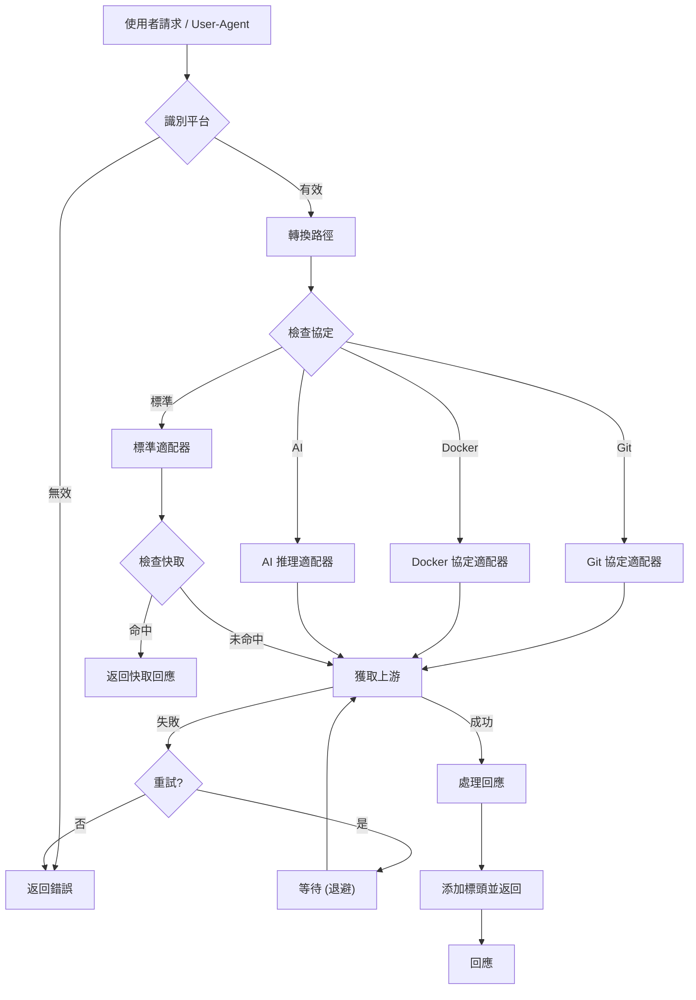
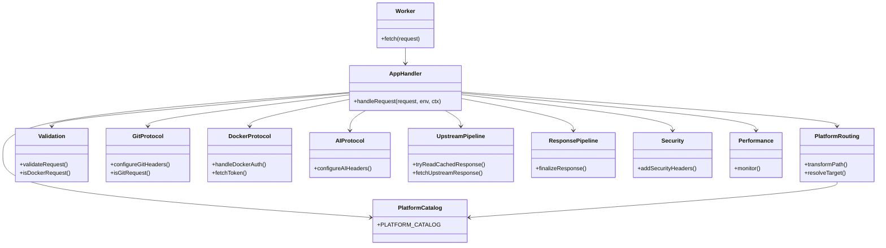

<div align="center">

# Xget 🚀

<a href="https://trendshift.io/repositories/14768" target="_blank"></a>

[![Ask Zread](https://img.shields.io/badge/Ask_Zread-_.svg?style=flat&color=00b0aa&labelColor=000000&logo=data%3Aimage%2Fsvg%2Bxml%3Bbase64%2CPHN2ZyB3aWR0aD0iMTYiIGhlaWdodD0iMTYiIHZpZXdCb3g9IjAgMCAxNiAxNiIgZmlsbD0ibm9uZSIgeG1sbnM9Imh0dHA6Ly93d3cudzMub3JnLzIwMDAvc3ZnIj4KPHBhdGggZD0iTTQuOTYxNTYgMS42MDAxSDIuMjQxNTZDMS44ODgxIDEuNjAwMSAxLjYwMTU2IDEuODg2NjQgMS42MDE1NiAyLjI0MDFWNC45NjAxQzEuNjAxNTYgNS4zMTM1NiAxLjg4ODEgNS42MDAxIDIuMjQxNTYgNS42MDAxSDQuOTYxNTZDNS4zMTUwMiA1LjYwMDEgNS42MDE1NiA1LjMxMzU2IDUuNjAxNTYgNC45NjAxVjIuMjQwMUM1LjYwMTU2IDEuODg2NjQgNS4zMTUwMiAxLjYwMDEgNC45NjE1NiAxLjYwMDFaIiBmaWxsPSIjZmZmIi8%2BCjxwYXRoIGQ9Ik00Ljk2MTU2IDEwLjM5OTlIMi4yNDE1NkMxLjg4ODEgMTAuMzk5OSAxLjYwMTU2IDEwLjY4NjQgMS42MDE1NiAxMS4wMzk5VjEzLjc1OTlDMS42MDE1NiAxNC4xMTM0IDEuODg4MSAxNC4zOTk5IDIuMjQxNTYgMTQuMzk5OUg0Ljk2MTU2QzUuMzE1MDIgMTQuMzk5OSA1LjYwMTU2IDE0LjExMzQgNS42MDE1NiAxMy43NTk5VjExLjAzOTlDNS42MDE1NiAxMC42ODY0IDUuMzE1MDIgMTAuMzk5OSA0Ljk2MTU2IDEwLjM5OTlaIiBmaWxsPSIjZmZmIi8%2BCjxwYXRoIGQ9Ik0xMy43NTg0IDEuNjAwMUgxMS4wMzg0QzEwLjY4NSAxLjYwMDEgMTAuMzk4NCAxLjg4NjY0IDEwLjM5ODQgMi4yNDAxVjQuOTYwMUMxMC4zOTg0IDUuMzEzNTYgMTAuNjg1IDUuNjAwMSAxMS4wMzg0IDUuNjAwMUgxMy43NTg0QzE0LjExMTkgNS42MDAxIDE0LjM5ODQgNS4zMTM1NiAxNC4zOTg0IDQuOTYwMVYyLjI0MDFDMTQuMzk4NCAxLjg4NjY0IDE0LjExMTkgMS42MDAxIDEzLjc1ODQgMS42MDAxWiIgZmlsbD0iI2ZmZiIvPgo8cGF0aCBkPSJNNCAxMkwxMiA0TDQgMTJaIiBmaWxsPSIjZmZmIi8%2BCjxwYXRoIGQ9Ik00IDEyTDEyIDQiIHN0cm9rZT0iI2ZmZiIgc3Ryb2tlLXdpZHRoPSIxLjUiIHN0cm9rZS1saW5lY2FwPSJyb3VuZCIvPgo8L3N2Zz4K&logoColor=ffffff)](https://zread.ai/xixu-me/Xget)
[](https://deepwiki.com/xixu-me/Xget)
[](https://codecov.io/github/xixu-me/xget)
[](#生態系統整合)
[](#生態系統整合)

[](#部署到-cloudflare-workers)
[](#部署到-edgeone-pages)
[](#部署到-vercel)
[](#部署到-netlify)
[](#部署到-deno-deploy)
[](#自託管部署)
[](#自託管部署)

[English](README.md) | [汉语（简体）](README.zh-Hans.md) | **漢語（繁體）**

</div>

> [!TIP]
> 歡迎加入「Xget 開源與 AI 交流群」，一起交流開源專案、AI 應用、工程實踐、效率工具和獨立開發；如果你也在做產品、寫程式、折騰專案或者對開源和 AI 感興趣，歡迎[**進群**](https://file.xi-xu.me/QR%20Codes/%E7%BE%A4%E4%BA%8C%E7%BB%B4%E7%A0%81.png)認識更多認真做事、樂於分享的朋友。

面向開發者資源的超高效能、安全、一體化加速引擎，為程式碼託管、模型和資料集中心、軟體包管理儲存庫、容器註冊表、AI 推理供應商等提供統一、高效的加速，同時替你處理快取、重試、安全回應標頭，以及各種協定相容行為。

技術深度解析文章：**[《深入剖析 Xget：一個高效能、多協定、高安全性的開發者資源加速引擎》](https://blog.xi-xu.me/en/2025/10/07/Deep-Dive-into-Xget.html)**。

受邀入駐
[GitCode](https://gitcode.com/xixu-me/xget)，並被認證為 G-Star 畢業專案。作為「一個被廣泛使用的公共專案」，獲得 OpenAI 的
[Codex for Open Source](https://developers.openai.com/community/codex-for-oss)
計畫支援，也獲得多位技術博主自發推薦，包括[阮一峰](https://www.ruanyifeng.com/blog/2025/12/weekly-issue-379.html#:~:text=Xget)、[GitHubDaily](https://x.com/i/status/1956204203937829256)、[魚 C](https://www.bilibili.com/video/BV1EeeBzVEop/)、[玄離 199](https://www.bilibili.com/video/BV197hqzsE8Y/?t=8)
等。感謝所有支持、分享、推薦和實際使用 Xget 的個人、團隊與社群。

## 支援的平台

> [!NOTE]
> 下方徽章會跳轉到 README 中對應的使用或部署章節。

[](#github)
[](#gitlab)
[](#gitea)
[](#codeberg)
[](#sourceforge)
[](#aosp-android-開源專案)
[](#hugging-face-鏡像)
[](#civitai-ai-模型平台)
[](#npm-軟體包管理加速)
[](#python-軟體包管理加速)
[](#conda-軟體包管理加速)
[](#maven-軟體包管理加速)
[](#apache-軟體下載加速)
[](#gradle-軟體包管理加速)
[](#homebrew-軟體包管理加速)
[](#ruby-軟體包管理加速)
[](#r-軟體包管理加速)
[](#perl-軟體包管理加速)
[](#texlatex-軟體包管理加速)
[](#go-模組加速)
[](#nuget-軟體包管理加速)
[](#rust-軟體包管理加速)
[](#php-軟體包管理加速)
[](#flathub-儲存庫鏡像)
[](#debianubuntu-apt-配置)
[](#debianubuntu-apt-配置)
[](#fedora-dnf-配置)
[](#rocky-linux-dnf-配置)
[](#opensuse-zypper-配置)
[](#arch-linux-pacman-配置)
[](#arxiv-論文下載)
[](#f-droid-儲存庫鏡像)
[](#jenkins-外掛程式下載)
[](#容器註冊表)
[](#ai-推理供應商)

## 快速開始

**預部署實例：`xget.xi-xu.me`** - 僅適合評估與試用，正式環境或對可用性敏感的場景建議自行部署。

> [!WARNING]
> 如果你選擇自託管，除非你明確要做公開鏡像，否則請至少加上驗證、IP 白名單，或同時啟用兩者。

**URL 轉換器：**[**`xuc.xi-xu.me`**](https://xuc.xi-xu.me) - 一鍵轉換任意支援平台的 URL 為 Xget 的加速格式

**Agent Skills：`npx skills add xixu-me/skills -s xget`**

## 為什麼選擇 Xget

### 面向效能的設計

- **全球邊緣執行環境**：基於 Cloudflare
  Workers，盡量讓請求更靠近使用者與上游服務
- **協定感知處理**：支援 HTTP/3、Range 請求、Git 流量、容器註冊表流程與 AI 推理 API
- **快取與重試鏈路**：對可相容回應提供邊緣快取，對暫時性上游失敗提供重試，並對支援的平台做請求規範化
- **連線重用**：在執行環境與上游允許的前提下，重用標準 HTTP
  keep-alive 與連線重用能力
- **請求耗時可觀測**：在協定相容的情況下，可透過 `X-Performance-Metrics`
  回應標頭暴露階段性耗時資訊

### 多平台深度整合

- **一站式多平台支援**：統一支援各種開發場景中的主流平台
- **智慧識別與轉換**：自動識別平台前綴並轉換為目標平台的正確 URL 結構
- **一致的加速體驗**：無論檔案類型或來源，均可享受統一且穩定的極速下載體驗

### 企業級安全保障

- **多層安全標頭**：
  - `Strict-Transport-Security`：強制 HTTPS 傳輸，預防中間人攻擊
  - `X-Frame-Options: DENY`：防止點擊劫持攻擊
  - `Content-Security-Policy`：嚴格的內容安全策略
  - `Referrer-Policy`：控制參照來源資訊洩露
  - `Permissions-Policy`：預設限制瀏覽器中的隱私敏感能力
  - `X-XSS-Protection`：面向舊版瀏覽器的相容性回應標頭
- **請求驗證機制**：
  - HTTP 方法白名單：常規請求限制為 GET/HEAD，而 Git/LFS、容器映像儲存庫、AI 推理與 Hugging
    Face API 請求會按需允許 `POST`、`PUT`、`PATCH` 和 `DELETE`
  - 路徑長度限制：防止超長 URL 攻擊（最大 2048 字元）
  - 輸入清理：防止路徑遍歷和注入攻擊
- **逾時保護**：30 秒請求逾時，防止資源耗盡和惡意請求

### 現代架構與可靠性

- **智慧重試機制**：
  - 最大 3 次重試，線性延遲策略（1000ms × 重試次數）
  - 自動錯誤恢復，提高下載成功率
  - 逾時檢測和中斷處理
- **高效快取策略**：
  - 基於策略的快取時長，讓可變中繼資料保持新鮮，同時對不可變製品使用更長快取
  - Git 操作跳過快取，確保即時性
  - 基於 Cloudflare Cache API 和 Cloudflare fetch 快取控制的邊緣快取
- **效能監控系統**：
  - 內建 `PerformanceMonitor` 類別，即時追蹤請求各階段耗時
  - 透過 `X-Performance-Metrics` 回應標頭提供詳細效能數據
  - 支援快取命中率統計和最佳化建議

### Git 協定完全相容

- **智慧協定檢測**：
  - 自動識別 Git 特定端點（`/info/refs`、`/git-upload-pack`、`/git-receive-pack`）
  - 檢測 Git 用戶端 User-Agent 模式
  - 支援 `service=git-upload-pack` 等查詢參數
- **完整操作支援**：
  - `git clone`：完整儲存庫克隆，支援淺克隆和分支指定
  - `git push`：程式碼推送和分支管理
  - `git pull/fetch`：增量更新和遠端同步
  - `git submodule`：子模組遞迴克隆
- **協定最佳化**：
  - 保持 Git 專用請求標頭和驗證資訊
  - 智慧 User-Agent 處理（預設 `git/2.34.1`）
  - 支援 Git LFS 大檔案傳輸

### 生態系統整合

- **專用瀏覽器擴充功能**：[Xget Now](https://github.com/xixu-me/Xget-Now)
  提供無縫體驗
  - 自動 URL 轉址，無需手動修改 URL
  - 支援自訂 Xget 實例網域
  - 多平台偏好設定和黑白名單管理
  - 本地處理，確保隱私安全
- **下載工具相容性**：完美支援 wget、cURL、aria2、IDM 等主流下載工具
- **CI/CD 整合**：可直接在 GitHub Actions、GitLab CI 等環境中使用

## 系統架構

### 請求處理流程



### 組件架構



## URL 轉換規則

使用預部署實例 **`xget.xi-xu.me`**
或您自己部署的實例，只需簡單替換網域並新增平台前綴：

### 轉換格式

| 平台             | 平台前綴    | 原始 URL 格式                                                       | 加速 URL 格式                                                                    |
| ---------------- | ----------- | ------------------------------------------------------------------- | -------------------------------------------------------------------------------- |
| GitHub           | `gh`        | `https://github.com/...`                                            | `https://xget.xi-xu.me/gh/...`                                                   |
| GitHub Gist      | `gist`      | `https://gist.github.com/...`                                       | `https://xget.xi-xu.me/gist/...`                                                 |
| GitLab           | `gl`        | `https://gitlab.com/...`                                            | `https://xget.xi-xu.me/gl/...`                                                   |
| Gitea            | `gitea`     | `https://gitea.com/...`                                             | `https://xget.xi-xu.me/gitea/...`                                                |
| Codeberg         | `codeberg`  | `https://codeberg.org/...`                                          | `https://xget.xi-xu.me/codeberg/...`                                             |
| SourceForge      | `sf`        | `https://sourceforge.net/...`                                       | `https://xget.xi-xu.me/sf/...`                                                   |
| AOSP             | `aosp`      | `https://android.googlesource.com/...`                              | `https://xget.xi-xu.me/aosp/...`                                                 |
| Hugging Face     | `hf`        | `https://huggingface.co/...`                                        | `https://xget.xi-xu.me/hf/...`                                                   |
| Civitai          | `civitai`   | `https://civitai.com/...`                                           | `https://xget.xi-xu.me/civitai/...`                                              |
| npm              | `npm`       | `https://registry.npmjs.org/...`                                    | `https://xget.xi-xu.me/npm/...`                                                  |
| PyPI             | `pypi`      | `https://pypi.org/...`                                              | `https://xget.xi-xu.me/pypi/...`                                                 |
| conda            | `conda`     | `https://repo.anaconda.com/...` 和 `https://conda.anaconda.org/...` | `https://xget.xi-xu.me/conda/...` 和 `https://xget.xi-xu.me/conda/community/...` |
| Maven            | `maven`     | `https://repo1.maven.org/...`                                       | `https://xget.xi-xu.me/maven/...`                                                |
| Apache           | `apache`    | `https://downloads.apache.org/...`                                  | `https://xget.xi-xu.me/apache/...`                                               |
| Gradle           | `gradle`    | `https://plugins.gradle.org/...`                                    | `https://xget.xi-xu.me/gradle/...`                                               |
| Homebrew         | `homebrew`  | `https://github.com/Homebrew/...`                                   | `https://xget.xi-xu.me/homebrew/...`                                             |
| RubyGems         | `rubygems`  | `https://rubygems.org/...`                                          | `https://xget.xi-xu.me/rubygems/...`                                             |
| CRAN             | `cran`      | `https://cran.r-project.org/...`                                    | `https://xget.xi-xu.me/cran/...`                                                 |
| CPAN             | `cpan`      | `https://www.cpan.org/...`                                          | `https://xget.xi-xu.me/cpan/...`                                                 |
| CTAN             | `ctan`      | `https://tug.ctan.org/...`                                          | `https://xget.xi-xu.me/ctan/...`                                                 |
| Go 模組          | `golang`    | `https://proxy.golang.org/...`                                      | `https://xget.xi-xu.me/golang/...`                                               |
| NuGet            | `nuget`     | `https://api.nuget.org/...`                                         | `https://xget.xi-xu.me/nuget/...`                                                |
| Rust Crates      | `crates`    | `https://crates.io/...`                                             | `https://xget.xi-xu.me/crates/...`                                               |
| Packagist        | `packagist` | `https://repo.packagist.org/...`                                    | `https://xget.xi-xu.me/packagist/...`                                            |
| Flathub          | `flathub`   | `https://dl.flathub.org/...`                                        | `https://xget.xi-xu.me/flathub/...`                                              |
| Debian           | `debian`    | `https://deb.debian.org/...`                                        | `https://xget.xi-xu.me/debian/...`                                               |
| Ubuntu           | `ubuntu`    | `https://archive.ubuntu.com/...`                                    | `https://xget.xi-xu.me/ubuntu/...`                                               |
| Fedora           | `fedora`    | `https://dl.fedoraproject.org/...`                                  | `https://xget.xi-xu.me/fedora/...`                                               |
| Rocky Linux      | `rocky`     | `https://download.rockylinux.org/...`                               | `https://xget.xi-xu.me/rocky/...`                                                |
| openSUSE         | `opensuse`  | `https://download.opensuse.org/...`                                 | `https://xget.xi-xu.me/opensuse/...`                                             |
| Arch Linux       | `arch`      | `https://geo.mirror.pkgbuild.com/...`                               | `https://xget.xi-xu.me/arch/...`                                                 |
| arXiv            | `arxiv`     | `https://arxiv.org/...`                                             | `https://xget.xi-xu.me/arxiv/...`                                                |
| F-Droid          | `fdroid`    | `https://f-droid.org/...`                                           | `https://xget.xi-xu.me/fdroid/...`                                               |
| Jenkins 外掛程式 | `jenkins`   | `https://updates.jenkins.io/...`                                    | `https://xget.xi-xu.me/jenkins/...`                                              |
| 容器註冊表       | `cr`        | 見[容器註冊表](#容器註冊表)                                         | 見[容器註冊表](#容器註冊表)                                                      |
| AI 推理供應商    | `ip`        | 見 [AI 推理供應商](#ai-推理供應商)                                  | 見 [AI 推理供應商](#ai-推理供應商)                                               |

### 各平台轉換範例

#### GitHub

```url
# 原始 URL
https://github.com/microsoft/vscode/archive/refs/heads/main.zip

# 轉換後（新增 gh 前綴）
https://xget.xi-xu.me/gh/microsoft/vscode/archive/refs/heads/main.zip
```

#### GitHub Gist

```url
# 原始 URL
https://gist.github.com/xixu-me/e2ea9db6b1f143892495f796fef18631/raw/3b8807172ee492d0da3a7e370b0fb88fc97b53e6/Free-ChatGPT-Paid-Plan.md

# 轉換後（新增 gist 前綴）
https://xget.xi-xu.me/gist/xixu-me/e2ea9db6b1f143892495f796fef18631/raw/3b8807172ee492d0da3a7e370b0fb88fc97b53e6/Free-ChatGPT-Paid-Plan.md
```

#### GitLab

```url
# 原始 URL
https://gitlab.com/gitlab-org/gitlab/-/archive/master/gitlab-master.zip

# 轉換後（新增 gl 前綴）
https://xget.xi-xu.me/gl/gitlab-org/gitlab/-/archive/master/gitlab-master.zip
```

#### Gitea

```url
# 原始 URL
https://gitea.com/gitea/gitea/archive/master.zip

# 轉換後（新增 gitea 前綴）
https://xget.xi-xu.me/gitea/gitea/gitea/archive/master.zip
```

#### Codeberg

```url
# 原始 URL
https://codeberg.org/forgejo/forgejo/archive/forgejo.zip

# 轉換後（新增 codeberg 前綴）
https://xget.xi-xu.me/codeberg/forgejo/forgejo/archive/forgejo.zip
```

#### SourceForge

```url
# 原始 URL
https://sourceforge.net/projects/sevenzip/files/7-Zip/23.01/7z2301-x64.exe/download

# 轉換後（新增 sf 前綴）
https://xget.xi-xu.me/sf/projects/sevenzip/files/7-Zip/23.01/7z2301-x64.exe/download
```

#### AOSP (Android 開源專案)

```url
# AOSP 專案原始 URL
https://android.googlesource.com/platform/frameworks/base

# 轉換後（新增 aosp 前綴）
https://xget.xi-xu.me/aosp/platform/frameworks/base

# AOSP 裝置樹原始 URL
https://android.googlesource.com/device/google/pixel

# 轉換後（新增 aosp 前綴）
https://xget.xi-xu.me/aosp/device/google/pixel
```

#### Hugging Face

```url
# 模型檔案原始 URL
https://huggingface.co/microsoft/DialoGPT-medium/resolve/main/pytorch_model.bin

# 轉換後（新增 hf 前綴）
https://xget.xi-xu.me/hf/microsoft/DialoGPT-medium/resolve/main/pytorch_model.bin

# 資料集檔案原始 URL
https://huggingface.co/datasets/rajpurkar/squad/resolve/main/plain_text/train-00000-of-00001.parquet

# 轉換後（新增 hf 前綴）
https://xget.xi-xu.me/hf/datasets/rajpurkar/squad/resolve/main/plain_text/train-00000-of-00001.parquet
```

#### Civitai

```url
# AI 模型下載原始 URL
https://civitai.com/api/download/models/128713

# 轉換後（新增 civitai 前綴）
https://xget.xi-xu.me/civitai/api/download/models/128713

# 模型 API 原始 URL
https://civitai.com/api/v1/models/7240

# 轉換後（新增 civitai 前綴）
https://xget.xi-xu.me/civitai/api/v1/models/7240

# 模型版本 API 原始 URL
https://civitai.com/api/v1/model-versions/128713

# 轉換後（新增 civitai 前綴）
https://xget.xi-xu.me/civitai/api/v1/model-versions/128713
```

#### npm

```url
# 軟體包檔案原始 URL
https://registry.npmjs.org/react/-/react-18.2.0.tgz

# 轉換後（新增 npm 前綴）
https://xget.xi-xu.me/npm/react/-/react-18.2.0.tgz

# 軟體包元資料原始 URL
https://registry.npmjs.org/lodash

# 轉換後（新增 npm 前綴）
https://xget.xi-xu.me/npm/lodash
```

#### PyPI

```url
# Python 軟體包檔案原始 URL
https://pypi.org/packages/source/r/requests/requests-2.31.0.tar.gz

# 轉換後（新增 pypi 前綴）
https://xget.xi-xu.me/pypi/packages/source/r/requests/requests-2.31.0.tar.gz

# Wheel 檔案原始 URL
https://pypi.org/packages/py3/r/requests/requests-2.31.0-py3-none-any.whl

# 轉換後（新增 pypi 前綴）
https://xget.xi-xu.me/pypi/packages/py3/r/requests/requests-2.31.0-py3-none-any.whl
```

#### conda

```url
# 預設頻道軟體包檔案原始 URL
https://repo.anaconda.com/pkgs/main/linux-64/numpy-1.24.3-py311h08b1b3b_1.conda

# 轉換後（新增 conda 前綴）
https://xget.xi-xu.me/conda/pkgs/main/linux-64/numpy-1.24.3-py311h08b1b3b_1.conda

# 社群頻道元資料原始 URL
https://conda.anaconda.org/conda-forge/linux-64/repodata.json

# 轉換後（新增 conda/community 前綴）
https://xget.xi-xu.me/conda/community/conda-forge/linux-64/repodata.json
```

#### Maven

```url
# Maven 中央儲存庫 JAR 檔案原始 URL
https://repo1.maven.org/maven2/org/springframework/spring-core/5.3.21/spring-core-5.3.21.jar

# 轉換後（新增 maven 前綴）
https://xget.xi-xu.me/maven/maven2/org/springframework/spring-core/5.3.21/spring-core-5.3.21.jar

# Maven 元資料原始 URL
https://repo1.maven.org/maven2/org/apache/commons/commons-lang3/maven-metadata.xml

# 轉換後（新增 maven 前綴）
https://xget.xi-xu.me/maven/maven2/org/apache/commons/commons-lang3/maven-metadata.xml
```

#### Apache 軟體下載

```url
# Apache 軟體下載原始 URL
https://downloads.apache.org/kafka/3.6.1/kafka_2.13-3.6.1.tgz

# 轉換後（新增 apache 前綴）
https://xget.xi-xu.me/apache/kafka/3.6.1/kafka_2.13-3.6.1.tgz

# Apache Maven 下載原始 URL
https://downloads.apache.org/maven/maven-3/3.9.5/binaries/apache-maven-3.9.5-bin.tar.gz

# 轉換後（新增 apache 前綴）
https://xget.xi-xu.me/apache/maven/maven-3/3.9.5/binaries/apache-maven-3.9.5-bin.tar.gz

# Apache Spark 下載原始 URL
https://downloads.apache.org/spark/spark-3.5.0/spark-3.5.0-bin-hadoop3.tgz

# 轉換後（新增 apache 前綴）
https://xget.xi-xu.me/apache/spark/spark-3.5.0/spark-3.5.0-bin-hadoop3.tgz
```

#### Gradle

```url
# Gradle 外掛程式入口網站 JAR 檔案原始 URL
https://plugins.gradle.org/m2/org/gradle/gradle-hello-world-plugin/0.2/gradle-hello-world-plugin-0.2.jar

# 轉換後（新增 gradle 前綴）
https://xget.xi-xu.me/gradle/m2/org/gradle/gradle-hello-world-plugin/0.2/gradle-hello-world-plugin-0.2.jar

# Gradle 外掛程式元資料原始 URL
https://plugins.gradle.org/m2/com/github/ben-manes/gradle-versions-plugin/0.51.0/gradle-versions-plugin-0.51.0.module

# 轉換後（新增 gradle 前綴）
https://xget.xi-xu.me/gradle/m2/com/github/ben-manes/gradle-versions-plugin/0.51.0/gradle-versions-plugin-0.51.0.module
```

#### Homebrew

```url
# Homebrew 公式儲存庫原始 URL
https://github.com/Homebrew/homebrew-core/raw/HEAD/Formula/g/git.rb

# 轉換後（新增 homebrew 前綴）
https://xget.xi-xu.me/homebrew/homebrew-core/raw/HEAD/Formula/g/git.rb

# Homebrew API 原始 URL
https://formulae.brew.sh/api/formula/git.json

# 轉換後（新增 homebrew/api 前綴）
https://xget.xi-xu.me/homebrew/api/formula/git.json

# Homebrew Bottles 原始 URL
https://ghcr.io/v2/homebrew/core/git/manifests/2.39.0

# 轉換後（新增 homebrew/bottles 前綴）
https://xget.xi-xu.me/homebrew/bottles/v2/homebrew/core/git/manifests/2.39.0
```

#### RubyGems

```url
# RubyGems 軟體包檔案原始 URL
https://rubygems.org/gems/rails-7.0.4.gem

# 轉換後（新增 rubygems 前綴）
https://xget.xi-xu.me/rubygems/gems/rails-7.0.4.gem

# RubyGems API 原始 URL
https://rubygems.org/api/v1/gems/nokogiri.json

# 轉換後（新增 rubygems 前綴）
https://xget.xi-xu.me/rubygems/api/v1/gems/nokogiri.json
```

#### CRAN

```url
# CRAN 軟體包檔案原始 URL
https://cran.r-project.org/src/contrib/ggplot2_3.5.2.tar.gz

# 轉換後（新增 cran 前綴）
https://xget.xi-xu.me/cran/src/contrib/ggplot2_3.5.2.tar.gz

# CRAN 軟體包元資料原始 URL
https://cran.r-project.org/web/packages/dplyr/DESCRIPTION

# 轉換後（新增 cran 前綴）
https://xget.xi-xu.me/cran/web/packages/dplyr/DESCRIPTION
```

#### CPAN (Perl 軟體包管理)

```url
# CPAN 模組原始 URL
https://www.cpan.org/modules/by-module/DBI/DBI-1.643.tar.gz

# 轉換後（新增 cpan 前綴）
https://xget.xi-xu.me/cpan/modules/by-module/DBI/DBI-1.643.tar.gz

# CPAN 作者軟體包原始 URL
https://www.cpan.org/authors/id/T/TI/TIMB/DBI-1.643.tar.gz

# 轉換後（新增 cpan 前綴）
https://xget.xi-xu.me/cpan/authors/id/T/TI/TIMB/DBI-1.643.tar.gz
```

#### CTAN (TeX/LaTeX 軟體包管理)

```url
# CTAN 軟體包檔案原始 URL
https://tug.ctan.org/tex-archive/macros/latex/contrib/beamer.zip

# 轉換後（新增 ctan 前綴）
https://xget.xi-xu.me/ctan/tex-archive/macros/latex/contrib/beamer.zip

# CTAN 字體檔案原始 URL
https://tug.ctan.org/tex-archive/fonts/cm/pk/ljfour/public/cm/dpi600/cmr10.pk

# 轉換後（新增 ctan 前綴）
https://xget.xi-xu.me/ctan/tex-archive/fonts/cm/pk/ljfour/public/cm/dpi600/cmr10.pk
```

#### Go 模組

```url
# Go 模組代理原始 URL
https://proxy.golang.org/github.com/gin-gonic/gin/@v/v1.9.1.zip

# 轉換後（新增 golang 前綴）
https://xget.xi-xu.me/golang/github.com/gin-gonic/gin/@v/v1.9.1.zip

# Go 模組資訊原始 URL
https://proxy.golang.org/github.com/gorilla/mux/@v/list

# 轉換後（新增 golang 前綴）
https://xget.xi-xu.me/golang/github.com/gorilla/mux/@v/list
```

#### NuGet

```url
# NuGet 軟體包下載原始 URL
https://api.nuget.org/v3-flatcontainer/newtonsoft.json/13.0.3/newtonsoft.json.13.0.3.nupkg

# 轉換後（新增 nuget 前綴）
https://xget.xi-xu.me/nuget/v3-flatcontainer/newtonsoft.json/13.0.3/newtonsoft.json.13.0.3.nupkg

# NuGet 軟體包元資料原始 URL
https://api.nuget.org/v3/registration5-semver1/microsoft.aspnetcore.app/index.json

# 轉換後（新增 nuget 前綴）
https://xget.xi-xu.me/nuget/v3/registration5-semver1/microsoft.aspnetcore.app/index.json
```

#### Rust Crates

```url
# Crate 下載原始 URL
https://crates.io/api/v1/crates/serde/1.0.0/download

# 轉換後（新增 crates 前綴）
https://xget.xi-xu.me/crates/serde/1.0.0/download

# Crate 元資料原始 URL
https://crates.io/api/v1/crates/serde

# 轉換後（新增 crates 前綴）
https://xget.xi-xu.me/crates/serde

# Crate 搜尋原始 URL
https://crates.io/api/v1/crates?q=serde

# 轉換後（新增 crates 前綴）
https://xget.xi-xu.me/crates/?q=serde
```

#### Packagist

```url
# Packagist 軟體包元資料原始 URL
https://repo.packagist.org/p2/symfony/console.json

# 轉換後（新增 packagist 前綴）
https://xget.xi-xu.me/packagist/p2/symfony/console.json

# Packagist 軟體包清單原始 URL
https://repo.packagist.org/packages/list.json

# 轉換後（新增 packagist 前綴）
https://xget.xi-xu.me/packagist/packages/list.json
```

#### Flathub

```url
# Flathub 儲存庫原始 URL
https://dl.flathub.org/repo/summary

# 轉換後（新增 flathub 前綴）
https://xget.xi-xu.me/flathub/repo/summary

# Flathub 應用程式引用原始 URL
https://dl.flathub.org/repo/appstream/org.gnome.gedit.flatpakref

# 轉換後（新增 flathub 前綴）
https://xget.xi-xu.me/flathub/repo/appstream/org.gnome.gedit.flatpakref
```

#### Linux 發行版

```url
# Debian 軟體包原始 URL
https://deb.debian.org/debian/pool/main/c/curl/curl_7.88.1-10+deb12u4_amd64.deb

# 轉換後（新增 debian 前綴）
https://xget.xi-xu.me/debian/debian/pool/main/c/curl/curl_7.88.1-10+deb12u4_amd64.deb

# Ubuntu 軟體包原始 URL
https://archive.ubuntu.com/ubuntu/pool/main/g/git/git_2.34.1-1ubuntu1.9_amd64.deb

# 轉換後（新增 ubuntu 前綴）
https://xget.xi-xu.me/ubuntu/ubuntu/pool/main/g/git/git_2.34.1-1ubuntu1.9_amd64.deb

# Fedora 軟體包原始 URL
https://dl.fedoraproject.org/pub/fedora/linux/releases/39/Everything/x86_64/os/Packages/n/nginx-1.24.0-1.fc39.x86_64.rpm

# 轉換後（新增 fedora 前綴）
https://xget.xi-xu.me/fedora/pub/fedora/linux/releases/39/Everything/x86_64/os/Packages/n/nginx-1.24.0-1.fc39.x86_64.rpm

# Rocky Linux 軟體包原始 URL
https://download.rockylinux.org/pub/rocky/9/BaseOS/x86_64/os/Packages/b/bash-5.1.8-6.el9.x86_64.rpm

# 轉換後（新增 rocky 前綴）
https://xget.xi-xu.me/rocky/pub/rocky/9/BaseOS/x86_64/os/Packages/b/bash-5.1.8-6.el9.x86_64.rpm

# openSUSE 軟體包原始 URL
https://download.opensuse.org/distribution/leap/15.5/repo/oss/x86_64/vim-9.0.1572-150500.20.8.1.x86_64.rpm

# 轉換後（新增 opensuse 前綴）
https://xget.xi-xu.me/opensuse/distribution/leap/15.5/repo/oss/x86_64/vim-9.0.1572-150500.20.8.1.x86_64.rpm

# Arch Linux 軟體包原始 URL
https://geo.mirror.pkgbuild.com/core/os/x86_64/linux-6.6.10.arch1-1-x86_64.pkg.tar.zst

# 轉換後（新增 arch 前綴）
https://xget.xi-xu.me/arch/core/os/x86_64/linux-6.6.10.arch1-1-x86_64.pkg.tar.zst
```

#### arXiv

```url
# arXiv 論文 PDF 原始 URL
https://arxiv.org/pdf/2301.07041.pdf

# 轉換後（新增 arxiv 前綴）
https://xget.xi-xu.me/arxiv/pdf/2301.07041.pdf

# arXiv 論文原始碼原始 URL
https://arxiv.org/e-print/2301.07041

# 轉換後（新增 arxiv 前綴）
https://xget.xi-xu.me/arxiv/e-print/2301.07041
```

#### F-Droid

```url
# F-Droid 應用程式 APK 原始 URL
https://f-droid.org/repo/org.fdroid.fdroid_1016050.apk

# 轉換後（新增 fdroid 前綴）
https://xget.xi-xu.me/fdroid/repo/org.fdroid.fdroid_1016050.apk

# F-Droid 應用程式元資料原始 URL
https://f-droid.org/api/v1/packages/org.fdroid.fdroid

# 轉換後（新增 fdroid 前綴）
https://xget.xi-xu.me/fdroid/api/v1/packages/org.fdroid.fdroid
```

#### Jenkins 外掛程式

```url
# Jenkins 更新中心原始 URL
https://updates.jenkins.io/update-center.json

# 轉換後（新增 jenkins 前綴）
https://xget.xi-xu.me/jenkins/update-center.json

# Jenkins 外掛程式下載原始 URL
https://updates.jenkins.io/download/plugins/maven-plugin/3.27/maven-plugin.hpi

# 轉換後（新增 jenkins 前綴）
https://xget.xi-xu.me/jenkins/download/plugins/maven-plugin/3.27/maven-plugin.hpi
```

#### 容器註冊表

Xget 支援多個容器註冊表，使用 `cr/[容器註冊表前綴]` 格式：

| 容器註冊表           | 容器註冊表前綴 | 原始 URL 格式                               | 加速 URL 格式                               |
| -------------------- | -------------- | ------------------------------------------- | ------------------------------------------- |
| Docker Hub           | `docker`       | `https://registry-1.docker.io/...`          | `https://xget.xi-xu.me/cr/docker/...`       |
| Quay.io              | `quay`         | `https://quay.io/...`                       | `https://xget.xi-xu.me/cr/quay/...`         |
| Google 容器註冊表    | `gcr`          | `https://gcr.io/...`                        | `https://xget.xi-xu.me/cr/gcr/...`          |
| Microsoft 容器註冊表 | `mcr`          | `https://mcr.microsoft.com/...`             | `https://xget.xi-xu.me/cr/mcr/...`          |
| Amazon Public ECR    | `ecr`          | `https://public.ecr.aws/...`                | `https://xget.xi-xu.me/cr/ecr/...`          |
| GitHub 容器註冊表    | `ghcr`         | `https://ghcr.io/...`                       | `https://xget.xi-xu.me/cr/ghcr/...`         |
| GitLab 容器註冊表    | `gitlab`       | `https://registry.gitlab.com/...`           | `https://xget.xi-xu.me/cr/gitlab/...`       |
| Red Hat 註冊表       | `redhat`       | `https://registry.redhat.io/...`            | `https://xget.xi-xu.me/cr/redhat/...`       |
| Oracle 容器註冊表    | `oracle`       | `https://container-registry.oracle.com/...` | `https://xget.xi-xu.me/cr/oracle/...`       |
| Cloudsmith           | `cloudsmith`   | `https://docker.cloudsmith.io/...`          | `https://xget.xi-xu.me/cr/cloudsmith/...`   |
| DigitalOcean 註冊表  | `digitalocean` | `https://registry.digitalocean.com/...`     | `https://xget.xi-xu.me/cr/digitalocean/...` |
| VMware 註冊表        | `vmware`       | `https://projects.registry.vmware.com/...`  | `https://xget.xi-xu.me/cr/vmware/...`       |
| Kubernetes 註冊表    | `k8s`          | `https://registry.k8s.io/...`               | `https://xget.xi-xu.me/cr/k8s/...`          |
| Heroku 註冊表        | `heroku`       | `https://registry.heroku.com/...`           | `https://xget.xi-xu.me/cr/heroku/...`       |
| SUSE 註冊表          | `suse`         | `https://registry.suse.com/...`             | `https://xget.xi-xu.me/cr/suse/...`         |
| openSUSE 註冊表      | `opensuse`     | `https://registry.opensuse.org/...`         | `https://xget.xi-xu.me/cr/opensuse/...`     |
| Gitpod 註冊表        | `gitpod`       | `https://registry.gitpod.io/...`            | `https://xget.xi-xu.me/cr/gitpod/...`       |

```url
# Docker Hub 原始 URL（官方鏡像）
https://registry-1.docker.io/v2/library/nginx/manifests/latest

# 轉換後（新增 cr/docker 前綴）
https://xget.xi-xu.me/cr/docker/v2/nginx/manifests/latest

# Docker Hub 原始 URL（使用者鏡像）
https://registry-1.docker.io/v2/nginxinc/nginx-unprivileged/manifests/latest

# 轉換後（新增 cr/docker 前綴）
https://xget.xi-xu.me/cr/docker/v2/nginxinc/nginx-unprivileged/manifests/latest

# GitHub 容器註冊表原始 URL
https://ghcr.io/v2/nginxinc/nginx-unprivileged/manifests/latest

# 轉換後（新增 cr/ghcr 前綴）
https://xget.xi-xu.me/cr/ghcr/v2/nginxinc/nginx-unprivileged/manifests/latest

# Google 容器註冊表原始 URL
https://gcr.io/v2/distroless/base/manifests/latest

# 轉換後（新增 cr/gcr 前綴）
https://xget.xi-xu.me/cr/gcr/v2/distroless/base/manifests/latest
```

應用場景見[容器鏡像加速](#容器鏡像加速)。

#### AI 推理供應商

Xget 支援眾多主流 AI 推理供應商的 API 加速，使用 `ip/[AI 推理供應商前綴]` 格式：

| AI 推理供應商  | AI 推理供應商前綴 | 原始 URL 格式                                   | 加速 URL 格式                                |
| -------------- | ----------------- | ----------------------------------------------- | -------------------------------------------- |
| OpenAI         | `openai`          | `https://api.openai.com/...`                    | `https://xget.xi-xu.me/ip/openai/...`        |
| Anthropic      | `anthropic`       | `https://api.anthropic.com/...`                 | `https://xget.xi-xu.me/ip/anthropic/...`     |
| Gemini         | `gemini`          | `https://generativelanguage.googleapis.com/...` | `https://xget.xi-xu.me/ip/gemini/...`        |
| Vertex AI      | `vertexai`        | `https://aiplatform.googleapis.com/...`         | `https://xget.xi-xu.me/ip/vertexai/...`      |
| Cohere         | `cohere`          | `https://api.cohere.ai/...`                     | `https://xget.xi-xu.me/ip/cohere/...`        |
| Mistral AI     | `mistralai`       | `https://api.mistral.ai/...`                    | `https://xget.xi-xu.me/ip/mistralai/...`     |
| xAI            | `xai`             | `https://api.x.ai/...`                          | `https://xget.xi-xu.me/ip/xai/...`           |
| GitHub Models  | `githubmodels`    | `https://models.github.ai/...`                  | `https://xget.xi-xu.me/ip/githubmodels/...`  |
| NVIDIA API     | `nvidiaapi`       | `https://integrate.api.nvidia.com/...`          | `https://xget.xi-xu.me/ip/nvidiaapi/...`     |
| Perplexity     | `perplexity`      | `https://api.perplexity.ai/...`                 | `https://xget.xi-xu.me/ip/perplexity/...`    |
| Groq           | `groq`            | `https://api.groq.com/...`                      | `https://xget.xi-xu.me/ip/groq/...`          |
| Cerebras       | `cerebras`        | `https://api.cerebras.ai/...`                   | `https://xget.xi-xu.me/ip/cerebras/...`      |
| SambaNova      | `sambanova`       | `https://api.sambanova.ai/...`                  | `https://xget.xi-xu.me/ip/sambanova/...`     |
| Siray          | `siray`           | `https://api.siray.ai/...`                      | `https://xget.xi-xu.me/ip/siray/...`         |
| HF Inference   | `huggingface`     | `https://router.huggingface.co/...`             | `https://xget.xi-xu.me/ip/huggingface/...`   |
| Together       | `together`        | `https://api.together.xyz/...`                  | `https://xget.xi-xu.me/ip/together/...`      |
| Replicate      | `replicate`       | `https://api.replicate.com/...`                 | `https://xget.xi-xu.me/ip/replicate/...`     |
| Fireworks      | `fireworks`       | `https://api.fireworks.ai/...`                  | `https://xget.xi-xu.me/ip/fireworks/...`     |
| Nebius         | `nebius`          | `https://api.studio.nebius.ai/...`              | `https://xget.xi-xu.me/ip/nebius/...`        |
| Jina           | `jina`            | `https://api.jina.ai/...`                       | `https://xget.xi-xu.me/ip/jina/...`          |
| Voyage AI      | `voyageai`        | `https://api.voyageai.com/...`                  | `https://xget.xi-xu.me/ip/voyageai/...`      |
| Fal AI         | `falai`           | `https://fal.run/...`                           | `https://xget.xi-xu.me/ip/falai/...`         |
| Novita         | `novita`          | `https://api.novita.ai/...`                     | `https://xget.xi-xu.me/ip/novita/...`        |
| Burncloud      | `burncloud`       | `https://ai.burncloud.com/...`                  | `https://xget.xi-xu.me/ip/burncloud/...`     |
| OpenRouter     | `openrouter`      | `https://openrouter.ai/...`                     | `https://xget.xi-xu.me/ip/openrouter/...`    |
| Poe            | `poe`             | `https://api.poe.com/...`                       | `https://xget.xi-xu.me/ip/poe/...`           |
| Featherless AI | `featherlessai`   | `https://api.featherless.ai/...`                | `https://xget.xi-xu.me/ip/featherlessai/...` |
| Hyperbolic     | `hyperbolic`      | `https://api.hyperbolic.xyz/...`                | `https://xget.xi-xu.me/ip/hyperbolic/...`    |

```url
# OpenAI API 原始 URL
https://api.openai.com/v1/chat/completions

# 轉換後（新增 ip/openai 前綴）
https://xget.xi-xu.me/ip/openai/v1/chat/completions

# Claude API 原始 URL
https://api.anthropic.com/v1/messages

# 轉換後（新增 ip/anthropic 前綴）
https://xget.xi-xu.me/ip/anthropic/v1/messages

# Gemini API 原始 URL
https://generativelanguage.googleapis.com/v1beta/models/gemini-2.5-flash:generateContent

# 轉換後（新增 ip/gemini 前綴）
https://xget.xi-xu.me/ip/gemini/v1beta/models/gemini-2.5-flash:generateContent

# HF Inference API 原始 URL
https://router.huggingface.co/hf-inference/models/openai/whisper-large-v3

# 轉換後（新增 ip/huggingface 前綴）
https://xget.xi-xu.me/ip/huggingface/hf-inference/models/openai/whisper-large-v3
```

應用場景見 [AI 推理 API 加速](#ai-推理-api-加速)。

## 應用場景

### Git 操作與配置

#### Git 操作

```bash
# 克隆儲存庫
git clone https://xget.xi-xu.me/gh/microsoft/vscode.git

# 克隆指定分支
git clone -b main https://xget.xi-xu.me/gh/facebook/react.git

# 淺克隆（僅最新提交）
git clone --depth 1 https://xget.xi-xu.me/gh/torvalds/linux.git

# 克隆 GitLab 儲存庫
git clone https://xget.xi-xu.me/gl/gitlab-org/gitlab.git

# 克隆 Gitea 儲存庫
git clone https://xget.xi-xu.me/gitea/gitea/gitea.git

# 克隆 Codeberg 儲存庫
git clone https://xget.xi-xu.me/codeberg/forgejo/forgejo.git

# 克隆 SourceForge 儲存庫
git clone https://xget.xi-xu.me/sf/projects/mingw-w64/code.git

# 克隆 AOSP 儲存庫
git clone https://xget.xi-xu.me/aosp/platform/frameworks/base.git

# 新增遠端儲存庫
git remote add upstream https://xget.xi-xu.me/gh/[擁有者]/[儲存庫].git

# 拉取更新
git pull https://xget.xi-xu.me/gh/microsoft/vscode.git main

# 子模組遞迴克隆
git clone --recursive https://xget.xi-xu.me/gh/[使用者名稱]/[帶子模組的儲存庫].git
```

#### Git 全域加速配置

```bash
# 為特定網域配置 Git 使用 Xget
git config --global url."https://xget.xi-xu.me/gh/".insteadOf "https://github.com/"
git config --global url."https://xget.xi-xu.me/gl/".insteadOf "https://gitlab.com/"
git config --global url."https://xget.xi-xu.me/gitea/".insteadOf "https://gitea.com/"
git config --global url."https://xget.xi-xu.me/codeberg/".insteadOf "https://codeberg.org/"
git config --global url."https://xget.xi-xu.me/sf/".insteadOf "https://sourceforge.net/"
git config --global url."https://xget.xi-xu.me/aosp/".insteadOf "https://android.googlesource.com/"

# 驗證配置
git config --global --get-regexp url

# 現在所有相關平台的 git clone 都會自動使用 Xget
git clone https://github.com/microsoft/vscode.git  # 自動轉換為 Xget URL
git clone https://gitlab.com/gitlab-org/gitlab.git  # 自動轉換為 Xget URL
git clone https://codeberg.org/forgejo/forgejo.git  # 自動轉換為 Xget URL
git clone https://android.googlesource.com/platform/frameworks/base.git  # 自動轉換為 Xget URL
```

### 主流下載工具整合

#### wget 下載

```bash
# 下載單一檔案
wget https://xget.xi-xu.me/gh/microsoft/vscode/archive/refs/heads/main.zip

# 斷點續傳
wget -c https://xget.xi-xu.me/hf/microsoft/DialoGPT-large/resolve/main/pytorch_model.bin

# 批次下載
wget -i urls.txt  # urls.txt 包含多個 Xget URL
```

#### cURL 下載

```bash
# 基本下載
curl -L -O https://xget.xi-xu.me/gh/golang/go/archive/refs/tags/go1.22.0.tar.gz

# 顯示進度列
curl -L --progress-bar -o model.bin https://xget.xi-xu.me/hf/openai/whisper-large-v3/resolve/main/pytorch_model.bin

# 設定 User-Agent
curl -L -H "User-Agent: MyApp/1.0" https://xget.xi-xu.me/gl/gitlab-org/gitlab-runner/-/archive/main/gitlab-runner-main.zip
```

#### aria2 多執行緒下載

```bash
# 多執行緒下載大檔案
aria2c -x 16 -s 16 https://xget.xi-xu.me/hf/microsoft/DialoGPT-large/resolve/main/pytorch_model.bin

# 斷點續傳
aria2c -c https://xget.xi-xu.me/gh/microsoft/vscode/archive/refs/heads/main.zip

# 批次下載設定檔
aria2c -i download-list.txt  # 包含多個 Xget URL 的檔案
```

### Hugging Face 鏡像

```python
import os
from transformers import AutoTokenizer, AutoModelForCausalLM

# 設定環境變數，讓 transformers 庫自動使用 Xget 鏡像
os.environ['HF_ENDPOINT'] = 'https://xget.xi-xu.me/hf'

# 定義模型名稱
model_name = 'microsoft/DialoGPT-medium'

print(f"正在從鏡像下載模型: {model_name}")

# 使用 AutoModelForCausalLM 來載入對話生成模型
# 由於上面設定了環境變數，這裡無需新增任何額外參數
tokenizer = AutoTokenizer.from_pretrained(model_name)
model = AutoModelForCausalLM.from_pretrained(model_name)

print("模型和分詞器載入成功！")

# 您現在可以使用 tokenizer 和 model 了
# 例如:
# new_user_input_ids = tokenizer.encode("Hello, how are you?", return_tensors='pt')
# chat_history_ids = model.generate(new_user_input_ids, max_length=1000, pad_token_id=tokenizer.eos_token_id)
# print(tokenizer.decode(chat_history_ids[:, new_user_input_ids.shape[-1]:][0], skip_special_tokens=True))
```

### Civitai AI 模型平台

```python
import requests

# 設定 API 基礎 URL 使用 Xget
base_url = "https://xget.xi-xu.me/civitai"

# 獲取模型資訊
def get_model_info(model_id):
    """獲取 Civitai 模型資訊"""
    url = f"{base_url}/api/v1/models/{model_id}"
    response = requests.get(url)
    return response.json()

# 下載模型
def download_model(model_version_id, output_path):
    """下載 Civitai 模型檔案"""
    download_url = f"{base_url}/api/download/models/{model_version_id}"

    print(f"正在下載模型版本 {model_version_id}...")

    response = requests.get(download_url, stream=True)
    response.raise_for_status()

    with open(output_path, 'wb') as f:
        for chunk in response.iter_content(chunk_size=8192):
            f.write(chunk)

    print(f"模型已下載到: {output_path}")

# 使用範例
model_id = 7240  # 範例模型 ID
model_info = get_model_info(model_id)
print(f"模型名稱: {model_info['name']}")

# 下載第一個模型版本
if model_info['modelVersions']:
    version_id = model_info['modelVersions'][0]['id']
    download_model(version_id, f"model_{version_id}.safetensors")
```

### npm 軟體包管理加速

#### 配置 npm 使用 Xget 鏡像

```bash
# 臨時使用 Xget 鏡像
npm install --registry https://xget.xi-xu.me/npm/

# 全域配置 npm 鏡像
npm config set registry https://xget.xi-xu.me/npm/

# 驗證配置
npm config get registry
```

#### 配置 Bun 使用 Xget 鏡像

```toml
# bunfig.toml（專案級）或 ~/.bunfig.toml（全域）
[install]
registry = "https://xget.xi-xu.me/npm/"
```

```bash
# 使用 Bun 安裝依賴項
bun install

# Bun 也支援 .npmrc，可直接重用既有的 npm 鏡像配置
echo "registry=https://xget.xi-xu.me/npm/" > .npmrc
bun install
```

#### 在專案中使用（npm / Bun）

```bash
# 在 .npmrc 檔案中配置專案級鏡像（npm / Bun 可重用）
echo "registry=https://xget.xi-xu.me/npm/" > .npmrc

# 使用 npm 安裝依賴項
npm install

# 使用 Bun 安裝依賴項
bun install
```

### Python 軟體包管理加速

#### 配置 pip 使用 Xget 鏡像

```bash
# 臨時使用 Xget 鏡像
pip install requests -i https://xget.xi-xu.me/pypi/simple/

# 全域配置 pip 鏡像
pip config set global.index-url https://xget.xi-xu.me/pypi/simple/
pip config set global.trusted-host xget.xi-xu.me

# 驗證配置
pip config list
```

#### 在專案中使用

```bash
# 建立 pip.conf 檔案（Linux/macOS）
mkdir -p ~/.pip
cat > ~/.pip/pip.conf << EOF
[global]
index-url = https://xget.xi-xu.me/pypi/simple/
trusted-host = xget.xi-xu.me
EOF

# 或在專案根目錄建立 pip.conf
cat > pip.conf << EOF
[global]
index-url = https://xget.xi-xu.me/pypi/simple/
trusted-host = xget.xi-xu.me
EOF

# 使用設定檔安裝
pip install -r requirements.txt --config-file pip.conf
```

#### 在 requirements.txt 中指定鏡像

```txt
# requirements.txt
--index-url https://xget.xi-xu.me/pypi/simple/
--trusted-host xget.xi-xu.me

requests>=2.25.0
numpy>=1.21.0
pandas>=1.3.0
matplotlib>=3.4.0
```

### conda 軟體包管理加速

#### 配置 conda 使用 Xget 鏡像

```bash
# 配置預設頻道鏡像
conda config --add default_channels https://xget.xi-xu.me/conda/pkgs/msys2
conda config --add default_channels https://xget.xi-xu.me/conda/pkgs/r
conda config --add default_channels https://xget.xi-xu.me/conda/pkgs/main

# 配置所有社群頻道鏡像（推薦）
conda config --set channel_alias https://xget.xi-xu.me/conda/community

# 或配置特定社群頻道
conda config --add channels https://xget.xi-xu.me/conda/community/conda-forge
conda config --add channels https://xget.xi-xu.me/conda/community/bioconda

# 設定頻道優先順序
conda config --set channel_priority strict

# 驗證配置
conda config --show
```

#### 在 .condarc 中配置

.condarc 檔案可以放在使用者主目錄（`~/.condarc`）或專案根目錄下：

```yaml
default_channels:
  - https://xget.xi-xu.me/conda/pkgs/main
  - https://xget.xi-xu.me/conda/pkgs/r
  - https://xget.xi-xu.me/conda/pkgs/msys2
channel_alias: https://xget.xi-xu.me/conda/community
channel_priority: strict
show_channel_urls: true
```

#### 使用環境檔案

環境檔案中可以直接指定完整的鏡像 URL：

```yaml
# environment.yml
name: myproject
channels:
  - https://xget.xi-xu.me/conda/pkgs/main
  - https://xget.xi-xu.me/conda/pkgs/r
  - https://xget.xi-xu.me/conda/community/bioconda
  - https://xget.xi-xu.me/conda/community/conda-forge
dependencies:
  - python=3.11
  - numpy>=1.24.0
  - pandas>=2.0.0
  - matplotlib>=3.7.0
  - scipy>=1.10.0
  - pip
  - pip:
      - requests>=2.28.0
```

```bash
# 使用環境檔案建立環境
conda env create -f environment.yml

# 更新環境
conda env update -f environment.yml
```

### Maven 軟體包管理加速

#### 配置 Maven 使用 Xget 鏡像

```xml
<!-- 在 ~/.m2/settings.xml 中配置 Maven 鏡像 -->
<settings>
  <mirrors>
    <mirror>
      <id>xget-maven-central</id>
      <mirrorOf>central</mirrorOf>
      <name>Xget Maven Central Mirror</name>
      <url>https://xget.xi-xu.me/maven/maven2</url>
    </mirror>
  </mirrors>
</settings>
```

#### 在專案中使用

```xml
<!-- 在 pom.xml 中配置專案級鏡像 -->
<project>
  <repositories>
    <repository>
      <id>xget-maven-central</id>
      <name>Xget Maven Central</name>
      <url>https://xget.xi-xu.me/maven/maven2</url>
    </repository>
  </repositories>

  <pluginRepositories>
    <pluginRepository>
      <id>xget-maven-central</id>
      <name>Xget Maven Central</name>
      <url>https://xget.xi-xu.me/maven/maven2</url>
    </pluginRepository>
  </pluginRepositories>
</project>
```

```bash
# 使用命令列指定鏡像
mvn clean install -Dmaven.repo.remote=https://xget.xi-xu.me/maven/maven2

# 下載特定依賴項
mvn dependency:get -Dartifact=org.springframework:spring-core:5.3.21 \
  -DremoteRepositories=https://xget.xi-xu.me/maven/maven2
```

### Apache 軟體下載加速

#### 使用 Xget 下載 Apache 軟體

```bash
# 下載 Apache Kafka
wget https://xget.xi-xu.me/apache/kafka/3.6.1/kafka_2.13-3.6.1.tgz

# 下載 Apache Maven
curl -L -O https://xget.xi-xu.me/apache/maven/maven-3/3.9.5/binaries/apache-maven-3.9.5-bin.tar.gz

# 下載 Apache Spark
aria2c https://xget.xi-xu.me/apache/spark/spark-3.5.0/spark-3.5.0-bin-hadoop3.tgz

# 下載 Apache Hadoop
wget https://xget.xi-xu.me/apache/hadoop/common/hadoop-3.3.6/hadoop-3.3.6.tar.gz

# 下載 Apache Flink
curl -L -O https://xget.xi-xu.me/apache/flink/flink-1.18.1/flink-1.18.1-bin-scala_2.12.tgz
```

#### 常用 Apache 軟體下載

```bash
# 大數據相關
wget https://xget.xi-xu.me/apache/hive/hive-3.1.3/apache-hive-3.1.3-bin.tar.gz
wget https://xget.xi-xu.me/apache/hbase/2.5.7/hbase-2.5.7-bin.tar.gz
wget https://xget.xi-xu.me/apache/zookeeper/zookeeper-3.8.4/apache-zookeeper-3.8.4-bin.tar.gz

# Web 伺服器
wget https://xget.xi-xu.me/apache/httpd/httpd-2.4.59.tar.gz
wget https://xget.xi-xu.me/apache/tomcat/tomcat-10/v10.1.19/bin/apache-tomcat-10.1.19.tar.gz

# 開發工具
wget https://xget.xi-xu.me/apache/ant/1.10.14/apache-ant-1.10.14-bin.tar.gz
wget https://xget.xi-xu.me/apache/netbeans/netbeans/20/netbeans-20-bin.zip
```

### Gradle 軟體包管理加速

#### 配置 Gradle 使用 Xget 鏡像

```gradle
// 在 build.gradle 中配置 Gradle 鏡像
repositories {
    maven {
        url 'https://xget.xi-xu.me/maven/maven2'
    }
    gradlePluginPortal {
        url 'https://xget.xi-xu.me/gradle/m2'
    }
}

// 配置外掛程式儲存庫
pluginManagement {
    repositories {
        maven {
            url 'https://xget.xi-xu.me/gradle/m2'
        }
        gradlePluginPortal()
    }
}
```

#### 全域配置

```gradle
// 在 ~/.gradle/init.gradle 中配置全域鏡像
allprojects {
    repositories {
        maven {
            url 'https://xget.xi-xu.me/maven/maven2'
        }
    }
}

settingsEvaluated { settings ->
    settings.pluginManagement {
        repositories {
            maven {
                url 'https://xget.xi-xu.me/gradle/m2'
            }
            gradlePluginPortal()
        }
    }
}
```

```bash
# 使用命令列指定鏡像
gradle build -Dmaven.repo.remote=https://xget.xi-xu.me/maven/maven2

# 重新整理依賴項
gradle build --refresh-dependencies
```

### Homebrew 軟體包管理加速

#### 配置 Homebrew 使用 Xget 鏡像

```bash
# 設定 Homebrew 環境變數使用 Xget 鏡像
export HOMEBREW_BREW_GIT_REMOTE="https://xget.xi-xu.me/homebrew/brew.git"
export HOMEBREW_CORE_GIT_REMOTE="https://xget.xi-xu.me/homebrew/homebrew-core.git"
export HOMEBREW_API_DOMAIN="https://xget.xi-xu.me/homebrew/api"
export HOMEBREW_BOTTLE_DOMAIN="https://xget.xi-xu.me/homebrew/bottles"

# 更新 Homebrew
brew update
```

#### 長期配置

```bash
# 為 bash 使用者新增到 ~/.bash_profile
echo 'export HOMEBREW_BREW_GIT_REMOTE="https://xget.xi-xu.me/homebrew/brew.git"' >> ~/.bash_profile
echo 'export HOMEBREW_CORE_GIT_REMOTE="https://xget.xi-xu.me/homebrew/homebrew-core.git"' >> ~/.bash_profile
echo 'export HOMEBREW_API_DOMAIN="https://xget.xi-xu.me/homebrew/api"' >> ~/.bash_profile
echo 'export HOMEBREW_BOTTLE_DOMAIN="https://xget.xi-xu.me/homebrew/bottles"' >> ~/.bash_profile

# 為 zsh 使用者新增到 ~/.zprofile
echo 'export HOMEBREW_BREW_GIT_REMOTE="https://xget.xi-xu.me/homebrew/brew.git"' >> ~/.zprofile
echo 'export HOMEBREW_CORE_GIT_REMOTE="https://xget.xi-xu.me/homebrew/homebrew-core.git"' >> ~/.zprofile
echo 'export HOMEBREW_API_DOMAIN="https://xget.xi-xu.me/homebrew/api"' >> ~/.zprofile
echo 'export HOMEBREW_BOTTLE_DOMAIN="https://xget.xi-xu.me/homebrew/bottles"' >> ~/.zprofile
```

#### 在專案中使用

```bash
# 安裝軟體包
brew install git

# 搜尋軟體包
brew search python

# 更新軟體包
brew upgrade

# 檢視已安裝軟體包
brew list
```

#### 驗證鏡像配置

```bash
# 檢查 Homebrew 配置
brew config

# 檢視環境變數
echo $HOMEBREW_API_DOMAIN
echo $HOMEBREW_BOTTLE_DOMAIN
```

### Ruby 軟體包管理加速

#### 配置 RubyGems 使用 Xget 鏡像

```bash
# 臨時使用 Xget 鏡像
gem install rails --source https://xget.xi-xu.me/rubygems/

# 全域配置 RubyGems 鏡像
gem sources --add https://xget.xi-xu.me/rubygems/
gem sources --remove https://rubygems.org/

# 驗證配置
gem sources -l
```

#### 在專案中使用

```ruby
# 在 Gemfile 中配置專案級鏡像
source 'https://xget.xi-xu.me/rubygems/'

gem 'rails', '~> 7.0.0'
gem 'pg', '~> 1.1'
gem 'puma', '~> 5.0'
```

```bash
# 使用 bundle 安裝
bundle config mirror.https://rubygems.org https://xget.xi-xu.me/rubygems/
bundle install
```

### R 軟體包管理加速

#### 配置 R 使用 Xget CRAN 鏡像

```r
# 在 R 中臨時使用 Xget CRAN 鏡像
install.packages("ggplot2", repos = "https://xget.xi-xu.me/cran/")

# 全域配置 CRAN 鏡像
options(repos = c(CRAN = "https://xget.xi-xu.me/cran/"))

# 驗證配置
getOption("repos")
```

#### 在 .Rprofile 中配置

```r
# 在使用者主目錄的 .Rprofile 檔案中配置全域鏡像
options(repos = c(
  CRAN = "https://xget.xi-xu.me/cran/",
  BioCsoft = "https://bioconductor.org/packages/release/bioc",
  BioCann = "https://bioconductor.org/packages/release/data/annotation",
  BioCexp = "https://bioconductor.org/packages/release/data/experiment"
))

# 設定下載方法
options(download.file.method = "libcurl")
```

#### 在專案中使用

```r
# 在專案的 renv.lock 或指令碼中指定鏡像
renv::init()
renv::settings$repos.override(c(CRAN = "https://xget.xi-xu.me/cran/"))

# 安裝包
install.packages(c("dplyr", "ggplot2", "tidyr"))

# 或使用 pak 軟體包管理器
pak::pkg_install("tidyverse", repos = "https://xget.xi-xu.me/cran/")
```

```bash
# 在命令列中使用 R 指令碼安裝包
Rscript -e "options(repos = c(CRAN = 'https://xget.xi-xu.me/cran/')); install.packages('ggplot2')"

# 批次安裝包
Rscript -e "
options(repos = c(CRAN = 'https://xget.xi-xu.me/cran/'))
packages <- c('dplyr', 'ggplot2', 'tidyr', 'readr')
install.packages(packages)
"
```

### Perl 軟體包管理加速

#### 配置 CPAN 使用 Xget 鏡像

```bash
# 配置 CPAN 使用 Xget 鏡像
cpan o conf urllist push https://xget.xi-xu.me/cpan/
cpan o conf commit

# 或者直接編輯設定檔 ~/.cpan/CPAN/MyConfig.pm
# 新增：
# 'urllist' => [q[https://xget.xi-xu.me/cpan/]],
```

#### 使用 cpanm 安裝模組

```bash
# 安裝 cpanm（如果沒有）
curl -L https://cpanmin.us | perl - --sudo App::cpanminus

# 使用 Xget 鏡像安裝模組
cpanm --mirror https://xget.xi-xu.me/cpan/ DBI
cpanm --mirror https://xget.xi-xu.me/cpan/ Mojolicious

# 從 Makefile.PL 安裝依賴項
cpanm --mirror https://xget.xi-xu.me/cpan/ --installdeps .
```

#### 在專案中使用

```perl
# 在 cpanfile 中列出依賴項
requires 'DBI';
requires 'Mojolicious';
requires 'JSON';

# 然後使用 Xget 鏡像安裝
cpanm --mirror https://xget.xi-xu.me/cpan/ --installdeps .
```

### TeX/LaTeX 軟體包管理加速

#### 配置 TeX Live 使用 Xget CTAN 鏡像

```bash
# 配置 tlmgr 使用 Xget CTAN 鏡像
tlmgr option repository https://xget.xi-xu.me/ctan/systems/texlive/tlnet

# 更新軟體包資料庫
tlmgr update --self --all

# 安裝軟體包
tlmgr install beamer
tlmgr install tikz
```

#### 配置 MiKTeX 使用 Xget 鏡像

```bash
# Windows MiKTeX 配置
mpm --set-repository=https://xget.xi-xu.me/ctan/systems/win32/miktex

# 更新軟體包資料庫
mpm --update-db

# 安裝軟體包
mpm --install=beamer
mpm --install=pgf
```

#### 在專案中使用

```bash
# LaTeX 文件編譯時自動安裝缺失軟體包
pdflatex --shell-escape document.tex

# 或手動安裝特定軟體包
tlmgr install caption
tlmgr install subcaption
tlmgr install algorithm2e
```

### Go 模組加速

#### 配置 Go 使用 Xget 代理

```bash
# 配置 Go 模組代理
export GOPROXY=https://xget.xi-xu.me/golang,direct
export GOSUMDB=off

# 或者永久配置
go env -w GOPROXY=https://xget.xi-xu.me/golang,direct
go env -w GOSUMDB=off

# 驗證配置
go env GOPROXY
```

#### 在專案中使用

```bash
# 下載依賴項
go mod download

# 更新依賴項
go get -u ./...

# 清理模組快取
go clean -modcache
```

### NuGet 軟體包管理加速

#### 配置 NuGet 使用 Xget 鏡像

```bash
# 新增 Xget 軟體包來源
dotnet nuget add source https://xget.xi-xu.me/nuget/v3/index.json -n xget

# 列出軟體包來源
dotnet nuget list source

# 在專案中使用
dotnet restore --source https://xget.xi-xu.me/nuget/v3/index.json
```

#### 在 NuGet.Config 中配置

```xml
<!-- NuGet.Config -->
<?xml version="1.0" encoding="utf-8"?>
<configuration>
  <packageSources>
    <add key="xget" value="https://xget.xi-xu.me/nuget/v3/index.json" />
  </packageSources>
</configuration>
```

### Rust 軟體包管理加速

#### 配置 Cargo 使用 Xget 鏡像

```bash
# 配置 Cargo 使用 Xget 鏡像（在 ~/.cargo/config.toml 中）
mkdir -p ~/.cargo
cat >> ~/.cargo/config.toml << EOF
[source.crates-io]
replace-with = "xget"

[source.xget]
registry = "https://xget.xi-xu.me/crates/"
EOF

# 驗證配置
cargo search serde
```

#### 在專案中使用

```toml
# 在 Cargo.toml 中可以正常使用依賴項
[dependencies]
serde = "1.0"
tokio = "1.0"
reqwest = "0.11"
```

```bash
# 建置專案時會自動使用 Xget
cargo build

# 更新依賴項
cargo update

# 新增新依賴項
cargo add clap
```

### PHP 軟體包管理加速

#### 配置 Composer 使用 Xget 鏡像

```bash
# 全域配置 Composer 鏡像
composer config -g repo.packagist composer https://xget.xi-xu.me/packagist/

# 專案級配置
composer config repo.packagist composer https://xget.xi-xu.me/packagist/

# 驗證配置
composer config -l
```

#### 在 composer.json 中配置

```json
{
  "repositories": [
    {
      "type": "composer",
      "url": "https://xget.xi-xu.me/packagist/"
    }
  ],
  "require": {
    "symfony/console": "^6.0",
    "guzzlehttp/guzzle": "^7.0"
  }
}
```

### Flathub 儲存庫鏡像

#### 配置 Flatpak / Flathub 使用 Xget 鏡像

```bash
# 如果之前從未加入過 Flathub，請先匯入官方描述檔，
# 讓 Flatpak 信任 Flathub 的簽章金鑰。
flatpak remote-add --if-not-exists flathub \
  https://dl.flathub.org/repo/flathub.flatpakrepo

# 然後將現有的 Flathub 遠端儲存庫改寫到 Xget 鏡像
flatpak remote-modify flathub \
  --url=https://xget.xi-xu.me/flathub/repo/

# 需要時恢復預設上游位址
flatpak remote-modify flathub \
  --url=https://dl.flathub.org/repo/
```

Xget 鏡像的是 Flathub 的 OSTree 儲存庫端點。依照目前 Flatpak 用戶端的實際行為，直接匯入鏡像
`.flatpakrepo`
描述檔，或直接新增鏡像儲存庫 URL，仍可能回退到上游 Flathub 位址，或因未匯入簽章金鑰而失敗，因此較可靠的做法是先加入官方 Flathub，再透過
`flatpak remote-modify ... --url=...`
改寫遠端位址。若你使用系統層級遠端儲存庫，請在相同命令前加上 `sudo`。

#### 支援的 Flathub 服務

```url
# OSTree 儲存庫中繼資料
https://xget.xi-xu.me/flathub/repo/config
https://xget.xi-xu.me/flathub/repo/summary
https://xget.xi-xu.me/flathub/repo/summary.sig
https://xget.xi-xu.me/flathub/repo/summary.idx
https://xget.xi-xu.me/flathub/repo/summaries/...

# Flatpak 遠端儲存庫描述檔
https://xget.xi-xu.me/flathub/repo/flathub.flatpakrepo

# 應用程式引用描述檔
https://xget.xi-xu.me/flathub/repo/appstream/[應用程式 ID].flatpakref

# 儲存庫物件與靜態增量
https://xget.xi-xu.me/flathub/repo/objects/...
https://xget.xi-xu.me/flathub/repo/deltas/...
https://xget.xi-xu.me/flathub/repo/delta-indexes/...
```

#### 使用範例

```bash
# 確認儲存下來的遠端儲存庫 URL 已指向 Xget
flatpak remotes --show-details

# 檢視遠端儲存庫內容
flatpak remote-ls flathub

# 在改寫 Flathub 遠端儲存庫後安裝應用程式
flatpak install flathub org.gnome.gedit

# 直接透過重寫後的 .flatpakref 安裝
flatpak install --from \
  https://xget.xi-xu.me/flathub/repo/appstream/org.gnome.gedit.flatpakref

# 疑難排解時輸出 libcurl HTTP 偵錯資訊
OSTREE_DEBUG_HTTP=1 flatpak remote-ls flathub

# 更新已安裝的應用程式與執行時
flatpak update
```

### Linux 發行版加速

#### Debian/Ubuntu APT 配置

```bash
# 備份原始軟體源列表
sudo cp /etc/apt/sources.list /etc/apt/sources.list.backup

# 配置 Debian 鏡像
echo "deb https://xget.xi-xu.me/debian/debian bookworm main" | sudo tee /etc/apt/sources.list
echo "deb https://xget.xi-xu.me/debian/debian-security bookworm-security main" | sudo tee -a /etc/apt/sources.list

# 配置 Ubuntu 鏡像
echo "deb https://xget.xi-xu.me/ubuntu/ubuntu jammy main restricted universe multiverse" | sudo tee /etc/apt/sources.list
echo "deb https://xget.xi-xu.me/ubuntu/ubuntu jammy-updates main restricted universe multiverse" | sudo tee -a /etc/apt/sources.list

# 更新軟體包列表
sudo apt update
```

#### Fedora DNF 配置

```bash
# 配置 Fedora 鏡像
sudo sed -i 's|^metalink=|#metalink=|g' /etc/yum.repos.d/fedora*.repo
sudo sed -i 's|^#baseurl=http://download.example/pub/fedora/linux|baseurl=https://xget.xi-xu.me/fedora/pub/fedora/linux|g' /etc/yum.repos.d/fedora*.repo

# 更新軟體包快取
sudo dnf makecache
```

#### Rocky Linux DNF 配置

```bash
# 配置 Rocky Linux 鏡像
sudo sed -i 's|^mirrorlist=|#mirrorlist=|g' /etc/yum.repos.d/rocky*.repo
sudo sed -i 's|^#baseurl=http://dl.rockylinux.org|baseurl=https://xget.xi-xu.me/rocky|g' /etc/yum.repos.d/rocky*.repo

# 更新軟體包快取
sudo dnf makecache
```

#### openSUSE Zypper 配置

```bash
# 配置 openSUSE Leap 鏡像
sudo zypper mr -d repo-oss
sudo zypper ar -f https://xget.xi-xu.me/opensuse/distribution/leap/15.5/repo/oss/ repo-oss-xget

# 配置 openSUSE Tumbleweed 鏡像
sudo zypper mr -d repo-oss
sudo zypper ar -f https://xget.xi-xu.me/opensuse/tumbleweed/repo/oss/ repo-oss-xget

# 重新整理軟體源
sudo zypper refresh

# 驗證配置
sudo zypper lr -u
```

#### Arch Linux Pacman 配置

```bash
# 備份原始鏡像列表
sudo cp /etc/pacman.d/mirrorlist /etc/pacman.d/mirrorlist.backup

# 配置 Arch Linux 鏡像
echo 'Server = https://xget.xi-xu.me/arch/$repo/os/$arch' | sudo tee /etc/pacman.d/mirrorlist

# 更新軟體包資料庫
sudo pacman -Sy
```

### 學術資源加速

#### arXiv 論文下載

```bash
# 下載 arXiv 論文 PDF
wget https://xget.xi-xu.me/arxiv/pdf/2301.07041.pdf

# 下載論文原始碼
curl -L -O https://xget.xi-xu.me/arxiv/e-print/2301.07041

# 批次下載多篇論文
for id in 2301.07041 2302.13971 2303.08774; do
  wget https://xget.xi-xu.me/arxiv/pdf/${id}.pdf
done
```

#### 在學術工具中使用

```python
# 在 Python 中使用 arXiv 加速下載
import requests

def download_arxiv_paper(arxiv_id, output_path):
    url = f"https://xget.xi-xu.me/arxiv/pdf/{arxiv_id}.pdf"
    response = requests.get(url)

    if response.status_code == 200:
        with open(output_path, 'wb') as f:
            f.write(response.content)
        print(f"Downloaded {arxiv_id} to {output_path}")
    else:
        print(f"Failed to download {arxiv_id}")

# 下載論文
download_arxiv_paper("2301.07041", "attention_is_all_you_need.pdf")
```

### F-Droid 儲存庫鏡像

#### 配置 F-Droid 用戶端使用 Xget 鏡像

1. 在 F-Droid 應用程式中進入**設定** → **儲存庫**
2. 點擊 **+** 後輸入儲存庫 URL：`https://xget.xi-xu.me/fdroid/repo`
3. 點擊**新增**後再點擊**新增鏡像**

#### 支援的 F-Droid 服務

```url
# F-Droid 應用程式 APK 下載
https://xget.xi-xu.me/fdroid/repo/[軟體包名]_[版本號].apk

# F-Droid 儲存庫索引
https://xget.xi-xu.me/fdroid/repo/index-v1.jar

# F-Droid 應用程式圖示
https://xget.xi-xu.me/fdroid/repo/icons-640/[軟體包名].[版本號].png

# F-Droid API 介面
https://xget.xi-xu.me/fdroid/api/v1/packages/[軟體包名]
```

#### 使用範例

```bash
# 直接下載 F-Droid 用戶端 APK
wget https://xget.xi-xu.me/fdroid/repo/org.fdroid.fdroid_1016050.apk

# 下載其他開源應用程式
curl -L -O https://xget.xi-xu.me/fdroid/repo/org.mozilla.fennec_fdroid_1014000.apk

# 獲取應用程式資訊
curl https://xget.xi-xu.me/fdroid/api/v1/packages/org.fdroid.fdroid
```

#### 批次應用程式管理

```bash
# 建立應用程式下載指令碼
cat > download_fdroid_apps.sh << 'EOF'
#!/bin/bash

# 定義要下載的應用程式列表
apps=(
    "org.fdroid.fdroid_1016050.apk"
    "org.mozilla.fennec_fdroid_1014000.apk"
    "com.termux_1180.apk"
    "org.videolan.vlc_13050399.apk"
)

# 建立下載目錄
mkdir -p fdroid_apps

# 批次下載應用程式
for app in "${apps[@]}"; do
    echo "正在下載: $app"
    wget -P fdroid_apps "https://xget.xi-xu.me/fdroid/repo/$app"
done

echo "所有應用程式下載完成！"
EOF

chmod +x download_fdroid_apps.sh
./download_fdroid_apps.sh
```

#### 開發者整合

對於 Android 開發者，可以在建置指令碼中整合 F-Droid 鏡像：

```gradle
// 在 build.gradle 中配置 F-Droid 依賴項檢查
task checkFDroidAvailability {
    doLast {
        def fdroidUrl = "https://xget.xi-xu.me/fdroid/api/v1/packages/${project.name}"
        try {
            def connection = new URL(fdroidUrl).openConnection()
            connection.requestMethod = 'GET'
            def responseCode = connection.responseCode
            if (responseCode == 200) {
                println "應用程式在 F-Droid 上可用: $fdroidUrl"
            }
        } catch (Exception e) {
            println "檢查 F-Droid 可用性時出錯: ${e.message}"
        }
    }
}
```

### Jenkins 外掛程式下載

#### 使用 Xget 加速 Jenkins 外掛程式下載和更新

支援 Jenkins 更新中心和外掛程式下載，相容清華鏡像等國內鏡像源的配置方式。

#### Jenkins 更新中心配置

##### 方法一：在 Jenkins Web 介面配置

1. 登入 Jenkins 管理介面
2. 進入 **Manage Jenkins** → **Plugins** → **Advanced**
3. 在 **Update Site** 部分，將 URL 更改為
   `https://xget.xi-xu.me/jenkins/update-center.json`
4. 點擊 **Submit** 儲存配置

##### 方法二：修改設定檔

```bash
# 在 Jenkins 伺服器上修改更新中心設定檔
# 預設位置：$JENKINS_HOME/hudson.model.UpdateCenter.xml
sudo nano /var/lib/jenkins/hudson.model.UpdateCenter.xml

# 將 URL 改為：
# <url>https://xget.xi-xu.me/jenkins/update-center.json</url>

# 重啟 Jenkins 服務
sudo systemctl restart jenkins
```

#### 支援的 Jenkins 服務

```url
# Jenkins 更新中心 JSON
https://xget.xi-xu.me/jenkins/update-center.json

# Jenkins 更新中心（實際 JSON 格式）
https://xget.xi-xu.me/jenkins/update-center.actual.json

# Jenkins 外掛程式下載
https://xget.xi-xu.me/jenkins/download/plugins/[外掛程式名]/[版本]/[外掛程式名].hpi

# 實驗性外掛程式更新中心
https://xget.xi-xu.me/jenkins/experimental/update-center.json
```

#### 使用範例

```bash
# 下載 Maven 外掛程式
wget https://xget.xi-xu.me/jenkins/download/plugins/maven-plugin/3.27/maven-plugin.hpi

# 下載 Git 外掛程式
curl -L -O https://xget.xi-xu.me/jenkins/download/plugins/git/5.2.1/git.hpi

# 獲取更新中心資訊
curl https://xget.xi-xu.me/jenkins/update-center.json

# 批次下載常用外掛程式
cat > download_jenkins_plugins.sh << 'EOF'
#!/bin/bash

# 定義要下載的外掛程式列表
plugins=(
    "git:5.2.1"
    "maven-plugin:3.27"
    "workflow-aggregator:596.v8c21c963d92d"
    "blueocean:1.27.8"
    "docker-workflow:563.vd5d2e5c4007f"
)

# 建立外掛程式下載目錄
mkdir -p jenkins_plugins

# 批次下載外掛程式
for plugin in "${plugins[@]}"; do
    name=$(echo $plugin | cut -d: -f1)
    version=$(echo $plugin | cut -d: -f2)
    echo "正在下載外掛程式: $name v$version"
    wget -P jenkins_plugins "https://xget.xi-xu.me/jenkins/download/plugins/$name/$version/$name.hpi"
done

echo "所有外掛程式下載完成！"
EOF

chmod +x download_jenkins_plugins.sh
./download_jenkins_plugins.sh
```

#### 離線 Jenkins 部署

對於無網路環境的 Jenkins 部署：

```bash
# 1. 下載 Jenkins 核心檔案
wget https://xget.xi-xu.me/jenkins/war/jenkins.war

# 2. 建立外掛程式打包指令碼
cat > prepare_jenkins_offline.sh << 'EOF'
#!/bin/bash

# 建立離線部署目錄結構
mkdir -p jenkins_offline/{plugins,update_center}

# 下載更新中心配置
curl -o jenkins_offline/update_center/update-center.json \
    https://xget.xi-xu.me/jenkins/update-center.json

# 必備外掛程式列表
essential_plugins=(
    "ant:475.vf34069fef73c"
    "build-timeout:1.31"
    "credentials:1319.v7eb_51b_3a_c97b_"
    "git:5.2.1"
    "github:1.38.0"
    "gradle:2.8.2"
    "ldap:682.v7b_544c9d1512"
    "mailer:463.vedf8358e006b_"
    "matrix-auth:3.2.2"
    "maven-plugin:3.27"
    "pam-auth:1.10"
    "pipeline-stage-view:2.34"
    "ssh-slaves:2.973.v0fa_8c0dea_f9f"
    "timestamper:1.26"
    "workflow-aggregator:596.v8c21c963d92d"
    "ws-cleanup:0.45"
)

# 下載所有必備外掛程式
for plugin in "${essential_plugins[@]}"; do
    name=$(echo $plugin | cut -d: -f1)
    version=$(echo $plugin | cut -d: -f2)
    echo "下載 $name:$version"
    wget -P jenkins_offline/plugins \
        "https://xget.xi-xu.me/jenkins/download/plugins/$name/$version/$name.hpi"
done

# 建立部署說明
cat > jenkins_offline/deploy_instructions.md << 'DEPLOY'
# Jenkins 離線部署說明

1. 將 jenkins.war 複製到目標伺服器
2. 啟動 Jenkins：java -jar jenkins.war
3. 將 plugins/ 目錄中的 .hpi 檔案複製到 $JENKINS_HOME/plugins/
4. 重啟 Jenkins
DEPLOY

echo "離線部署包準備完成！"
EOF

chmod +x prepare_jenkins_offline.sh
./prepare_jenkins_offline.sh
```

#### 在專案中使用

##### Jenkinsfile 中的外掛程式檢查

```groovy
pipeline {
    agent any

    stages {
        stage('Check Plugin Availability') {
            steps {
                script {
                    // 檢查 Maven 外掛程式可用性
                    def pluginUrl = "https://xget.xi-xu.me/jenkins/download/plugins/maven-plugin/3.27/maven-plugin.hpi"

                    try {
                        def response = httpRequest url: pluginUrl, httpMode: 'HEAD'
                        if (response.status == 200) {
                            echo "Maven 外掛程式可用: ${pluginUrl}"
                        }
                    } catch (Exception e) {
                        error "Maven 外掛程式不可用: ${e.message}"
                    }
                }
            }
        }

        stage('Build') {
            steps {
                // 您的建置步驟
                echo "使用加速後的外掛程式進行建置..."
            }
        }
    }
}
```

### 容器鏡像加速

#### 直接拉取鏡像

```bash
# 拉取 GitHub 容器註冊表鏡像
docker pull xget.xi-xu.me/cr/ghcr/nginxinc/nginx-unprivileged:latest

# 拉取 Google 容器註冊表鏡像
docker pull xget.xi-xu.me/cr/gcr/distroless/base:latest

# 拉取 Microsoft 容器註冊表鏡像
docker pull xget.xi-xu.me/cr/mcr/dotnet/runtime:8.0
```

#### Kubernetes 部署配置

```yaml
# deployment.yaml - 使用 Xget 的鏡像
apiVersion: apps/v1
kind: Deployment
metadata:
  name: nginx-deployment
spec:
  replicas: 3
  selector:
    matchLabels:
      app: nginx
  template:
    metadata:
      labels:
        app: nginx
    spec:
      containers:
        - name: nginx
          image: xget.xi-xu.me/cr/ghcr/nginxinc/nginx-unprivileged:latest
          ports:
            - containerPort: 80
        - name: redis
          image: xget.xi-xu.me/cr/ghcr/bitnami/redis:alpine
          ports:
            - containerPort: 6379
```

#### Docker Compose 配置

```yaml
# docker-compose.yml - 使用 Xget 加速鏡像
version: '3.8'
services:
  web:
    image: xget.xi-xu.me/cr/ghcr/nginxinc/nginx-unprivileged:latest
    ports:
      - '80:80'
    volumes:
      - ./html:/usr/share/nginx/html

  database:
    image: xget.xi-xu.me/cr/mcr/mssql/server:2022-latest
    environment:
      ACCEPT_EULA: Y
      SA_PASSWORD: 'MyStrongPassword123!'
    volumes:
      - mssql_data:/var/opt/mssql

  cache:
    image: xget.xi-xu.me/cr/ghcr/bitnami/redis:alpine
    ports:
      - '6379:6379'

volumes:
  mssql_data:
```

#### Dockerfile 最佳化

```dockerfile
# 在 Dockerfile 中使用 Xget 加速基礎鏡像
FROM xget.xi-xu.me/cr/ghcr/nodejs/node:18-alpine AS builder

WORKDIR /app
COPY package*.json ./
RUN npm install

COPY . .
RUN npm run build

# 生產階段
FROM xget.xi-xu.me/cr/ghcr/nginxinc/nginx-unprivileged:latest
COPY --from=builder /app/dist /usr/share/nginx/html

# 使用 Microsoft 容器註冊表的 .NET 鏡像
FROM xget.xi-xu.me/cr/mcr/dotnet/aspnet:8.0 AS runtime
WORKDIR /app
COPY --from=builder /app/publish .
ENTRYPOINT ["dotnet", "MyApp.dll"]
```

#### CI/CD 整合

```yaml
# GitHub Actions - 使用 Xget 加速容器建置
name: Build and Deploy
on: [push]

jobs:
  build:
    runs-on: ubuntu-latest
    steps:
      - uses: actions/checkout@v4

      - name: Build with accelerated base images
        run: |
          # 建置時使用 Xget 的基礎鏡像
          docker build -t myapp:latest \
            --build-arg BASE_IMAGE=xget.xi-xu.me/cr/ghcr/nodejs/node:18-alpine .

      - name: Test with accelerated images
        run: |
          # 使用加速鏡像進行測試
          docker run --rm \
            xget.xi-xu.me/cr/mcr/dotnet/runtime:8.0 \
            dotnet --version
```

#### Podman 配置

```bash
# 配置 Podman 使用 Xget 鏡像加速
# 編輯 /etc/containers/registries.conf
[[registry]]
prefix = "ghcr.io"
location = "xget.xi-xu.me/cr/ghcr"

# 或者直接拉取
podman pull xget.xi-xu.me/cr/ghcr/alpine/alpine:latest
podman pull xget.xi-xu.me/cr/ghcr/nginxinc/nginx-unprivileged:latest
```

#### containerd 配置

```toml
# 配置 containerd 使用 Xget
# 編輯 /etc/containerd/config.toml
[plugins."io.containerd.grpc.v1.cri".registry.mirrors]
  [plugins."io.containerd.grpc.v1.cri".registry.mirrors."ghcr.io"]
    endpoint = ["https://xget.xi-xu.me/cr/ghcr"]
  [plugins."io.containerd.grpc.v1.cri".registry.mirrors."gcr.io"]
    endpoint = ["https://xget.xi-xu.me/cr/gcr"]
```

```bash
# 重啟 containerd
sudo systemctl restart containerd
```

### AI 推理 API 加速

#### OpenAI API

```python
from openai import OpenAI

client = OpenAI(
    api_key="your-api-key",
    base_url="https://xget.xi-xu.me/ip/openai/v1",  # 使用 Xget
)

response = client.responses.create(
    model="gpt-5.1",
    input="Hello, GPT!",
)

print(response.output_text)
```

#### Claude API

```python
from anthropic import Anthropic

client = Anthropic(
    api_key="your-api-key",
    base_url="https://xget.xi-xu.me/ip/anthropic",  # 使用 Xget
)

message = client.messages.create(
    model="claude-sonnet-4-5",
    max_tokens=256,
    messages=[
        {
            "role": "user",
            "content": "Hello, Claude!",
        }
    ],
)

print(message.content[0].text)
```

#### Gemini API

```python
from google import genai
from google.genai import types

client = genai.Client(
    api_key="your-api-key",
    http_options=types.HttpOptions(base_url="https://xget.xi-xu.me/ip/gemini"),  # 使用 Xget
)

response = client.models.generate_content(
    model="gemini-3-pro-preview",
    contents="Hello, Gemini!",
)

print(response.text)
```

#### 多供應商統一介面

```python
from openai import OpenAI

providers = [
    ("Cohere",  "your-cohere-api-key",  "/cohere/compatibility/v1", "command-a-03-2025"),
    ("Mistral", "your-mistral-api-key", "/mistralai/v1",            "mistral-medium-latest"),
    ("xAI",     "your-xai-api-key",     "/xai/v1",                  "grok-4"),
]

for name, key, path, model in providers:
    client = OpenAI(api_key=key, base_url="https://xget.xi-xu.me/ip" + path)  # 使用 Xget
    response = client.chat.completions.create(
        model=model,
        messages=[{"role": "user", "content": f"Hello, who are you?"}],
    )
    print(name, "=>", response.choices[0].message.content)
```

#### JavaScript/Node.js 中使用

```javascript
// OpenAI API 加速
import OpenAI from 'openai';

const openaiClient = new OpenAI({
  apiKey: 'your-openai-api-key',
  baseURL: 'https://xget.xi-xu.me/ip/openai/v1' // 使用 Xget
});

async function chatWithGPT() {
  const response = await openaiClient.responses.create({
    model: 'gpt-5.1',
    input: 'Hello, GPT!'
  });

  console.log(response.output_text);
}

// Claude API 加速
import Anthropic from '@anthropic-ai/sdk';

const anthropicClient = new Anthropic({
  apiKey: 'your-claude-api-key',
  baseURL: 'https://xget.xi-xu.me/ip/anthropic' // 使用 Xget
});

async function chatWithClaude() {
  const message = await anthropicClient.messages.create({
    model: 'claude-sonnet-4-5',
    max_tokens: 256,
    messages: [
      {
        role: 'user',
        content: 'Hello, Claude!'
      }
    ]
  });

  console.log(message.content[0].text);
}

// Gemini API 加速
import { GoogleGenAI } from '@google/genai';

const geminiClient = new GoogleGenAI({
  apiKey: 'your-gemini-api-key'
});

async function chatWithGemini() {
  const response = await geminiClient.models.generateContent({
    model: 'gemini-3-pro-preview',
    contents: 'Hello, Gemini!',
    config: {
      httpOptions: {
        baseUrl: 'https://xget.xi-xu.me/ip/gemini' // 使用 Xget
      }
    }
  });

  console.log(response.text);
}
```

#### 環境變數配置

```bash
# 在 .env 檔案中配置
OPENAI_BASE_URL=https://xget.xi-xu.me/ip/openai
ANTHROPIC_BASE_URL=https://xget.xi-xu.me/ip/anthropic
GEMINI_BASE_URL=https://xget.xi-xu.me/ip/gemini
COHERE_BASE_URL=https://xget.xi-xu.me/ip/cohere
MISTRAL_AI_BASE_URL=https://xget.xi-xu.me/ip/mistralai
GROQ_BASE_URL=https://xget.xi-xu.me/ip/groq
```

然後在程式碼中使用：

```python
import os
from openai import OpenAI

# 從環境變數讀取配置
client = OpenAI(
    api_key=os.getenv("OPENAI_API_KEY"),
    base_url=os.getenv("OPENAI_BASE_URL")  # 自動使用 Xget
)
```

## 部署

### 部署到 Cloudflare Workers

1. **fork 本儲存庫**：[Fork xixu-me/Xget](https://github.com/xixu-me/Xget/fork)

2. **獲取 Cloudflare 憑證**：
   - 存取[帳戶 API 權杖](https://dash.cloudflare.com/?to=/:account/api-tokens)建立並記錄 API 權杖，使用「編輯 Cloudflare
     Workers」範本
   - 存取
     [Workers 和 Pages](https://dash.cloudflare.com/?to=/:account/workers-and-pages)
     記錄 Account ID

3. **配置 GitHub Secrets**：
   - 進入您的 GitHub 儲存庫 → Settings → Secrets and variables → Actions
   - 新增以下 secrets：
     - `CLOUDFLARE_API_TOKEN`：您的 API 權杖
     - `CLOUDFLARE_ACCOUNT_ID`：您的 Account ID

4. **觸發部署**：
   - 推送程式碼到 `main` 分支會自動觸發部署
   - 僅修改文件檔案（`.md`）、`LICENSE`、`.gitignore` 等不會觸發部署
   - 也可以在 GitHub Actions 頁面手動觸發部署

5. **綁定自訂網域**（可選）：在 Cloudflare Workers 控制台中綁定您的自訂網域

### 部署到 Cloudflare Pages

1. **fork 本儲存庫**：[Fork xixu-me/Xget](https://github.com/xixu-me/Xget/fork)

2. **獲取 Cloudflare 憑證**：
   - 存取[帳戶 API 權杖](https://dash.cloudflare.com/?to=/:account/api-tokens)建立並記錄 API 權杖，使用「編輯 Cloudflare
     Workers」範本
   - 存取
     [Workers 和 Pages](https://dash.cloudflare.com/?to=/:account/workers-and-pages)
     記錄 Account ID

3. **配置 GitHub Secrets**：
   - 進入您的 GitHub 儲存庫 → Settings → Secrets and variables → Actions
   - 新增以下 secrets：
     - `CLOUDFLARE_API_TOKEN`：您的 API 權杖
     - `CLOUDFLARE_ACCOUNT_ID`：您的 Account ID

4. **觸發部署**：
   - 儲存庫會自動將 Workers 程式碼轉換為 Pages 相容格式並同步到 `pages` 分支
   - 推送程式碼到 `main` 分支會自動觸發同步和部署工作流程
   - 僅修改文件檔案（`.md`）、`LICENSE`、`.gitignore` 等不會觸發部署
   - 也可以在 GitHub Actions 頁面手動觸發部署

5. **綁定自訂網域**（可選）：在 Cloudflare Pages 控制台中綁定您的自訂網域

**注意**：`pages` 分支是從 `main` 分支自動生成的。請勿手動編輯 `pages`
分支，因為它會被同步工作流程覆蓋。

### 部署到 EdgeOne Pages

1. **fork 本儲存庫**：[Fork xixu-me/Xget](https://github.com/xixu-me/Xget/fork)

2. **獲取 EdgeOne Pages API Token**：
   - 存取[中國站 EdgeOne 控制台](https://console.cloud.tencent.com/edgeone/pages?tab=api)或[國際站 EdgeOne 控制台](https://console.tencentcloud.com/edgeone/pages?tab=api)建立並記錄 API
     Token

3. **配置 GitHub Secrets**：
   - 進入您的 GitHub 儲存庫 → Settings → Secrets and variables → Actions
   - 新增以下 secret：
     - `EDGEONE_API_TOKEN`：您的 API Token

4. **觸發部署**：
   - 儲存庫會自動將 Workers 程式碼轉換為 Pages 相容格式並同步到 `pages` 分支
   - 推送程式碼到 `main` 分支會自動觸發同步和部署工作流程
   - 僅修改文件檔案（`.md`）、`LICENSE`、`.gitignore` 等不會觸發部署
   - 也可以在 GitHub Actions 頁面手動觸發部署

5. **綁定自訂網域**（可選）：在 EdgeOne Pages 控制台中綁定您的自訂網域

**注意**：`pages` 分支是從 `main` 分支自動生成的。請勿手動編輯 `pages`
分支，因為它會被同步工作流程覆蓋。

### 部署到 Vercel

1. **fork 本儲存庫**：[Fork xixu-me/Xget](https://github.com/xixu-me/Xget/fork)

2. **獲取 Vercel 憑證**：
   - 存取 [Vercel Account Settings](https://vercel.com/account/settings/tokens)
     建立並記錄 Access Token
   - 存取 Team Settings 記錄 Team ID
   - 新建專案後存取專案的 Settings 記錄 Project ID

3. **配置 GitHub Secrets**：
   - 進入您的 GitHub 儲存庫 → Settings → Secrets and variables → Actions
   - 新增以下 secrets：
     - `VERCEL_TOKEN`：您的 Access Token
     - `VERCEL_ORG_ID`：您的 Team ID
     - `VERCEL_PROJECT_ID`：您的 Project ID

4. **觸發部署**：
   - 儲存庫會自動將 Workers 程式碼轉換為 Functions 相容格式並同步到 `functions`
     分支
   - 推送程式碼到 `main` 分支會自動觸發同步和部署工作流程
   - 僅修改文件檔案（`.md`）、`LICENSE`、`.gitignore` 等不會觸發部署
   - 也可以在 GitHub Actions 頁面手動觸發部署

5. **綁定自訂網域**（可選）：在 Vercel 控制台中綁定您的自訂網域

**注意**：`functions` 分支是從 `main` 分支自動生成的。請勿手動編輯 `functions`
分支，因為它會被同步工作流程覆蓋。

### 部署到 Netlify

1. **fork 本儲存庫**：[Fork xixu-me/Xget](https://github.com/xixu-me/Xget/fork)

2. **獲取 Netlify 憑證**：
   - 存取 [Netlify User Settings](https://app.netlify.com/user/applications)
     建立並記錄 personal access token
   - 新建專案後存取 Project configuration 記錄 Project ID

3. **配置 GitHub Secrets**：
   - 進入您的 GitHub 儲存庫 → Settings → Secrets and variables → Actions
   - 新增以下 secrets：
     - `NETLIFY_AUTH_TOKEN`：您的 personal access token
     - `NETLIFY_SITE_ID`：您的 Project ID

4. **觸發部署**：
   - 儲存庫會自動將 Workers 程式碼轉換為 Functions 相容格式並同步到 `functions`
     分支
   - 推送程式碼到 `main` 分支會自動觸發同步和部署工作流程
   - 僅修改文件檔案（`.md`）、`LICENSE`、`.gitignore` 等不會觸發部署
   - 也可以在 GitHub Actions 頁面手動觸發部署

5. **綁定自訂網域**（可選）：在 Netlify 控制台中綁定您的自訂網域

**注意**：`functions` 分支是從 `main` 分支自動生成的。請勿手動編輯 `functions`
分支，因為它會被同步工作流程覆蓋。

### 部署到 Deno Deploy

1. **fork 本儲存庫**：[Fork xixu-me/Xget](https://github.com/xixu-me/Xget/fork)

2. **切換預設分支**：
   - 進入您的 GitHub 儲存庫 → Settings → General → Default branch
   - 將預設分支從 `main` 切換到 `functions`

3. **部署到 Deno Deploy**：
   - 參考
     [Deno Deploy 官方文件](https://docs.deno.com/deploy/getting_started/)執行部署
   - 在 Deno Deploy 控制台建立新專案並連接您的 GitHub 儲存庫

4. **綁定自訂網域**（可選）：在 Deno Deploy 控制台中綁定您的自訂網域

**注意**：`functions` 分支是從 `main` 分支自動生成的。請勿手動編輯 `functions`
分支，因為它會被同步工作流程覆蓋。

### 自託管部署

如果您希望在自己的伺服器上執行 Xget，可以使用 Docker 或 Podman 部署：

#### 使用預先建置鏡像

從 GitHub Container Registry 拉取並執行預先建置的鏡像：

**使用 Docker:**

```bash
# 拉取最新鏡像
docker pull ghcr.io/xixu-me/xget:latest

# 執行容器
docker run -d \
  --name xget \
  -p 8080:8080 \
  ghcr.io/xixu-me/xget:latest
```

**使用 Podman:**

```bash
# 拉取最新鏡像
podman pull ghcr.io/xixu-me/xget:latest

# 執行容器
podman run -d \
  --name xget \
  -p 8080:8080 \
  ghcr.io/xixu-me/xget:latest
```

#### 本地建置

從原始碼建置容器鏡像：

**使用 Docker:**

```bash
# 克隆儲存庫
git clone https://github.com/xixu-me/Xget.git
cd Xget

# 建置鏡像
docker build -t xget:local .

# 執行容器
docker run -d \
  --name xget \
  -p 8080:8080 \
  xget:local
```

**使用 Podman:**

```bash
# 克隆儲存庫
git clone https://github.com/xixu-me/Xget.git
cd Xget

# 建置鏡像
podman build -t xget:local .

# 執行容器
podman run -d \
  --name xget \
  -p 8080:8080 \
  xget:local
```

#### 使用 Docker Compose / Podman Compose

建立 `docker-compose.yml` 檔案：

```yaml
version: '3.8'

services:
  xget:
    image: ghcr.io/xixu-me/xget:latest
    container_name: xget
    ports:
      - '8080:8080'
    restart: unless-stopped
```

**使用 Docker Compose:**

```bash
docker compose up -d
```

**使用 Podman Compose:**

```bash
podman compose up -d
```

部署完成後，Xget 將在 8080 連接埠執行。

如果您希望在 DigitalOcean 上部署和執行 Xget，可以參考文件[《Deploying and Optimizing Xget on DigitalOcean》](docs/deploy-on-digitalocean.md)。透過下方推薦連結註冊帳戶，可獲得 200 美元代金券積分，可用於建立 Droplet、Kubernetes、App
Platform 等資源：

<p>
  <a href="https://m.do.co/c/7efe110ca23f">
    
  </a>
</p>

**注意**：自託管部署不包括全球邊緣網路加速，效能取決於您的伺服器配置和網路環境。

## 配置

### 配置參數

您可以透過修改 `src/config/index.js` 來自訂配置：

```javascript
export const CONFIG = {
  TIMEOUT_SECONDS: 30, // 請求逾時時間（秒）
  MAX_RETRIES: 3, // 最大重試次數
  RETRY_DELAY_MS: 1000, // 重試延遲時間（毫秒）
  CACHE_DURATION: 300, // 可變資源兜底快取時長（300秒 = 5分鐘）
  SECURITY: {
    ALLOWED_METHODS: ['GET', 'HEAD'], // 常規請求的基礎允許清單；協定流量內建了更寬的允許範圍
    ALLOWED_ORIGINS: ['*'], // 允許的 CORS 來源
    MAX_PATH_LENGTH: 2048 // 最大路徑長度（字元）
  }
};
```

### 效能調優建議

- **快取最佳化**：根據使用模式調整 `CACHE_DURATION` 兜底值；中繼資料和不可變製品會使用內建策略化 TTL
- **逾時設定**：網路條件較差時可適當增加 `TIMEOUT_SECONDS`
- **重試策略**：高延遲環境下可增加 `MAX_RETRIES` 和 `RETRY_DELAY_MS`

### 新增新平台

要新增對新平台的支援，請更新平台目錄；如果需要特殊路徑轉換，再補上轉換器：

```javascript
// src/config/platform-catalog.js
export const PLATFORM_CATALOG = {
  // 現有平台...
  custom: 'https://example.com'
};

// src/routing/platform-transformers.js
const PLATFORM_PATH_TRANSFORMERS = {
  custom: path => path.replace(/^\/custom\//, '/')
};
```

## 開發

1. **儲存庫設定**

   ```bash
   git clone https://github.com/xixu-me/Xget.git
   cd Xget
   npm install
   npx wrangler login  # 首次使用
   ```

2. **本地開發**

   ```bash
   npm run dev              # 啟動開發伺服器 (http://localhost:8787)
   npm run test:run         # 執行完整測試套件
   npm run test:coverage    # 生成測試覆蓋率報告
   npm run lint             # 程式碼檢查
   npm run format           # 程式碼格式化
   npm run deploy           # 部署到生產環境
   ```

## 測試

儲存庫包含完整的測試套件，確保程式碼品質和功能正確性。

### 完整測試

```bash
# 安裝測試依賴項
npm install

# 執行所有測試
npm run test:run

# 生成覆蓋率報告
npm run test:coverage

# 監視模式
npm run test:watch
```

### 測試覆蓋

- **單元測試**: 核心功能、平台配置、效能監控
- **整合測試**: 端到端流程、平台整合、Git 協定
- **安全測試**: 輸入驗證、安全標頭、權限控制
- **效能測試**: 回應時間、記憶體使用、並行處理

## 故障排除

### 常見問題

**Q: 下載速度沒有明顯提升？**
A: 檢查來源檔案是否已經在 CDN 邊緣節點快取，首次存取可能較慢，後續存取會顯著提升。

**Q: Git 操作失敗？**
A: 確認使用了正確的 URL 格式，且 Git 用戶端版本支援 HTTPS 代理。

**Q: 部署後無法存取？** A: 檢查 Cloudflare Workers 網域是否正確綁定，確認
`wrangler.toml` 配置正確。

**Q: 出現 400 錯誤？** A: 檢查 URL 路徑格式，確認平台前綴正確使用。

### 效能監控

在回應標頭中返回效能指標：

- `X-Performance-Metrics`: 包含請求各階段的耗時統計
- `X-Cache-Status`: 顯示快取命中狀態

### 日誌除錯

在開發環境中，您可以透過 Cloudflare Workers 控制台檢視詳細日誌：

```bash
npx wrangler dev --log-level debug
```

## 免責聲明

- **合法合規使用**：本儲存庫旨在為程式碼儲存庫、軟體包註冊表、AI 推理 API、容器鏡像、模型、資料集及更多合法開發者資源提供統一加速服務。使用者應嚴格遵守所在司法管轄區法律法規及相關平台服務條款，任何非法用途的法律責任由使用者自行承擔
- **非關聯性與獨立責任**：本儲存庫與各第三方平台不存在任何隸屬、代理或合作關係。任何基於本儲存庫的 fork、二次開發、再分發或衍生版本均由其維護者獨立承擔全部責任；作者、維護者及貢獻者不對衍生儲存庫的任何行為或後果承擔法律或連帶責任
- **無擔保與免責條款**：在適用法律允許的最大範圍內，本儲存庫按「現狀（AS
  IS）」提供，不提供任何明示或暗示擔保（包括但不限於適銷性、特定用途適用性、非侵權等）。對因使用本儲存庫而造成的任何直接或間接損失（包括但不限於資料遺失、業務中斷、利潤損失等），作者、維護者及貢獻者不承擔任何責任
- **風險自擔原則**：使用者應自行評估使用風險，確保其使用行為合法合規，不侵犯第三方權益，不得將本儲存庫用於任何違法、侵權、惡意或不當用途
- **第三方平台合規**：使用者應遵守相關平台的服務條款、API 使用政策、速率限制及版權要求，避免對源平台造成過載或干擾。各平台對其內容、服務及政策擁有最終解釋權
- **智慧財產權保護**：透過本儲存庫獲取的內容受相應版權法保護。使用者應遵守相關許可協議、版權聲明及使用條款，不得從事任何侵犯智慧財產權的行為
- **安全防護建議**：雖然本儲存庫採用無日誌架構，不儲存使用者請求資料，但基於網際網路傳輸的固有風險，建議使用者對下載內容進行安全掃描，尤其對可執行檔案、指令碼等保持謹慎
- **開源性質聲明**：本儲存庫為開源專案，作者與貢獻者不承擔提供技術支援、錯誤修復或持續維護的義務。外部貢獻的合併不代表對特定用途或效果的承諾與背書
- **名稱使用規範**：嚴禁任何可能暗示作者或貢獻者提供商業合作、技術支援、擔保或背書的表述。涉及儲存庫名稱或作者標識的使用應遵循相關法律法規及通用規範
- **免責聲明更新**：本免責聲明可能隨儲存庫發展或法律環境變化進行更新修訂。使用者繼續使用、複製、分發或修改本儲存庫即視為接受最新版本的免責聲明

## 專案資源

我們歡迎各種形式的貢獻。開始前請先閱讀[貢獻指南](CONTRIBUTING.md)，並在協作過程中參考這些專案文件：

- [行為準則](CODE_OF_CONDUCT.md)
- [安全政策](SECURITY.md)
- [治理說明](GOVERNANCE.md)

你可以透過以下方式參與：

1. **報告問題**: 使用
   [issue 範本](https://github.com/xixu-me/Xget/issues/new/choose)回報 bug 或提出功能請求。
2. **提交程式碼**: fork 儲存庫，建立功能分支並提交 pull request。
3. **改進文件**: 修正錯誤、新增範例、完善說明。
4. **測試回饋**: 在不同環境下測試並分享結果。

版權所有 &copy; Xi Xu。

本儲存庫採用 AGPL-3.0 許可證，詳見 [`LICENSE`](LICENSE)。

## Star 歷史

<a href="https://www.star-history.com/#xixu-me/Xget&Date">
 <picture>
   <source media="(prefers-color-scheme: dark)" srcset="https://api.star-history.com/svg?repos=xixu-me/Xget&type=Date&theme=dark" />
   <source media="(prefers-color-scheme: light)" srcset="https://api.star-history.com/svg?repos=xixu-me/Xget&type=Date" />
   
 </picture>
</a>

---

<div align="center">

**如果這個儲存庫對您有幫助，請考慮給它一個 ⭐ star！**

Made with ❤️ by [Xi Xu](https://xi-xu.me)

</div>
